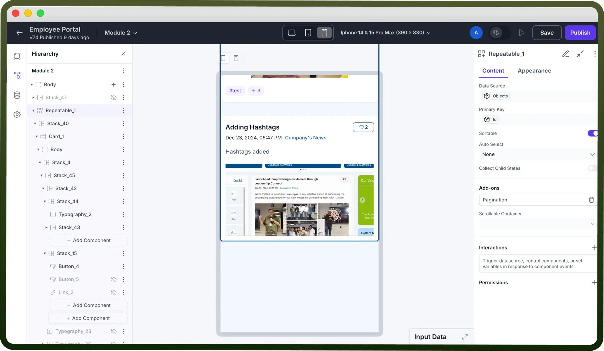

# Repeatable component

Source: https://www.unifyapps.com/docs/unify-applications/repeatable
Section: applications

---

## Overview

The **Repeatable component** is used to dynamically replicate a predefined set of UI components. It is designed for cases where the same form, layout, or visual block needs to be repeated for multiple data entries—enhancing modularity and reducing manual duplication.

This component is particularly useful for scenarios like:

- Displaying lists of items with similar structure
- Generating variable content blocks based on fetched data where users can add/remove repeating fields

  

## How to Use?

1. **Add the Repeatable Component**
  - Select the **Repeatable** component from the components panel
2. **Bind Data Source**
  - Link it to a data source (API, database table, or static JSON) using the Data Source column.
3. **Choose the layout type** The component offers flexibility in how repeated items are displayed by allowing you to choose between two layout types:
  - `Grid Layout`: This layout provides a comprehensive set of column options. You can specify the exact number of columns, and items will be arranged horizontally based on your configuration.
  - `List Layout`: In this layout, there's no need to define a fixed number of columns. You can freely add or remove items as needed. The alignment of items can be configured in either a horizontal or vertical direction, offering more flexibility in arrangement.

## Best Practices

- **Use Clear Variable Names**: When configuring Item Name use descriptive names (e.g., product, user, index) to improve readability within nested components.
- **Validate Data Structure**: Ensure the bound data source returns an array of objects with consistent structure to avoid rendering issues.
- **Keep Nested Components Lightweight**: Avoid adding too many heavy components within each repeated block to maintain performance and responsiveness.
