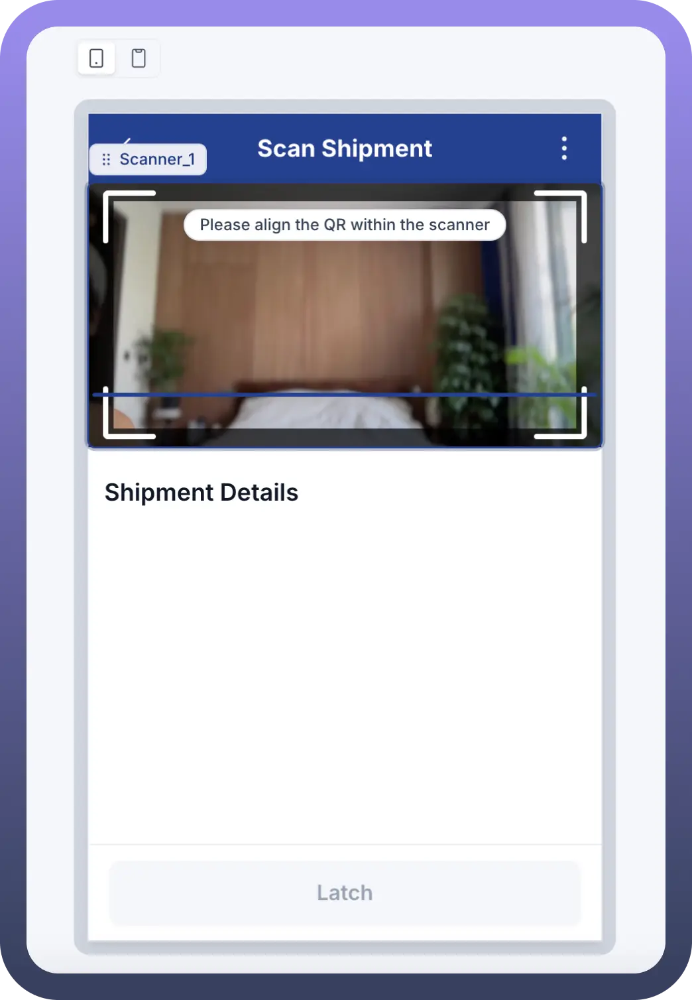
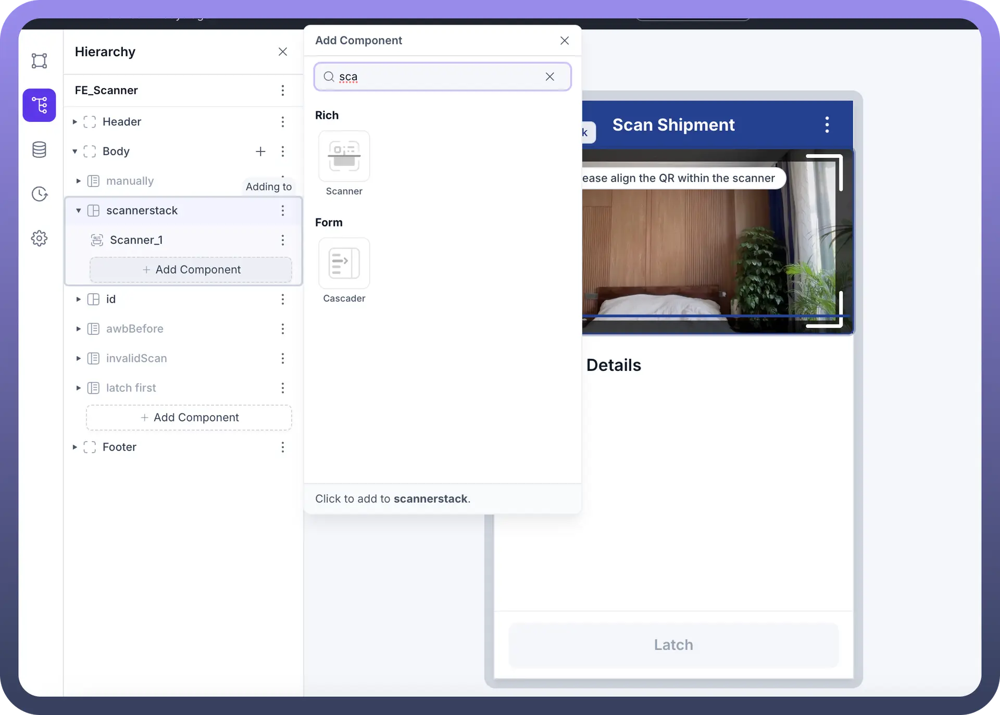
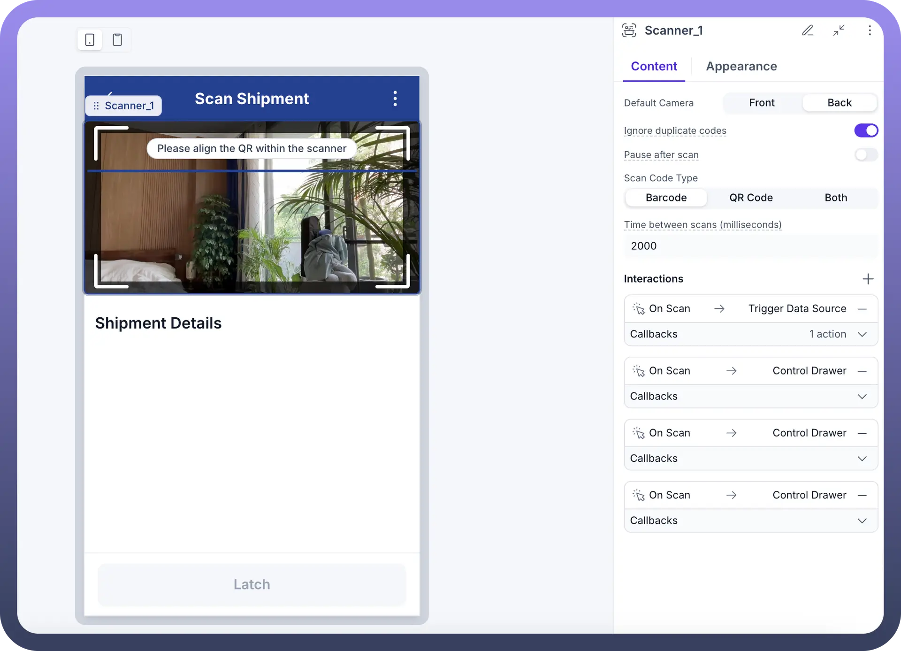
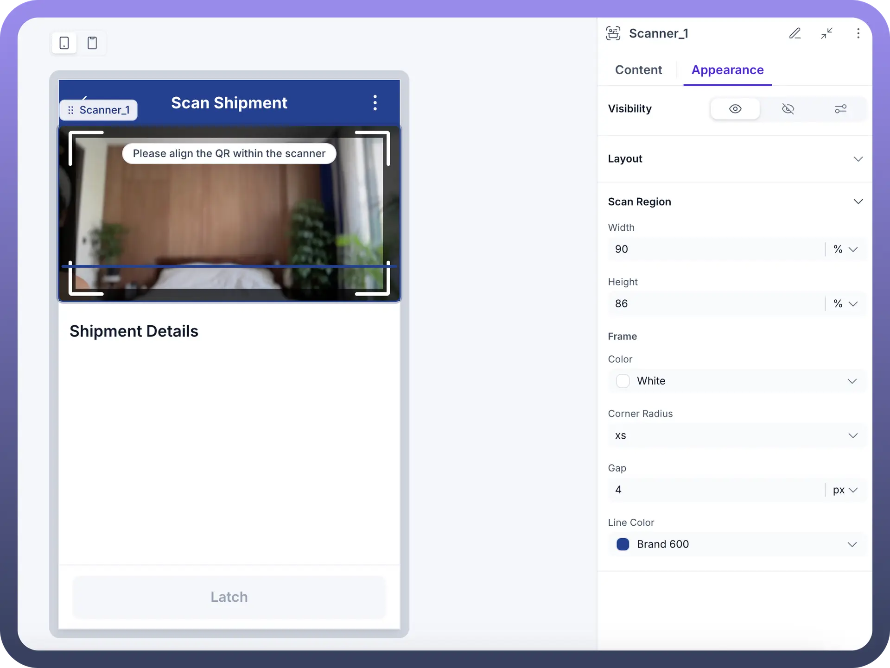

# Scanner

Source: https://www.unifyapps.com/docs/unify-applications/scanner
Section: applications

---

## Overview

Scanner by UnifyApps provides powerful barcode and QR code scanning capabilities for your applications. This enables you to integrate real-time data capture from physical items into your workflows, automate inventory management, track shipments, and streamline various business processes that rely on scanning physical codes.

## Use Cases

**Shipment Tracking and Processing:** Scan shipment barcodes or QR codes to automatically trigger workflows that update status, verify information, or initiate further processing steps. This eliminates manual data entry and reduces errors in logistics operations.

**Inventory Management:** Implement scanning solutions for inventory counts, stock verification, or asset tracking. Connect scanned data directly to your inventory management system to maintain accurate, real-time stock levels.

**Event Check-in and Registration:** Use the Scanner component to quickly verify attendees at events by scanning tickets or ID badges, triggering automated check-in processes and capturing attendance data.

**Document Management:** Scan QR codes attached to physical documents to instantly retrieve digital versions, update status information, or trigger document workflow processes.

## Component Configuration

**Trigger Setup**

The Scanner component can be configured to trigger various actions when a scan is completed. This allows for seamless integration with your automation workflows.

**Event Options:**

- `On Scan`**:** Triggers when a valid code is scanned
- `Action`**:** Select "Trigger Data Source" to send scan data to another component
- `Select Data Source`**:** Choose where the scanned data will be sent
- `Method`**:** Set to "Trigger" to initiate an action upon scanning
- `Conditions`**:** Optional "Only run when" settings to add conditions for when scans should trigger actions
- `Delay Duration`**:** Set a delay (in milliseconds) before triggering actions

### Scanner Component Structure

The Scanner component can be added to your application interface and configured within your component hierarchy.

**Component Hierarchy:**

- The Scanner component can be placed within your application structure
- Available under "`Rich`" components category
- Can be added to various container elements like Body, Header, or custom stacks
- Fully integrates with other form and UI components

### Scanner Content Configuration

Configure the core functionality of the Scanner component to meet your specific scanning requirements.

**Content Settings:**

- `Default Camera`**:** Choose between Front or Back camera
- `Ignore duplicate codes`**:** Toggle to prevent the same code from being scanned multiple times
- `Pause after scan`**:** Option to pause scanning after successful detection
- `Scan Code Type`**:** Select between Barcode, QR Code, or Both
- `Time between scans`**:** Set the minimum time (in milliseconds) between consecutive scans
- `Interactions`**:** Configure multiple actions triggered by scan events
  - Connect to Data Source actions
  - Control Drawer actions
  - Other UI interactions
- `Callbacks`**:** Set up response handling for scan events

### Scanner Appearance Configuration

Customize the visual aspects of the Scanner component to match your application design and improve user experience.

**Appearance Settings:**

- `Visibility`**:** Toggle scanner visibility
- `Layout`**:** Configure layout properties
- `Scan Region`**:**
  - `Width`**:** Set the width of the scanning area (percentage)
  - `Height`**:** Set the height of the scanning area (percentage)
- `Frame`**:**
  - `Color`**:** Choose the frame color (e.g., White)
  - `Corner Radius`**:** Set the roundness of corners (xs, sm, md, etc.)
  - `Gap`**:** Set the space between frame elements (in pixels)
  - `Line Color`**:** Set the color of the scanning line (e.g., Brand 600)

## Implementation Steps

1. **Add the Scanner Component:**
  - Navigate to your application builder
  - Select the container where you want to add the scanner
  - Click "`Add Component`" and search for "`Scanner`"
  - Select the Scanner component from the Rich components section
2. **Configure Scanner Settings:**
  - Set the camera, scan type, and timing options
  - Configure the appearance to match your application design
  - Add instructional text (e.g., "Please align the QR within the scanner")
3. **Set Up Scan Event Triggers:**
  - Configure the "`On Scan`" event
  - Connect to appropriate data sources or actions
  - Add any conditional logic for scan processing
4. **Connect with Workflow:**
  - Create automation flows that process the scanned data
  - Configure any validation or transformation of scan data
  - Set up error handling for invalid scans
