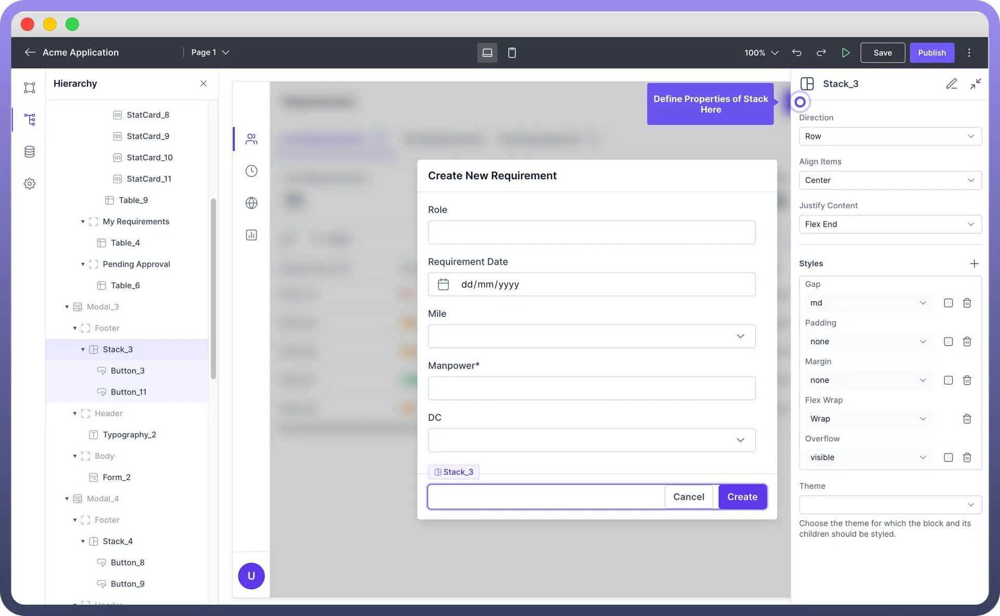

# Stack

Source: https://www.unifyapps.com/docs/unify-applications/stack
Section: applications

---

## Introduction

Stack is a **flexible** UI component that groups and organizes components vertically or horizontally. 

Stacks automatically manage **spacing** and **alignment** between child elements and allow an indefinite number of components within them.

## Create Stacks with Child Elements

- **Select the Stack**: Select the Stack component from the component panel. Click on the Stack component within your layout where you want to add child components.
- **Add Component**: In the hierarchy panel, click on the "`Add Component`" button next to the selected Stack.
- **Choose Child Components**: From the component panel, choose the desired components you want to add as children to the Stack. You can select multiple components such as `images`, `text`, `buttons`, or `other` UI components.

  

## Organize Child Elements

Any child components within an stack can be arranged using 3 settings given in the table below:

| **Setting** | **Description** |
|---|---|
| `Direction` | You can choose between **vertical** (Column) or **horizontal** (Row) stacking. 

This setting determines how the child components are arranged within the Stack. |
| `Align Items` | This setting allows you to align child components along the **cross axis**.

Options include **Flex Start**, **Flex End**, **Center**, **Baseline**, and **Stretch**. |
| `Justify Content` | This setting aligns child components along the main axis. 

Options include **Flex Start**, **Flex End**, **Center**, **Space Between**, **Space Around**, and **Space Evenly**. |

## Style your Stack

Styling a Stack component allows you to control the `appearance` and `layout` of the child components within it.

Below are the key properties you can configure, along with their descriptions.

| **Property** | **Description** |
|---|---|
| `Gap` | Set the space between child components within the Stack. Options typically include **none**, **small**, **medium**, and **large**. |
| `Padding` | Add space inside the Stack's border to create separation between the content and the border. Options typically include **none**, **small**, **medium**, and **large**. |
| `Margin` | Set the outer space around the Stack to create distance between it and surrounding elements. Options typically include **none**, **small**, **medium**, and **large**. |
| `Flex Wrap` | Control whether child components should wrap onto multiple lines or remain on a single line. Options include **No Wrap** and **Wrap**. |
| `Overflow` | Define how content that overflows the Stack's box should be handled. Options include **visible**, **hidden**, and **scroll**. |
| `Theme` | Choose the theme for which the Stack and its children should be styled. Options typically include **Light** and **Dark**. |

> **Note:** The Stack component’s **Overflow** property is particularly useful for handling content that exceeds the available space, ensuring your layout remains tidy.

## Best Practices

1. **Use Stacks for Simplicity**: When you need a straightforward layout of components, use the Stack component for simplicity and ease of maintenance.
2. **Combine with Other Layout Components**: Use Stacks in combination with Containers and Cards to create more complex and structured layouts.
3. **Consistent Spacing**: Utilize the Gap property to ensure consistent spacing between elements, providing a cleaner look.
