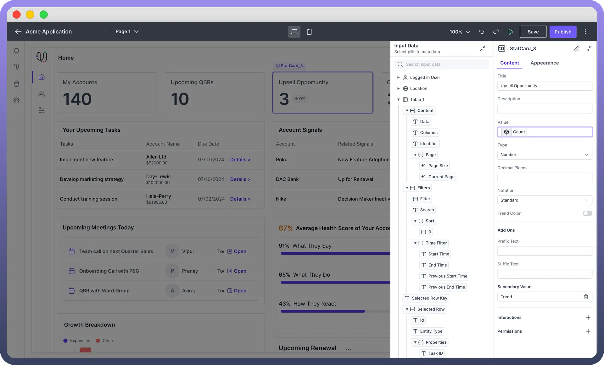
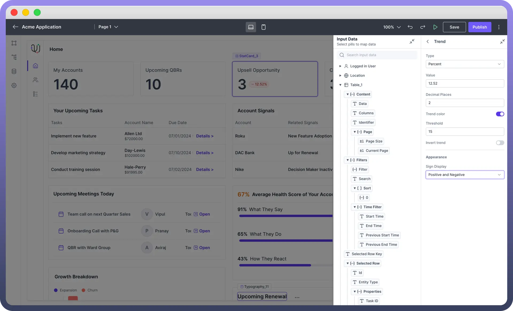

# Stat Card

Source: https://www.unifyapps.com/docs/unify-applications/stat-card
Section: applications

---

## Overview

Stat Card component is designed to **display key statistics** or **metrics** in a visually appealing way. It allows users to showcase important numerical data, trends, and related information, making it easy to convey insights at a glance.

## Define Content for Stat Card

You can define content for your stat card using the following properties:

| **Property** | **Description** |
|---|---|
| `Title` | Enter the title for the Stat Card. |
| `Description` | Add a brief description of the statistic or metric. This will show up in the Stat Card. |
| `Value` | Set the main value to be displayed on the Stat Card. You can **bind** this to a data source using the data pills. |
| `Type` | Choose the type of **value** (e.g., Number, Percentage, String, Currency, Time) |
| `Notation` | Select the notation format between **Standard** Notation (1234.56), **Scientific** Notation (1.23 e+3), **Engineering** Notation (1.23e+3) & compact notation (1.2k for 1200) |

## Add Trend Colour

The Trend Color setting visually **indicates performance** by changing the text color based on specified conditions:

- **Threshold**: Define a value above or below which the text color changes. By default, values above the threshold are green, and below are red.
- **Invert Trend**: Inverts the default color conditions. When enabled, values above the threshold turn red, and below turn green.

## Add Secondary Value

You can add a Secondary value with following properties:

| **Property** | **Description** |
|---|---|
| `Type` | Choose the type of trend indicator, such as **Percent**, **Number**, or **Currency**. |
| `Value` | Enter the value to be displayed in the trend indicator. |
| `Decimal Places` | Specify the number of decimal places for precision. |
| `Trend Color` | Option to set a trend color based on a **threshold**. |
| `Threshold` | Define the **value** threshold for the trend color. |
| `Invert Trend` | Invert the default color condition, where values above the threshold turn red and below turn green. |
| `Appearance` | This allows you to set the icon alongside the trend value as positive or negative symbols, arrows, or remove it altogether. |

## Appearance Customization

You can customize the appearance of stat card by using the following properties.

| **Property** | **Description** |
|---|---|
| `Size` | Choose from **predefined** sizes (e.g., sm, md, lg). |
| `Truncate Label` | Enable to truncate **long text** labels. |
| `Padding` | Adjust the padding around the Stat Card content. |
| `Gap` | Set the gap **between** elements within the Stat Card. |
| `Border Width` | Adjust the width of the border around the Stat Card. |
| `Border Radius` | Set the border radius for rounded corners. |
| `Border Color` | Choose the color for the border. |
| `Width` | Sets the **overall** width of the tab component. |
| `Min Width` | Specifies the minimum width the tab component can shrink to. |
| `Max Width` | Defines the maximum width the tab component can expand to. |

## Define Interactions

Stat Card support **"**`On Click"` event. On Click **Trigger** an action or an automation when the Stat Card is clicked. You can use this functionality to navigate to detailed views, update data, or execute specific actions on click of the stat card.

## Define Permissions

The Stat Card component allows you to set **visibility** permissions based on the permissions granted to the logged-in user. This ensures that only authorized users can view or interact with the Stat Card.

> **Note:** You can refer to [Permissions](/docs/unify-applications/stat-card) documentation to know more about defining permissions for each component.
