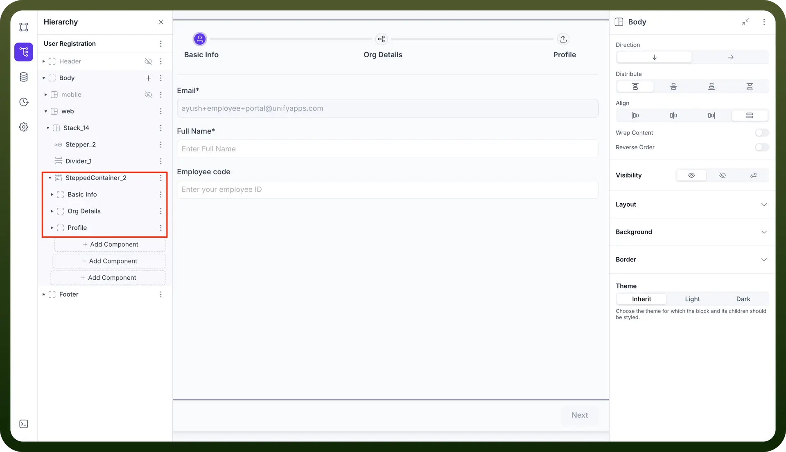
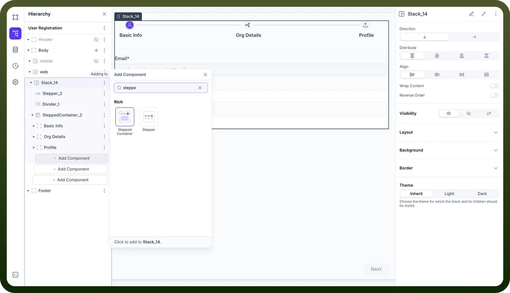

# Stepped Container component

Source: https://www.unifyapps.com/docs/unify-applications/stepped-container
Section: applications

---

## Overview

Stepper Container by UnifyApps serves as the foundational wrapper component that orchestrates and manages multi-step user interfaces. This container component provides the structural framework for organizing complex workflows, forms, and processes into manageable, sequential steps while maintaining consistent navigation, state management, and visual coherence across the entire user journey.

## Use Cases

**Multi-Form Wizards and Registration Flows**: Create comprehensive registration processes by housing multiple form sections within a single container, enabling seamless data collection across Basic Info, Organization Details, and Profile setup stages while maintaining form state throughout the process.

**Complex Workflow Management**: Orchestrate sophisticated business processes and approval workflows where multiple stakeholders need to complete different stages, with the container managing overall progress tracking and state persistence.

**Guided Setup and Configuration**: Build intuitive setup wizards for software configuration, account initialization, or system onboarding where users need to complete multiple related tasks in a logical sequence.

**Progressive Disclosure Interfaces**: Implement information architecture that reveals content progressively, reducing cognitive load by breaking complex interfaces into digestible, contextually organized sections.

## Component Configuration

### Container Structure

The Stepper Container component acts as the master controller that houses and coordinates individual step components, managing their lifecycle, navigation, and shared state.

**Key Elements:**

- **Container Wrapper**: Main housing that defines the overall stepper boundary and layout
- **Step Management**: Controls the creation, organization, and lifecycle of individual steps
- **Navigation Orchestration**: Manages transitions between steps and overall flow control
- **State Coordination**: Handles data persistence and sharing across different steps
- **Progress Tracking**: Monitors and displays overall completion status

### Content Configuration

Configure the container properties and behavior that will govern all nested step components.

**Container Settings:**

- **Stepper Assignment**: Link to specific stepper component for step definitions and behavior
- **Step Organization**: Manage the hierarchy and sequence of contained steps
  - Basic Info Container
  - Org Details Container
  - Profile Container
- **State Management**: Configure data persistence and sharing mechanisms
- **Navigation Rules**: Define progression logic and validation requirements
- **Permissions**: Control access and visibility for different user roles

## Adding Stepper Container to Your Application

The Stepper Container component provides the foundational structure for multi-step interfaces and must be properly configured before adding individual step components.

**Implementation Steps:**

1. Navigate to your application builder interface
2. Select the parent section where you want to implement the stepper workflow (e.g., Body, Main Content Area)
3. Click "`Add Component`" and search for "`Stepper Container`"
4. Add the Stepper Container component from the Rich components section
5. Configure container properties and stepper assignment
6. Add individual step components within the container structure
