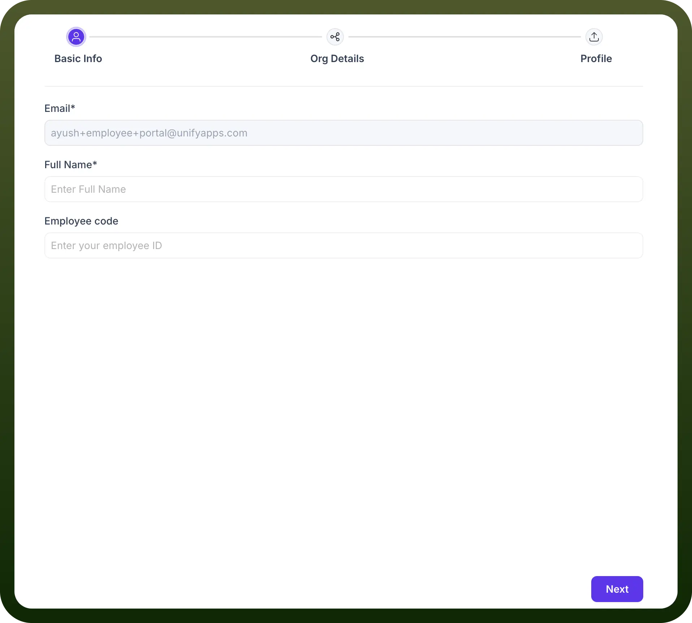
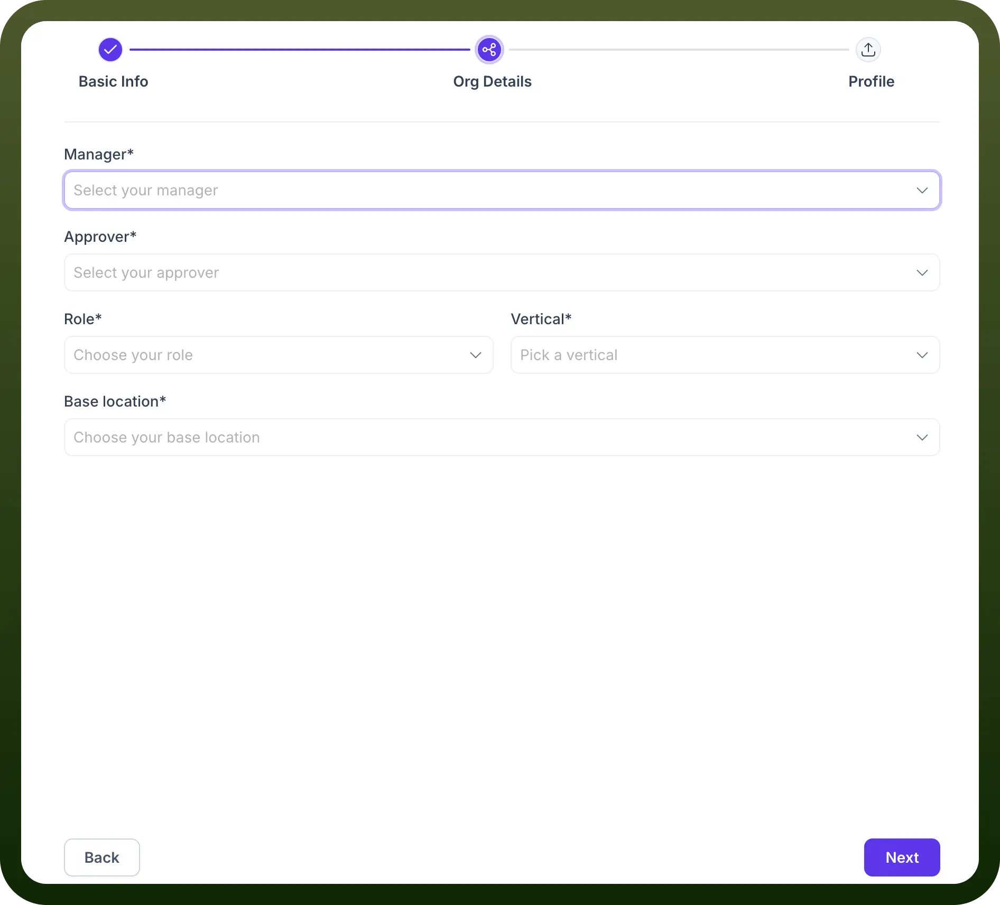
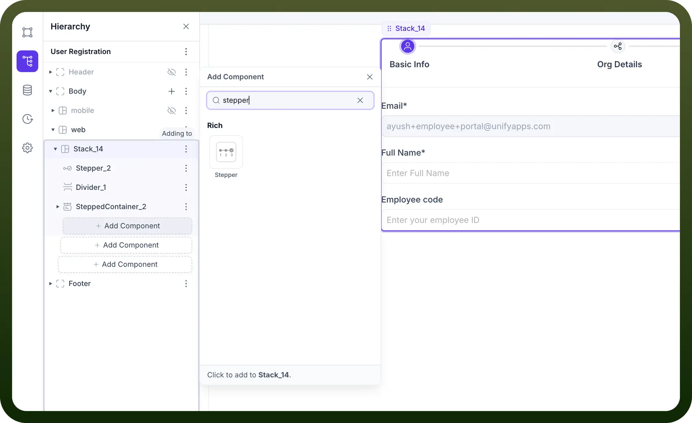
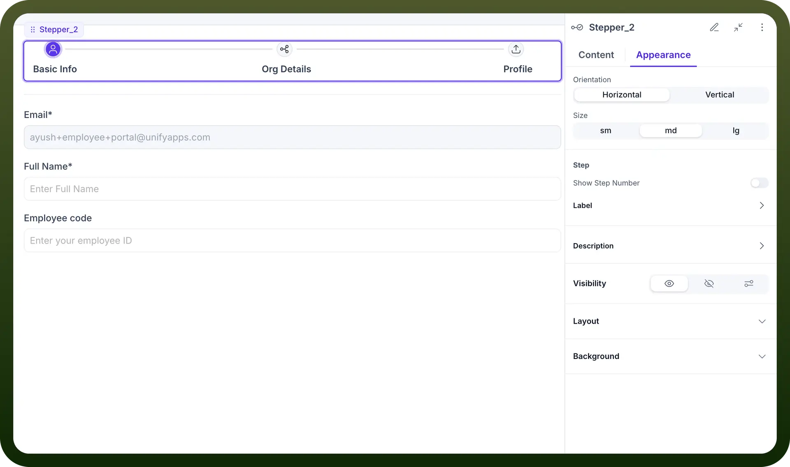

# Stepper component

Source: https://www.unifyapps.com/docs/unify-applications/stepper
Section: applications

---

## Overview

Stepper by UnifyApps provides a powerful multi-step navigation component for creating guided user journeys through complex forms, workflows, and processes. This component allows you to break down lengthy forms into manageable sections, improve user experience, and guide users through sequential tasks while maintaining context throughout the process.

## Use Cases

**User Registration and Onboarding:** Create a seamless registration experience by dividing the process into logical steps like Basic Info, Organization Details, and Profile setup. This reduces form fatigue and improves completion rates.

**Multi-stage Approval Workflows:** Guide users through complex approval processes with clear indication of the current stage, required inputs, and next steps in the workflow.

**Progressive Data Collection:** Collect information in a contextual, step-by-step manner that makes sense to users and maintains a logical flow of information gathering.

**Form Organization and Validation:** Break down complex forms into manageable sections with validation at each step, ensuring data accuracy before proceeding.

## Component Configuration

### Stepper Structure

The Stepper component organizes content into a sequence of steps that users navigate through, with visual indicators showing progress and current position.

**Key Elements:**

- **Steps Bar:** Visual navigation showing all steps and current progress
- **Step Content:** The form fields or content specific to each step
- **Navigation Controls:** Buttons to move between steps (Back, Next)

### Content Configuration

Configure the steps and content that will be displayed within your Stepper component.

**Content Settings:**

- `Type`**:** Choose between Mapped (dynamic) or Static step configuration
- `Steps`**:** Add, remove, and organize the sequence of steps
  - Basic Info
  - Org Details
  - Profile
- `Default Step`**:** Set which step should be shown initially
- `Interactions`**:** Configure actions triggered by step changes
  - Connect to Data Source actions
  - Trigger workflows when steps change
- `Callbacks`**:** Set up response handling for step events

### Adding Stepper to Your Application

The Stepper component can be added to your application interface and configured within your component hierarchy.

**Implementation Steps:**

1. Navigate to your application builder
2. Select the container where you want to add the stepper (e.g., Stack, Body)
3. Click "`Add Component`" and search for "`stepper`"
4. Add the Stepper component from the Rich components section
5. Configure your stepper structure and steps

### Appearance Configuration

Customize the visual aspects of the Stepper component to match your application design and improve user experience.

**Appearance Settings:**

- `Orientation`**:** Choose between Horizontal or Vertical layout
- `Size`**:** Select from sm (small), md (medium), or lg (large)
- `Step Settings`**:**
  - `Show Step Number`: Toggle display of step numbers
  - `Label`: Customize step labels
  - `Description`: Add explanatory text for each step
- `Visibility`**:** Control when the stepper is visible
- `Layout`**:** Configure spacing and arrangement
- `Background`**:** Customize background styling

**Typical Fields:**

- Profile picture
- Contact preferences
- System settings
- Additional personal information

## Implementation Steps

1. **Plan Your Steps:**
  - Identify logical groupings of information
  - Determine the optimal sequence
  - Plan validation requirements for each step
2. **Add the Stepper Component:**
  - Navigate to your application builder
  - Select the parent container
  - Add the Stepper component from the Rich components section
3. **Configure Steps:**
  - Add each required step
  - Configure fields within each step
  - Set up validation for each step
4. **Set Up Navigation:**
  - Configure Next/Back button actions
  - Add any conditional logic for step progression
  - Define what happens on completion
5. **Customize Appearance:**
  - Set orientation and size
  - Customize labels and descriptions
  - Adjust visibility and layout as needed

## Data Handling

**Mapped vs. Static Configuration**

The Stepper supports two configuration modes to accommodate different use cases:

**Mapped Configuration:**

- Dynamically generate steps based on data sources
- Useful for variable workflows or data-driven processes
- Allows for conditional step creation and customization

**Static Configuration:**

- Predefined steps with fixed structure
- Ideal for consistent, standardized processes
- Simpler to configure for standard forms

### Step Interactions

Configure actions that occur when users navigate between steps:

**Common Interactions:**

- **On Step Change:** Trigger data validation or save operations
- **Data Binding:** Connect step fields to data sources
- **Conditional Navigation:** Show/hide steps based on previous inputs
- **Process Triggering:** Initiate backend processes as steps complete
