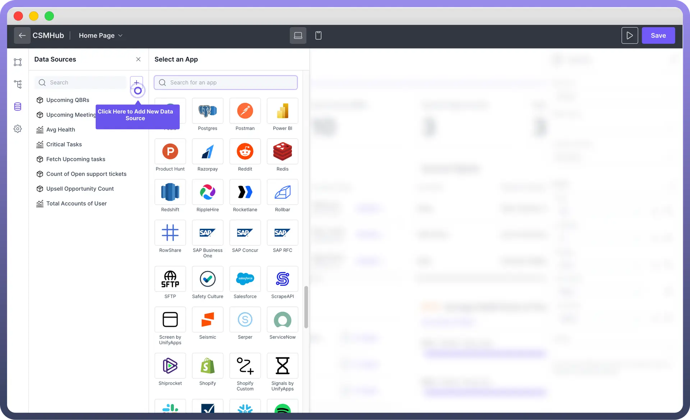
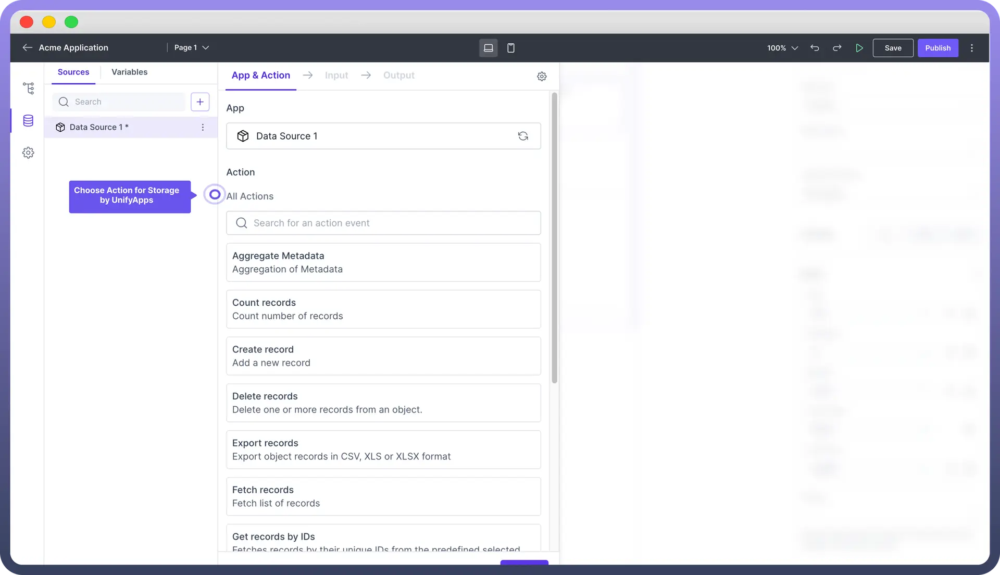
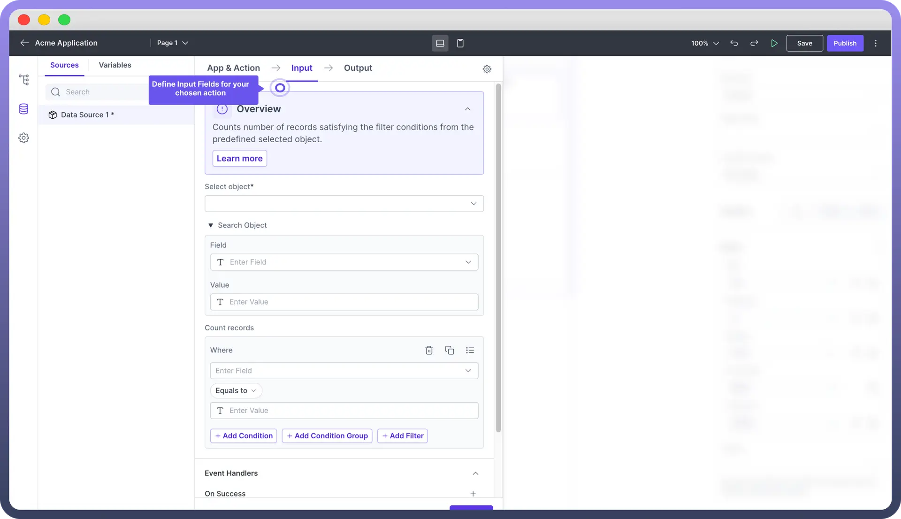

# Storage by UnifyApps

Source: https://www.unifyapps.com/docs/unify-applications/storage-by-unifyapps-2
Section: applications

---

## Overview

Storage by UnifyApps is a connector that allows you to **fetch** and **manipulate** data from UnifyApps Objects within your low-code application.

This article covers how to set up and use Storage by UnifyApps effectively.

## Add “Storage” Data Source in Application

If your data is stored in objects within Unify Objects, you need to link those objects in your application. For each application page, you must first link the data source from which you will pull data. Once you link the data source, the output will appear as data pills in your application.

To add Storage by UnifyApps as a data source:

1. Navigate to the "`Data`" section in your application. You would find it in the left pane of your application below the hierarchy section.
2. Click the "`+`" button to add a new data source.
3. Search for and select "`Storage by UnifyApps`" from the available options.

This integration enables you to work with data stored in UnifyApps Objects directly within your application.

> **Note:** The data source is defined at the application page level.

## Configure the “Storage by UnifyApps” Connector

After adding the connector for Storage by UnifyApps, you need to configure it to fetch data in required format from the object.

### Actions

Select an action for your data source. These are the list of commonly used actions.

| **Action** | **Action Description** |
|---|---|
| `Count Records` | Use this action to get the total number of records in your storage. |
| `Create Record` | This action enables you to add new data to your storage. Use this in scenarios where you want to create records based on user actions in your application. |
| `Delete Records` | With this action, you can remove one or more records from an object in your storage, facilitating data cleanup and management based on user actions in your application. |
| `Fetch Records` | Use this action to retrieve a list of records from your storage, bringing existing data into your application. |
| `Get Records by IDs` | This action fetches specific records using their unique identifiers from a predefined selected object, allowing for precise data retrieval. |
| `Update Record by ID` | This action lets you modify an existing record or create a new one if the specified ID doesn't exist, providing flexibility in managing individual data entries. |
| `Update Records by Query` | This action allows you to modify multiple records that match specific criteria, enabling efficient batch updates or data transformations. |

### Advanced Actions

| **Action** | **Action Description** |
|---|---|
| `Aggregate Metadata` | This action allows you to perform data analysis and summarization on your stored records. This can be useful for generating reports, gaining insights, or preparing data for further processing. |
| `Export Records` | This feature allows you to extract data from your storage in CSV, XLS, or XLSX formats. |
| `Import Records` | With this action, you can bulk add data to your storage from external files, streamlining the process of populating your database or updating large datasets. |
| `Semantic Search Records` | This feature enables you to search through your data using natural language queries, providing more intuitive and flexible data retrieval options. |
| `Share Records` | This action allows you to grant access to specific records for particular users or teams, enhancing collaboration and data security within your organization. |

### Define Input

Based on the selected action, you need to define the input for the connector to fetch data from the required object under specific conditions. The required inputs will vary depending on the chosen action.

For instance, for the "`Count Records`" action, the following input fields are necessary.

1. **Select Object:** Choose the object from the dropdown list from where you want to count records. **Note:** Ensure you have necessary permissions to access the object; otherwise it will not appear in the dropdown list.
2. **Search Object:** Define the field along with its value in case you are looking for only selected data values in your object.
  - `Field`**:** Enter the name of the field you want to search within the selected object.
  - `Value`**:** Enter the value you are looking for in the specified field.
3. **Conditional Counting:** Specify the criteria for the data you want to count.
  - **Where:** Set conditions to count records that meet specific criteria.
    - **Enter Field:** Specify the field name you want to filter on.
    - **Operator:** Choose the operator for the filter (e.g., equals to, contains, greater than, etc.).
    - **Enter Value:** Provide the value for the filter condition. You can add multiple conditions as well.
4. **Event Handlers**
  - **On Success:** Define actions to be taken when the operation is successful.
  - **On Failure:** Define actions to be taken when the operation fails. After configuring the input settings, click "`Save`" to save the configuration.
5. **Reviewing Output:** After configuring the input, review the expected output fields. These will be available as data pills in your application.

## Mapping Data to UI Components

Data fetched through Storage by UnifyApps becomes available as data pills. These can be used throughout your application in various components and logic flows.

> **Note:** You can refer to [Map Data to UI components](/docs/unify-applications/map-data-to-interface-components) article to know more about it.

## Best Practices

- Keep your Object schemas well-organized and documented.
- Use meaningful names for Objects and fields.
