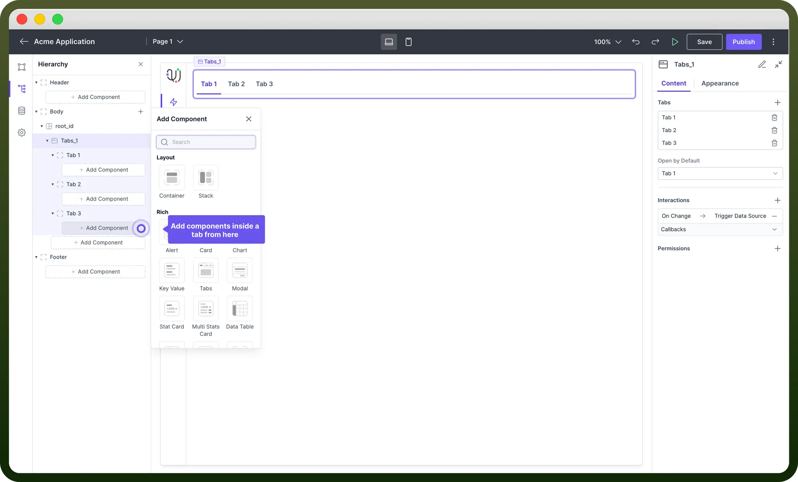

# Tabs component

Source: https://www.unifyapps.com/docs/unify-applications/tabs
Section: applications

---

## Overview

Tab component allows users to **organize** content into a **tabbed** interface, enabling easy navigation between different sections of an application acting as a full page container.

## Add / Delete Tab

You can add Tabs from the list components to your canvas. This would by default create 3 Tabs in your application. You can add or delete tabs from the properties panel.

To add New Tab, Click on the "`+`" button in the properties section & click on the `Delete` icon to remove  a particular tab.

## Key Properties

1. **Label:** Specifies the text displayed on the tab to indicate its content or purpose.
2. **Redirect to:** Redirects users to the input link on accessing the specific tab you set it for.
3. **Badge:** This allows you to add number or text badges next to the label in your tab component.

> **Note:** You can use “`Open By Default`” Property to choose the tab which you want to show first on opening of your application.

## Define Conditional Visibility

Set conditions to disable the tab based on specific criteria by using the "`Add Condition`" buttons under the "`Disabled`" section. It makes the tab non-interactive based on specific criteria.

For example, you can disable the tab if a required form field is empty. To set this, click "`Add Condition`" under the Disabled section and specify the condition.

## Appearance Customization

You can customize the appearance of tab with following properties:

| **Property** | **Description** |
|---|---|
| `Padding` | Controls the **space** inside the tab content area between the content and the tab borders. |
| `Height` | Sets the **overall** **height** of the tab component. |
| `Min-Height` | Specifies the minimum height the tab component can shrink to. |
| `Max-Height` | Defines the maximum height the tab component can expand to. |
| `Width` | Sets the **overall width** of the tab component. |
| `Min Width` | Specifies the minimum width the tab component can shrink to. |
| `Max Width` | Defines the maximum width the tab component can expand to. |
| `Overflow` | Determines the **behavior** of content that exceeds the tab component’s size (e.g., scroll, hide). |

## Add Components Inside a Tab

1. **Select Tab:** Click on the tab where you want to add components.
2. **Add Component:** Click on the "`Add Component`" button under the selected tab.
3. **Choose Component:** In the small window that opens, select the desired component from the list (e.g., Container, Stack, Alert, Card, Chart).
4. **Configure Component:** Once added, use the properties panel to adjust the settings of the new component as needed.

## Define Permissions

The Tab component allows you to set visibility permissions based on the **permissions granted** to the logged-in user.

This ensures that only authorized users can view or interact with specific tabs. You can also control Visibility across each tab.

Click on the tab for which you want to control permissions and inside that tab’s properties you would find the permission section.

> **Note:** You can refer to [Permissions](/docs/unify-applications/tabs) article to know more about defining permissions for each component.

## Best Practices

- **Organize Content:** Use tabs to logically group related content, improving the user experience.
- **Keep it Simple:** Avoid overloading tabs with too much content to maintain performance and usability.
