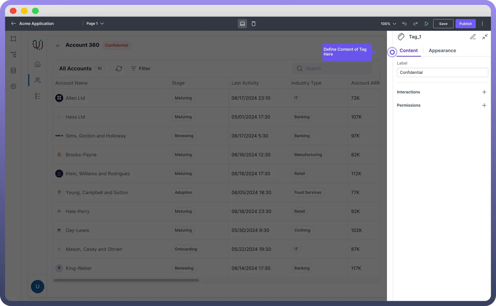
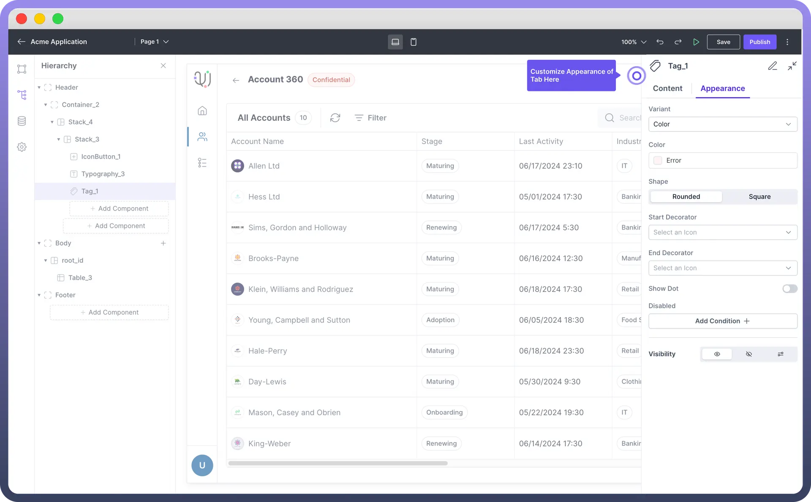

# Tag

Source: https://www.unifyapps.com/docs/unify-applications/tag
Section: applications

---

## **Overview**

Tag component is a visual label used to **highlight**, or **display** **status** information in your application. This article explains how to configure and utilize Tag components.

## Key Properties

After adding a Tag component to your design, customize it using the properties panel on the right side of the interface.

- **Set Label**: Enter the text to be displayed within the tag.

> **Note:** You can use the data pills from the **input** data tab while configuring the text to be shown. This can be used to update the data dynamically.

## Appearance Customization

Customize the Tag's appearance to match your application's design:

| Property | Description |
|---|---|
| `Variant` | Select the variant **style** for the tag (e.g., Color, Clear - No Colour) |
| `Color` | Choose the color **scheme** for the tag. |
| `Shape` | Select between **Rounded** or **Square** corners |
| `Start Decorator` | Add an optional icon at the **beginning** of the tag |
| `End Decorator` | Add an optional icon at the **end** of the tag |
| `Show Dot` | Toggle to display a **dot indicator** on the tag |
| `Disabled` | Set **conditions** to disable the tag |
| `Visibility` | Control the **tag's** visibility (visible, hidden, or conditional) |

## Define Interactions

Set up interactions for when users click or interact with the tag:

1. Navigate to the "`Interactions`" section in the properties panel.
2. Click "`Add Interaction`".
3. Choose the type of interaction (e.g., filter data, trigger action, show modal).
4. Configure the specific details of the chosen interaction.

> **Note:** Refer to the [Interactions](/docs/unify-applications/handle-interactions-in-interface) article for more detailed information on setting up various types of interactions.

## Best Practices

- **Consistency**: Use tag styles consistently for similar types of information across your application.
- **Clarity**: Keep tag text concise and clear to ensure readability.
- **Color Usage**: Use colors meaningfully to convey information or status.
