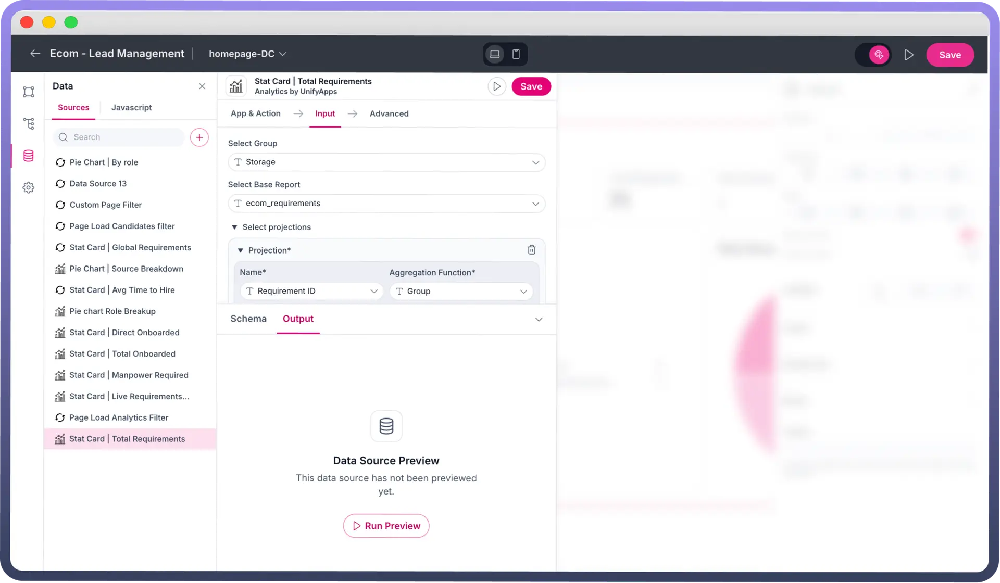
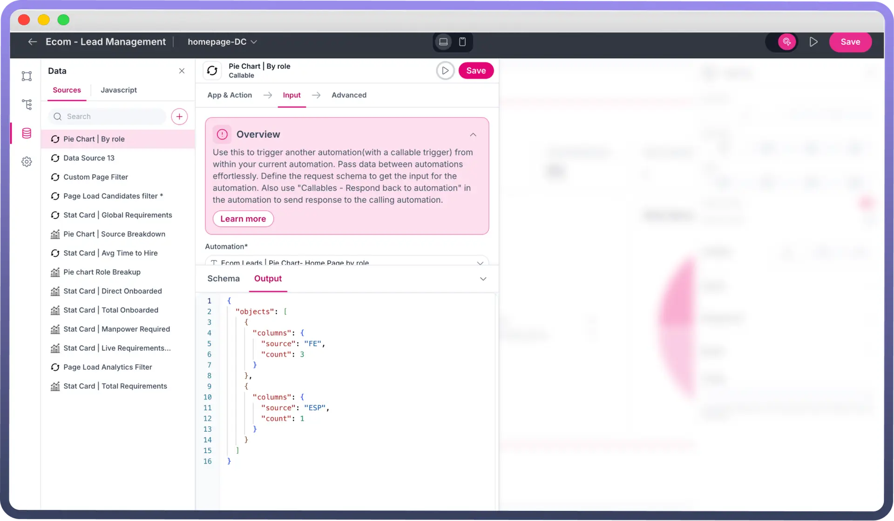
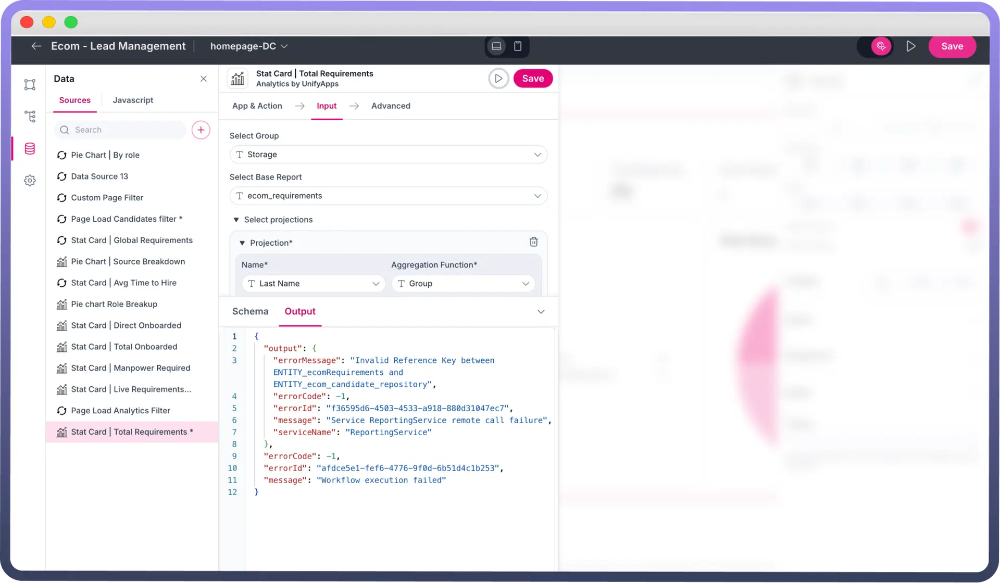

# Testing your Data Source

Source: https://www.unifyapps.com/docs/unify-applications/testing-your-data-source
Section: applications

---

## Overview

Testing data sources ensures data accuracy, integrity, structure and business logic. This option describes the format in which the data source is going to return.

## Run Preview

Run preview allows you to check the output of the given data source by fetching the result dynamically. This ensures that the schema or structure of the data source matches the expected format.

## Output

The output section shows the output for the data source. It specifies the JSON format in which the data will be fetched.

For APIs, this means ensuring that the response structure adheres to expected formats (e.g., JSON keys, data types). Test cases may include:

- Verifying the schema consistency across environments.
- Ensuring all necessary columns or fields are present and correctly structured.
- Testing schema changes.

Often, the data being pulled into your application must adhere to specific business rules or logic. This can include calculations, data transformations, and validation. Testing ensures that:

- Data conforms to expected business logic (e.g., price cannot be negative).
- Calculations (e.g., totals, averages) are accurate and consistent. It also provides the error code and error message in case there is a config issue with the data source. This can help in restructuring the data source and fetching required data.

  

  
