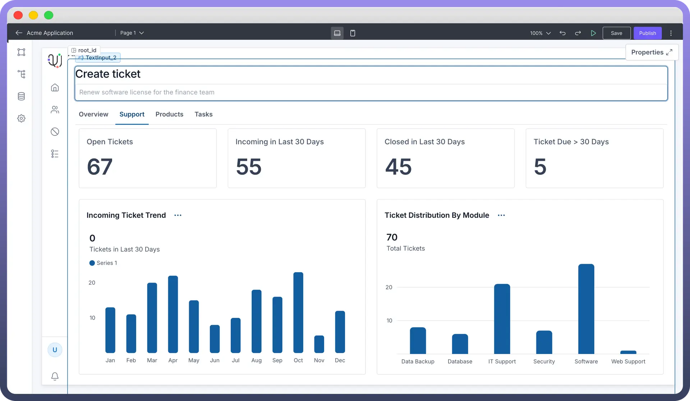

# Text Input

Source: https://www.unifyapps.com/docs/unify-applications/text-input
Section: applications

---

## Overview

The Text Input component allows users to input text within your application, with options for configuring default values, placeholder text, labels, additional add-ons and customizing it for enhanced user guidance. This guide provides a detailed overview of configuring and personalizing the Text Input component.

## Configuring the Text Input Component

Once the Text Input component is added, you can configure its properties through the right-side configuration panel.

### Setting Content and Text Input options

- **Default Value**: Set an initial text that appears in the field when it loads, providing an example or suggested entry.
- **Placeholder:** Add a short hint to guide users on what to enter. This text disappears once typing begins.

### Additional Add-Ons

Under the "`Add-ons`" section, you can add elements to guide users with extra context and clarity around the Text Input.

- `Label`**:** Appears above the input to describe what users should enter.
- `Caption`**:** Adds a brief note below the field for additional guidance.
- `Prefix`**:** An icon at the start of the input, e.g., currency symbols.
- `Suffix`**:** An icon at the end, e.g., units or indicators.

## Best Practices for Using Text Input Component

- **Use clear Labels**: Provide concise, descriptive labels above the input field to help users understand exactly what information is required.
- **Keep Placeholders short**: Offer brief but helpful placeholder text inside the input field, giving users a quick hint about what to enter
- **Add Captions if needed**: Include a short caption below the input field to clarify specific requirements or add extra instructions when needed.
- **Use relevant Icons**: Choose Prefix or Suffix icons that clearly relate to the type of input, like currency symbols or units, to add visual guidance and context for users.
