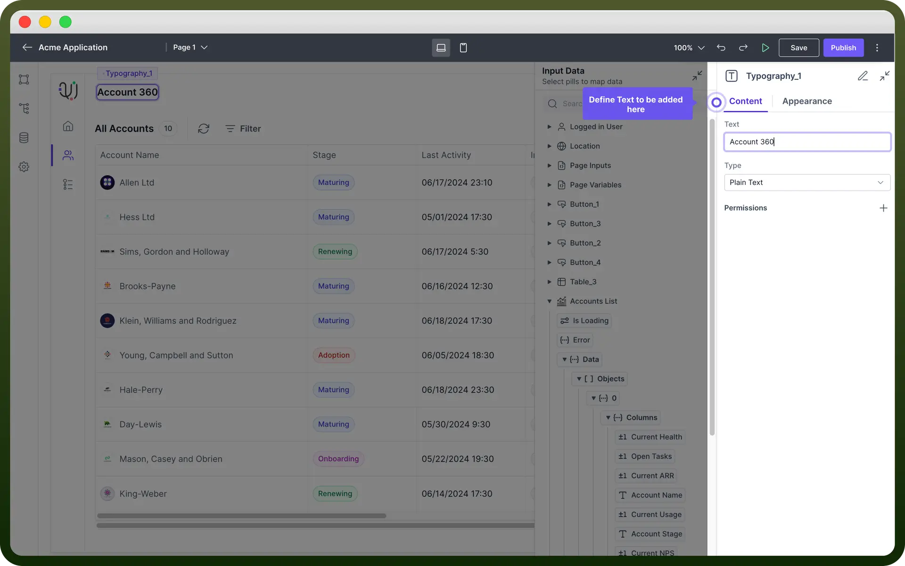
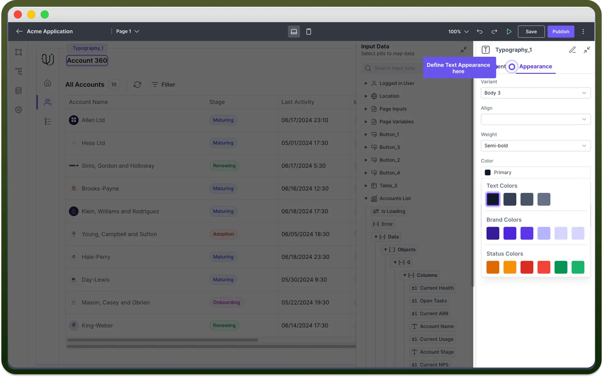

# Text component

Source: https://www.unifyapps.com/docs/unify-applications/text
Section: applications

---

## Overview

Text component allows users to **add** and **format text** within the applications. It can be used for various purposes, including headings, labels, instructions, or any other textual content.

In this article you will learn about how to configure text components..

## Define Content

1. **Text**: This field expects the actual text content to be displayed. You can use Data Pills as well to show Dynamic Content.
2. **Type**: This field defines the format of the text like plain text, HTML, or other markup languages. **Note:** Data Pills can be used to dynamically populate the text content from various data sources. For more information on data mapping, refer to the [Data Pills](/docs/unify-applications/text)article.

  

## Style Text Component

The appearance of the Text component can be customized to fit the design requirements of your application. The following properties are available for styling:

| Property | Description |
|---|---|
| `Variant` | Select the **text style,** such as body, heading, subtitle, etc. |
| `Align` | Set the **alignment** of the text (left, center, right, justify) |
| `Weight` | Choose the **font** weight (regular, bold, light, etc.) |
| `Color` | Define the **color** of the text. This can be set to any color from the palette or custom colors |
| `Padding` | Set the **padding** around the text. |
| `Width` | Define the **width** of the text box. |
| `Min Width` | Set the minimum width. |
| `Max Width` | Set the maximum width. |

## Best Practices

1. **Consistent Styling:** Maintain a consistent style throughout your application for a professional look.
2. **Accessibility**: Ensure the text is readable and accessible to all users by using appropriate font sizes and colors.
3. **Dynamic Content**: Use Data Pills to keep your text content dynamic and up-to-date with real-time data.
