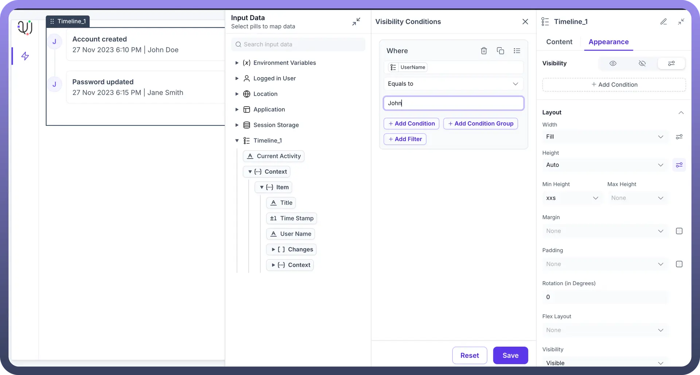

# Timeline

Source: https://www.unifyapps.com/docs/unify-applications/timeline
Section: applications

---

## Overview

The **TIMELINE** component allows users to create a timeline view providing a clear, visual representation of actions taken over time on any entity. With this users can easily visualize the actions and use it for multiple purposes like time tracking, audit purposes etc.

## Configuring Timeline

You may configure a Timeline component by following the below steps:

1. Add the “`Timeline`” component from your component list to your canvas’ body.
2. You can define content using the following properties:

| **Property** | **Description** |
|---|---|
| `Data` | This is the main parameter which will be fetched to track and show changes in the TIMELINE view.  For e.g. in the screenshot below, we are fetching the DATA for Timeline from a data source called “Data ->  Fetch Audit Logs”.  This data source runs on an Automation which fetches audit trails for every user using the standard “Audit by UnifyApps” node. More details below |
| `Title` | This field is used to display the Title of the action  which has been performed. This needs to be fetched from the Datapills “Timeline -> Context -> Title” Datafield and is visible under Input properties.  This can also be combined with other datapills to get meaningful outputs.  For e.g., in the screenshot, for displaying the title , we want to display when a user has logged in and hence used the datapill “UserName” with static text “LoggedIn”. |
| `User` | This field is used to display the Username for the user who has performed the action. This needs to be fetched from the Datapills “Timeline -> Context -> User” Datafield and is visible under Input properties.  This can also be combined with other datapills to get meaningful outputs.  For e.g., in the screenshot,we are displaying the user Email Id in this field |
| `Description` | This field is used to display the description of user activity.  Multiple data fields can be combined to create a meaningful description.

For eg. , in the screenshot below, we are using a static text “USER_ID” and then appending actual “User Id” values to display in the description. |
| `Timestamp` | This field is used to display the timestamp at which the action was taken. This needs to be fetched from the Datapills “Timeline -> Context -> Timestamp” Datafield and is visible under Input properties.  For. eg, in the screenshot below, we are fetching values from datapill “LOGIN TIME” as we are displaying the login activity. |
| `Date Format` | Choose the format in which date should be displayed in the timeline. User can choose from 4 different date formats: 6:30pm 18:30 18:30: 45 18:30:45:54 |
| `Time Format` | Choose the format in which time should be displayed in the timeline. User can choose from 3 different date formats:

1. 12 April 2025 2. Apr 12, 2025 3. 04/12/2025 |
| `Grouping` | Timeline activity can be also be grouped together using 3 different options: Day Month Year |

## Appearance Customization

**Layout**: Details about the layout can be found in the table below:

| Attributes | Properties |
|---|---|
| `Padding` | Add space inside an element's border to create separation between the content and the border. |
| `Height` | Set the height of an element to control its vertical size. |
| `Min-Height` | Define the minimum height an element can be, ensuring it doesn't shrink below this value. |
| `Max-Height` | Specify the maximum height an element can reach, preventing it from growing too tall. |
| `Gap` | Set the space between rows and columns in a grid or flex container to create consistent spacing. |
| `Margin` | Set the outer space around an element to create distance between it and surrounding elements. |

> **Note:** For more detailed information on styling a component, refer to the [Appearance](https://www.unifyapps.com/docs/unify-applications/container) article.

## Visibility Customizations

- You can define the visibility of the field based on the options provided, either make it visible in the application, invisible in the application and only make it available in hierarchy or add visibility conditions.
- You may also add a conditional visibility on the icon as shown below:

  

## Defining Permissions

Every component allows you to set visibility permissions based on the permissions granted to the logged-in user. This ensures that only authorized users can view and interact with the component.

> **Note:** You can refer to Permissions documentation to know more about defining permissions for each component.
