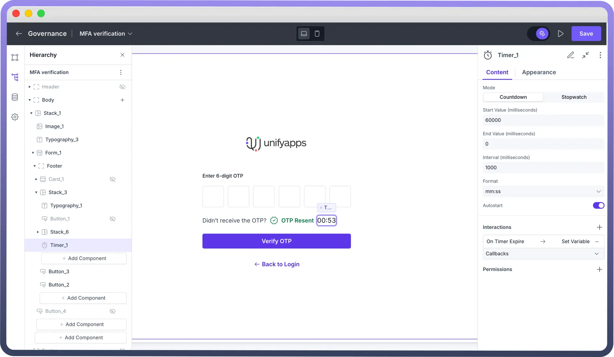
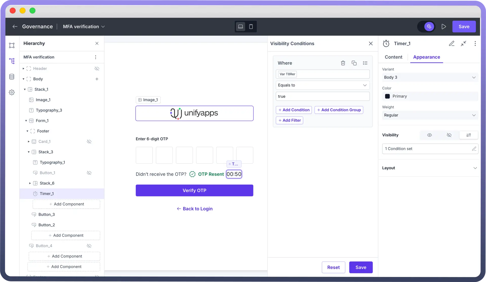

# Timer

Source: https://www.unifyapps.com/docs/unify-applications/timer
Section: applications

---

## Overview

The Timer lets users track time and define events through countdown or stopwatch modes. It allows users to measure elapsed time, set countdowns with specific durations, customize time display formats, and trigger actions when time changes.

## Adding Timer to your Application

You can add Timer from the list of components to your canvas. A countdown timer of 120000 milliseconds would be visible by default.

## Configuring Properties of a Timer

**Countdown**

Countdown starts from a set duration and counts down, and can be used when there’s a fixed time limit for an activity. One of the core use cases for countdown timers is enforcing a wait period before OTP (One-Time Password) regeneration, ensuring security and preventing abuse.

Here are the configuration properties for a countdown timer:

1. `Start Value`**:** Define a starting value for your timer in milliseconds
2. `End Value`**:** Define an ending value for your timer in milliseconds
3. `Format`**:** Switch between 10 different time formats
4. `Interval`**:** Define the duration for how frequently the timer is updated
5. `Autostart`**:** Enable automatic start of the timer on page load

**Stopwatch**

Stopwatch timer starts from a set duration and counts up until the end value is reached, and can be used to measure the time required for an activity. For example, stopwatch timers can be used in voice/video calling applications to show the ongoing call duration. Other use cases include tracking session durations in applications for online assessments, fitness tracking etc.

Here are the configuration properties for a countdown timer:

1. `Start Value`**:** Define a starting value for your timer in milliseconds
2. `End Value`**:** Define an ending value for your timer in milliseconds
3. `Format`**:** Switch between 10 different time formats
4. `Interval`**:** Define the duration for how frequently the timer is updated
5. `Autostart`**:** Enable automatic start of the timer on page load

> **Note:** For countdown mode, configure both start and end times. When using stopwatch mode, you can leave the end value empty.

## Customizing the Appearance

Use the appearance settings to align the look and functionality of the timeline component with your application’s needs.

> **Note:** You can refer to Appearance Settings documentation to know more about defining Layout for each component.

## Best Practices

**User Experience:** Choose appropriate time formats (MM:SS for short durations, HH:MM:SS for longer tracking) to ensure clarity.

**Performance Optimization:** Set an optimal interval—1000ms for standard timers, 100ms for precision, and avoid excessive updates (<10ms).

**Logical Start & End Values:** For countdowns, ensure Start Value > End Value (0). For stopwatches, default Start Value as 0 unless resuming a session.

**Automated Timer Handling:** Use Autostart only when immediate tracking is required (e.g., OTP expiry, call duration) and disable it when user control is needed.
