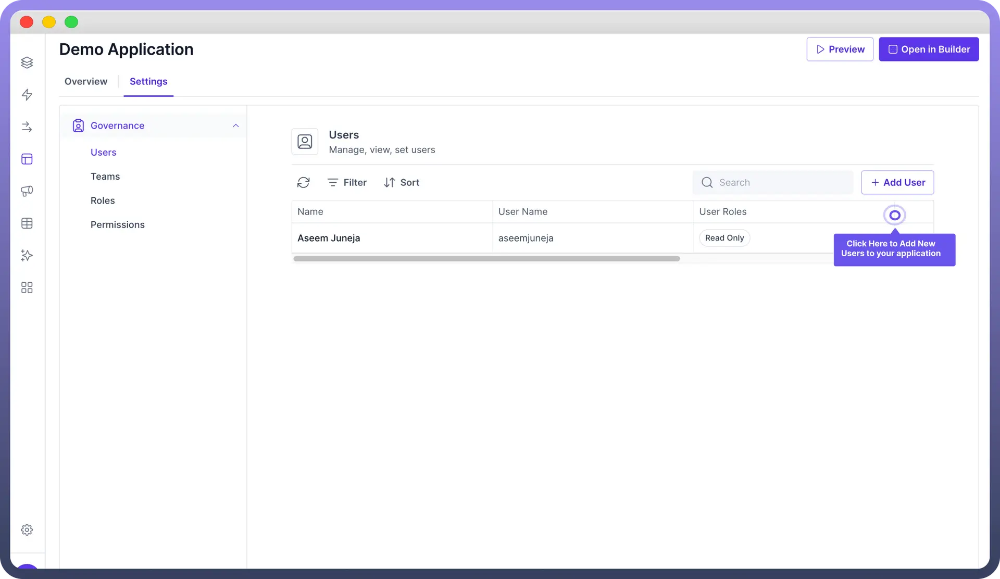
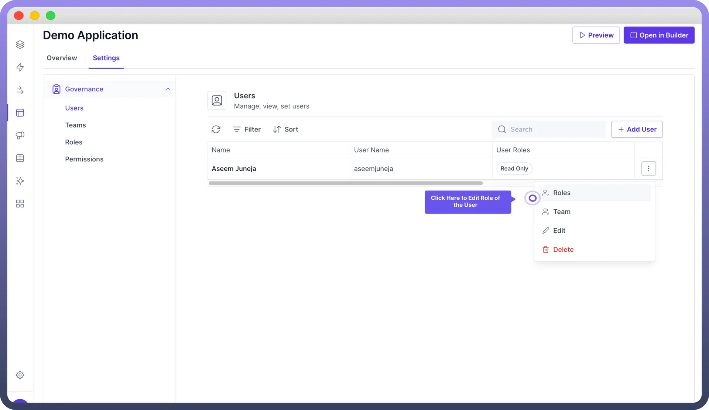
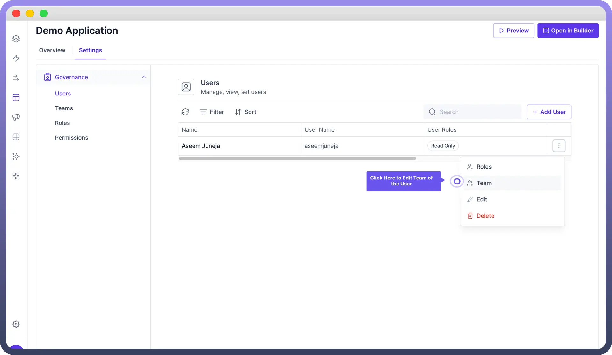
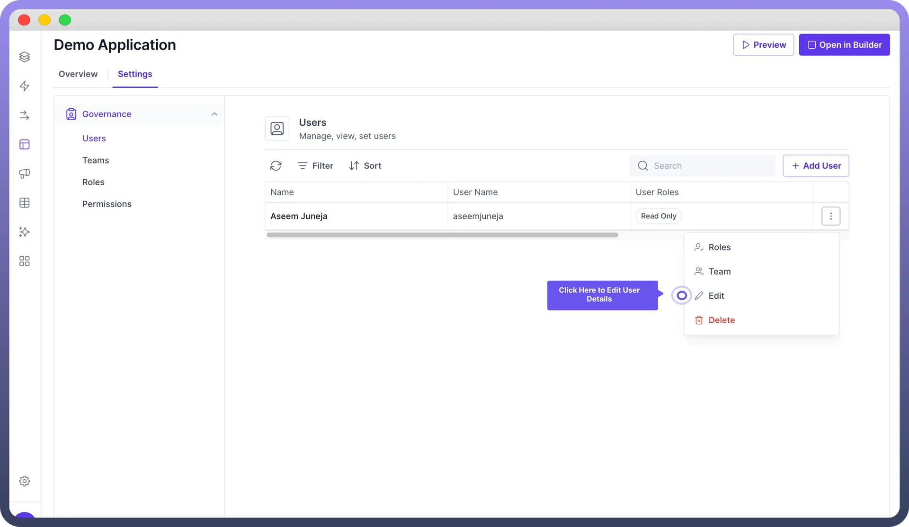
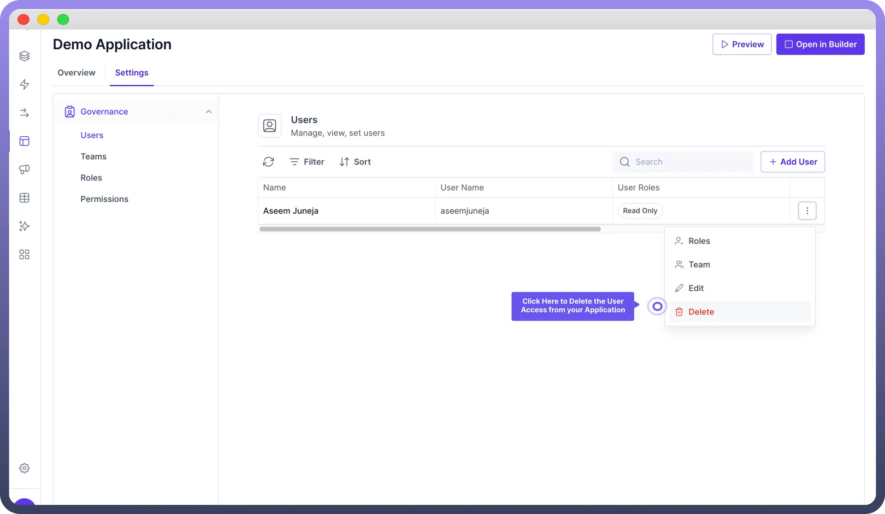

# User Management

Source: https://www.unifyapps.com/docs/unify-applications/user-management
Section: applications

---

## Overview

User management is a crucial aspect of application governance. It allows you to **control** access, **assign** roles, and **organize** users into teams to maintain security, streamline automations, and ensure proper data access within your application.

This article will help you with user management tasks.

## Add New Users

To add a new user to your application:

1. Navigate to the "`Settings`" tab of your application.
2. Click on "`Governance`" in the left sidebar.
3. Select "`Users`" from the submenu.
4. Click the "`+ New User`" or "`+ Add User`" button.
5. Fill in the required user details:
  - Name
  - Username
  - Password
  - State
  - Email
  - Any additional fields based on your user object schema **Note:** The input fields for users are dependent on the schema of the users object in Unify Objects. You can customize and expand user information by modifying the schema of the user object.
6. Click "`Create User`" to add the new user to your application.

## Change User Role & Permissions

Roles and permissions define what actions a user can perform within the application.

To change a user's role and permissions:

1. Go to the Users section in Governance settings.
2. Find the user you want to modify and click the three dot"`...`" menu.
3. Select "`Roles`" from the dropdown.
4. In the "`User Roles`" tab, check or uncheck roles as needed.
5. Click "`Save`" to apply the changes.

## Change User Team

Teams help organize users into groups for easier management and access control.

To add a user to a team:

1. In the Users section, find the desired user and click the three dot "`...`" menu.
2. Select "`Team`" from the dropdown.
3. In the "`User Teams`" tab, check the boxes next to the teams you want to add the user to.
4. Click "`Save`" to confirm the changes.

> **Note:** Users can be added to multiple teams as well to reflect various roles or responsibilities within the organization.

## Edit User Details

To edit a user's information:

1. Locate the user in the Users list.
2. Click the three dot "`...`" menu next to their name.
3. Select "`Edit`" from the dropdown.
4. Modify the necessary fields in the "`User Details`" tab.
5. Click "`Save`" to update the user's information.

## Delete a User

To remove a user from your application:

1. Find the user in the Users list.
2. Click the three dot "`...`" menu next to their name.
3. Select "`Delete`" from the dropdown.
4. Confirm the deletion in the popup dialog.

## Best Practices

1. Regularly **review** user roles and permissions to maintain proper access control.
2. Use descriptive usernames and enforce **strong password** policies.
3. **Organize** users into teams based on their responsibilities or departments.
4. Implement the principle of **least privilege**, granting users only the permissions they need.
5. Periodically **audit** user accounts and remove inactive or unnecessary users.
