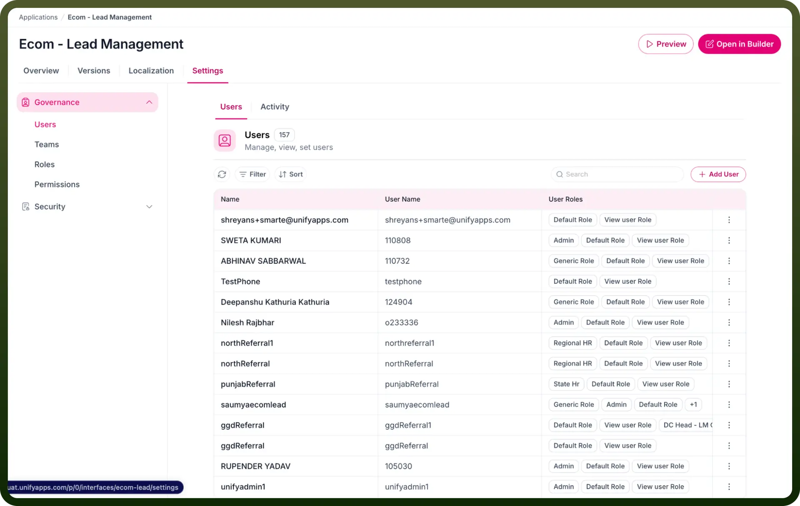
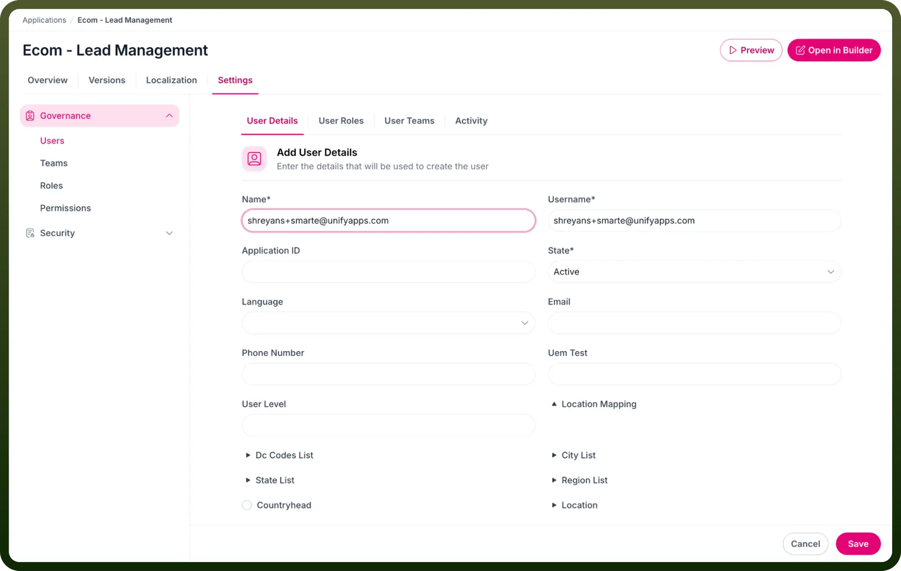
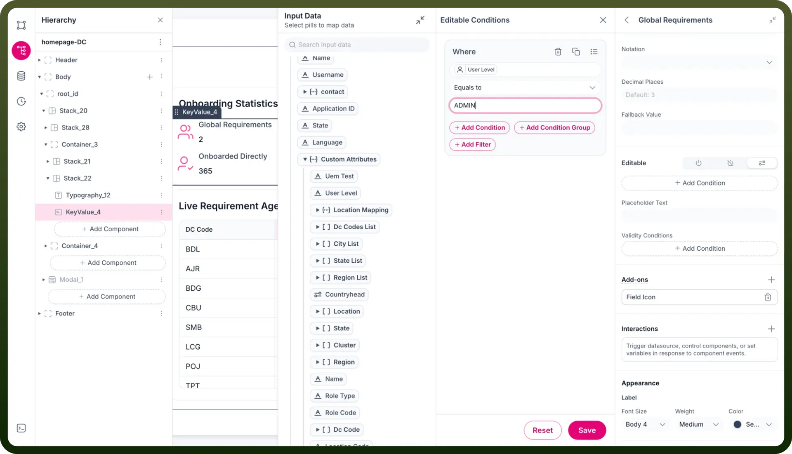
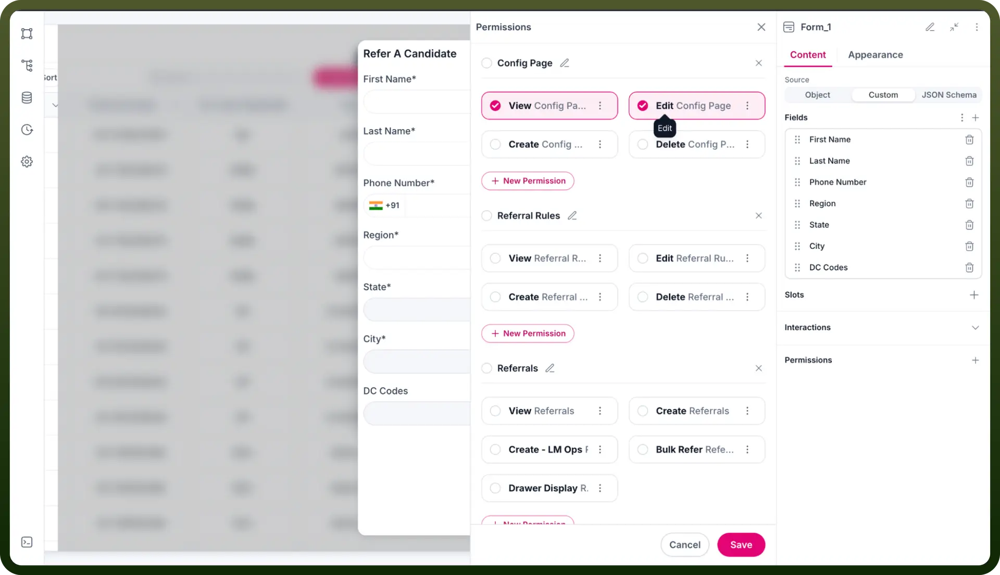

# User management component

Source: https://www.unifyapps.com/docs/unify-applications/user-management
Section: applications

---

## Overview

The User Management feature in Application Governance by UnifyApps helps manage application user access efficiently. It facilitates the assignment of roles, teams, and specific permissions through role-based access control (RBAC), ensuring secure and organized user management within applications.

## Use Cases

**Access Control**

Administrators assign roles and teams to application users, ensuring appropriate access levels based on responsibilities and security requirements.

**Compliance and Security**

Organizations enforce RBAC by configuring precise user permissions, enhancing compliance with internal security policies and regulatory standards.

## Step-by-Step Guide

**Assign Roles and Teams (Outside Builder in Settings)**

1. Navigate to the Application Governance section.
2. Select the `User Management` tab.

  

3. Click on the `Add User` button.
4. Select the user from the dropdown menu.
5. Assign the appropriate `Role` and `Team` from the dropdown.

**Set Access Conditions (Inside Builder)**

- Open the application builder.
- Select the specific item in the builder for which you want to define access conditions.
- Click on `Add Condition`.
- Define conditions for access (e.g., User is part of Team A, Role is Admin).

**Configure Permissions (Inside Builder)**

- Open the application builder.
- Select the specific item in the builder for which you want to define access conditions.
- Click on `Permissions`.
- Select the specific permissions required for the user based on their role or team.

> **Note:** Either **Set Access Conditions** or **Configure Permissions** can be used independently based on application requirements.

## Inputs and Configurations

- `User`: Select the user to manage access for.
- `Roles`: Choose predefined roles to assign.
- `Teams`: Choose predefined teams for organizing users.
- `Conditions`: Optional conditions to enforce specific access scenarios.
- `Permissions`: Granular access rights selectable from available permissions.

## Outputs

- Assigned roles and teams are displayed in the user's profile.
- Configured permissions or conditions define exact actions a user can perform.
