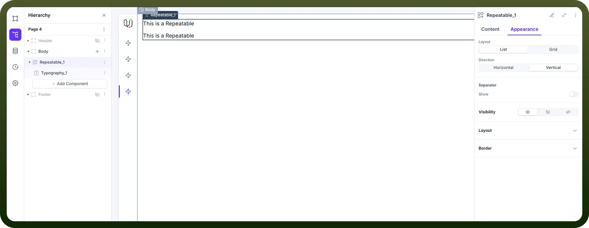
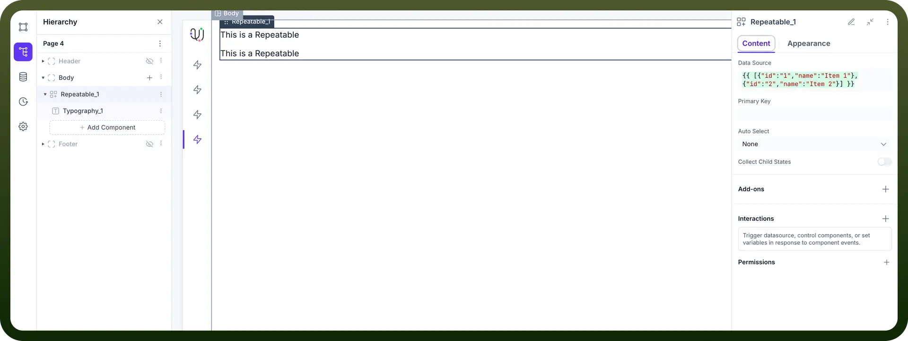
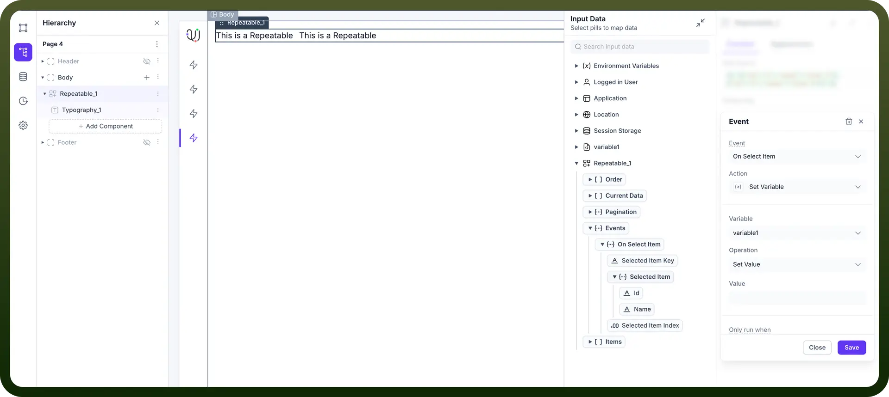

# Using repeatable component

Source: https://www.unifyapps.com/docs/unify-applications/using-repeatable
Section: applications

---

The **Repeatable** component is a powerful tool for displaying dynamic lists or grids of data within your application. It works by taking a component or a group of components you design (a template) and repeating it for each item in a given data source.

This is essential for building common UI patterns like product catalogs, user lists, task lists, comment threads, news feeds, and any other interface that needs to display a variable number of similar items.

## Key Properties / Configuration (Content Tab)

The **Content** tab is where you connect your data and configure the core behavior of the Repeatable component.

- **Data Source:** This is the most important property. It requires an **array of objects** to function. Each object in the array will represent one instance of the repeated content on the screen.
  - You can either bind this to a data source that returns data in the correct format (e.g., from an API call or a Unify Data Object).
  - Or, you can manually enter a static array for prototyping, for example: `{{ [{"id":"1","name":"Item 1"},{"id":"2","name":"Item 2"}] }}`
- **Primary Key:**
  - **What it is:** The name of a field in your data source objects that contains a unique identifier for each item (e.g., `id, email, product_sku`). In the example above, id would be the primary key.
  - **Why it's needed:** This allows the platform to efficiently track, update, and manage interactions for each individual item in the list, especially when items are selected or changed.
- **Auto Select:**
  - **What it is:** This setting determines if an item should be automatically selected when the list first loads.
  - **Options:**
    - `None`: No item is selected by default.
    - `First Item`: The first item from your data source is automatically selected.
    - `Last Item`: The last item from your data source is automatically selected.
  - **Why it's useful:** Ideal for creating master-detail layouts where selecting an item in the list displays its details in another part of the page. Auto-selecting the first item can populate the detail view on page load.
- **Collect Child States:**
  - **What it is:** A toggle switch to gather information from components inside your repeated items.
  - **Why it's useful:** Turn this **ON** if you have input components (like text fields, toggles, or dropdowns) within your repeatable template and you need to collect the values from *all* instances at once (e.g., submitting a form that contains a list of items with quantities). When off, the component is more performant as it doesn't track these individual states.

**Other Properties**

- **Add-ons:** Configure additional functionalities like search or filtering for the list.
- **Interactions:** Define actions that can be triggered by events on the Repeatable component itself, such as `On Row Clicked.`
- **Permissions:** Standard Unify Applications feature to control the visibility of the entire component based on user roles.

## Binding Data to Child Components

To make the Repeatable component useful, you need to display the data for each item. Any component you place inside the Repeatable (your "`template`") gets access to a special `currentItem` object.

- **currentItem:** This object represents the data for a single item in the Data Source array for that specific instance.
- **How to use it:** You can bind the properties of `currentItem` to the components inside the Repeatable. For example, if your template has a Text component, you could set its value to `{{currentItem.name}}` to display the name of each item from your data source.

## Working with Selected Items

A powerful feature of the Repeatable component is its ability to track which item a user has selected. This is the key to building interactive, master-detail interfaces.The component does this by exposing a special property called selectedItem. This property is an object that holds all the data for the currently selected row (e.g., `{"id": "user-01", "name": "Alice"}`).

When a user clicks on an item in the list, the Repeatable component triggers an `On Select` Item event. By navigating to the **Interactions** tab for your Repeatable component and adding an action to this event, you gain access to the context of that specific selection.

Within the data mapping panel for this event, you will see a new `On Select` Item object under `Events`. This object contains the `Selected Item` (the full data object for the row that was clicked), Selected Item Key (the value from the field you designated as the Primary Key), and `Selected Item Index` (the position of the item in the array, e.g., 0 for the first item). You can then map these data pills to perform actions. For example, to store the ID of the selected user into a variable, you would:

1. Choose the **Event** `On Select Item`.
2. Choose the **Action** `Set Variable`.
3. Select your target **Variable** (e.g., `variable1`).
4. For the **Value**, map the data pill from `Events > On Select Item > Selected Item > id.`

Now, every time a user clicks a different item in the list, variable1 will be updated with the corresponding ID, which you can then use to trigger other data sources to fetch more details for that specific item.

## Appearance Customization (Appearance Tab)

The **Appearance** tab allows you to control how your list or grid of items is displayed.

- **Layout:** Choose the overall arrangement of your repeated items.
  - **List:** Arranges items in a single row or column.
    - **Direction:** Set to `Horizontal` or `Vertical`.
    - **Separator:** Optionally, show a separator line between items. You can configure its `Color, Margin, Height (thickness).`
  - **Grid:** Arranges items in a grid with multiple columns.
    - **Columns:** Specify the number of columns you want the grid to have.

### Common Layout & Styling

Both List and Grid layouts have standard styling options for the main container:

- **Layout Properties:** `Width, Height, Margin, Padding, Gap` (the space between each repeated item), `Overflow, Wrap.`
- **Border Properties:** `Width, Color,` and `Corner Radius` for the border around the entire Repeatable component.

## Use Cases

- **Product Listings:** Displaying a grid of products with images, names, and prices.
- **User Directories:** Showing a vertical list of users with their avatar, name, and role.
- **Task Management:** A list of tasks where each item is a complex component containing a checkbox, task description, and due date.
- **Feeds and Timelines:** Displaying a series of posts or events in a vertical list.

## Best Practices

- **Ensure a Unique Primary Key:** Always use a `Primary Key` that is guaranteed to be unique for each item in your data source. Using a non-unique key can lead to unexpected behavior with selection and data updates.
- **Optimize for Performance:** For large datasets, avoid binding the entire raw data source directly. Use data source queries with pagination (`limit` and `offset`) to fetch data in manageable chunks.
- **Keep Templates Simple:** The set of components inside the Repeatable (your template) will be duplicated for every item. Keeping this template as simple and efficient as possible will improve your application's loading speed and performance.
- **Use** `Collect Child States` **Sparingly:** Only enable the `Collect Child States` toggle when you absolutely need to read input values from every instance of your repeated template (e.g., submitting a multi-row form). Keep it disabled for better performance in read-only lists.
- **Provide a Loading State:** The data source connected to your Repeatable will have an isLoading property. Use this to conditionally display a **Loader** component, providing visual feedback to the user while data is being fetched.
- **Handle Empty States:** If the data source might be empty, place the Repeatable inside a Container. You can then use conditional visibility to show the Repeatable only if data exists (e.g., `{{!datasource.isEmpty}}`) and show a different component (like a Text message saying "`No items found`") when it's empty.
