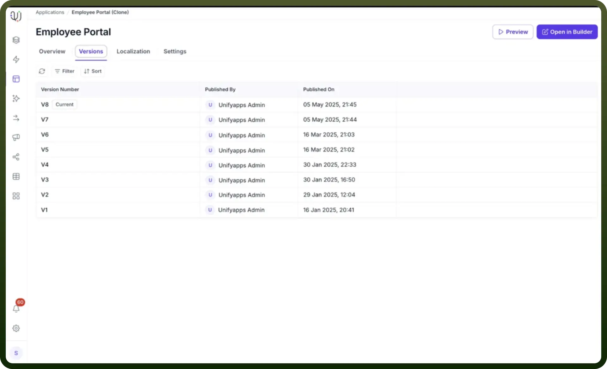
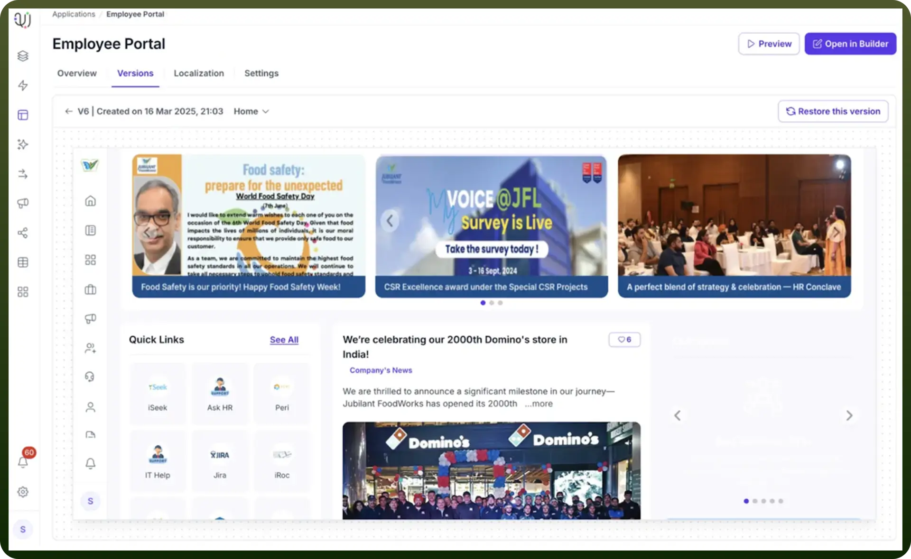
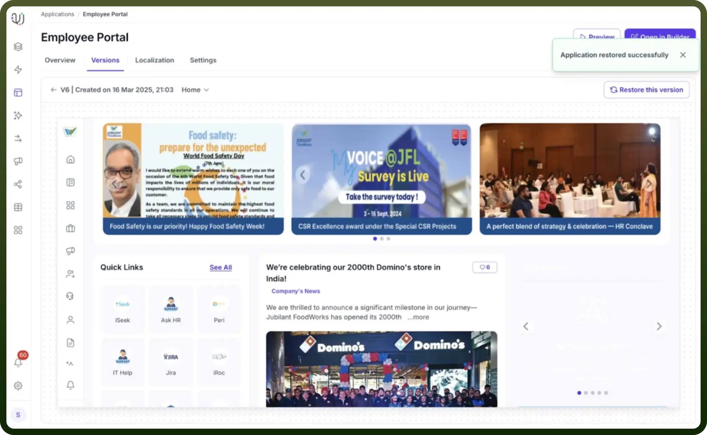

# Version control component

Source: https://www.unifyapps.com/docs/unify-applications/version-control
Section: applications

---

## Overview

Version Control in UnifyApps enables users to track, manage, and restore previous iterations of their applications. This powerful feature provides a comprehensive view of all deployed versions, allowing teams to monitor changes, collaborate effectively, and quickly revert to previous stable configurations if needed.

## Key Features

**Version Tracking**

- View a complete history of application versions
- Track details such as:
  - Version Number
  - Published By
  - Published On

**Version Restoration**

- Easily restore any previous version of the application
- Maintain a clear audit trail of application modifications

## How to Use Version Control

**Accessing Version History**

1. Navigate to the "`Versions`" tab in your application
2. Review the list of deployed versions
3. Observe key details for each version:
  - Version Number
  - Publisher's email
  - Publication timestamp

**Restoring a Previous Version**

1. Locate the desired version in the version list
2. Click the "`Restore this version`" button

3. Confirm the restoration
4. The system will display a confirmation message: "`Application restored successfully`"

## Supported Information

Each version entry includes:

- Unique Version Number
- Publisher's Identity
- Exact Publication Timestamp

## Use Cases

- Track application evolution
- Recover from unintended changes
- Maintain a comprehensive modification history
- Collaborate effectively across development teams
