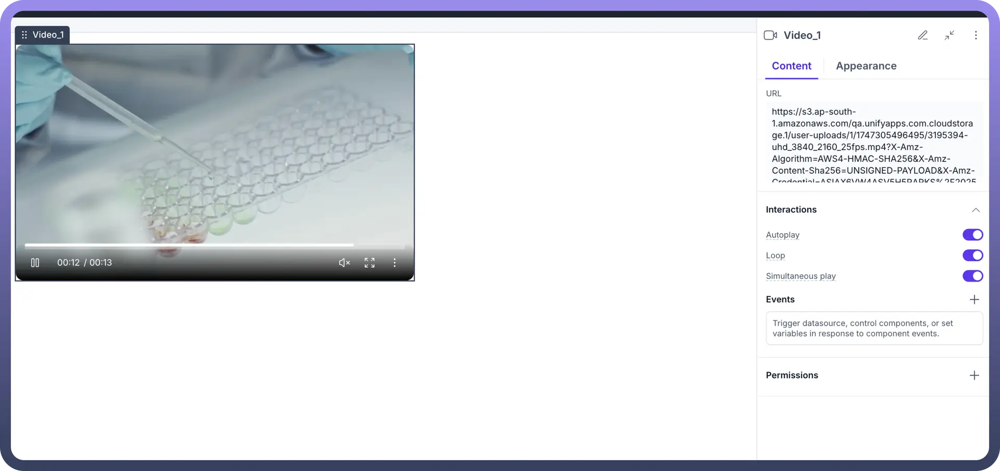

# Video

Source: https://www.unifyapps.com/docs/unify-applications/video
Section: applications

---

## Overview

The **Video** component allows users to add videos inside their low code application. It supports multiple formats including MP4, WebM, and MOV, and can be easily configured with custom controls and styling options. The component enables responsive playback across desktop and mobile devices, providing a seamless video experience for end users without requiring any coding knowledge.

## Configuring Video component

You may configure a Video component by following the below steps:

1. Add the “`Video`” component from your component list to your application body.
2. You can define content using the following properties:

| **Property** | **Description** |
|---|---|
| `URL` | Paste the URL where your video is hosted. Once added, preview of the video can be seen in the application builder.  
 Best practice for uploading video URLs is to create a File Type object in UnifyApps and upload the video file there. Once uploaded, the URL can be fetched by clicking on that record and getting it from its details. |
| `Interactions: Autoplay` | If switched ON, the video will start autoplaying whenever the page is opened/refreshed |
| `Interactions: Loop` | If switched ON, the video will keep on playing in loop until it is explicitly paused by the user |
| `Interactions: Simultaneous play` | If switched ON: Multiple videos can play at the same time. If switched Off: Playing this video will pause others currently playing |

## Video Appearance Customization

Following options are available for the users:

1. **Show Controls:** Switch On this toggle to show video controls like:
  - Play
  - Pause
  - Make full screen
  - Volume control
  - Settings -> Download video
  - Settings -> Playback speed (0.25x to 2x)
2. **Controls size**
  - You can choose from different size options for video controls : xs, sm,md,lg Other generic layout and visibility options are also available, details for which can be found in the table below:

    

| Attributes | Properties |
|---|---|
| `Padding` | Add space inside an element's border to create separation between the content and the border. |
| `Height` | Set the height of an element to control its vertical size. |
| `Min-Height` | Define the minimum height an element can be, ensuring it doesn't shrink below this value. |
| `Max-Height` | Specify the maximum height an element can reach, preventing it from growing too tall. |
| `Gap` | Set the space between rows and columns in a grid or flex container to create consistent spacing. |
| `Margin` | Set the outer space around an element to create distance between it and surrounding elements. |

### Visibility Customizations

- You can define the visibility of the field based on the options provided, either make it visible in the application, invisible in the application and only make it available in hierarchy or add visibility conditions.
- You may also add a conditional visibility on the icon. **Note:** For more detailed information on styling a component, refer to the [Appearance](https://www.unifyapps.com/docs/unify-applications/container) article.

## Defining Permissions

Every component allows you to set visibility permissions based on the permissions granted to the logged-in user. This ensures that only authorized users can view and interact with the component.

> **Note:** You can refer to Permissions documentation to know more about defining permissions for each component.
