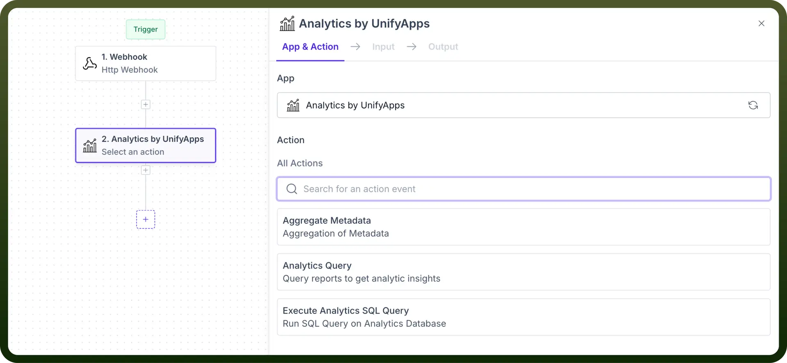
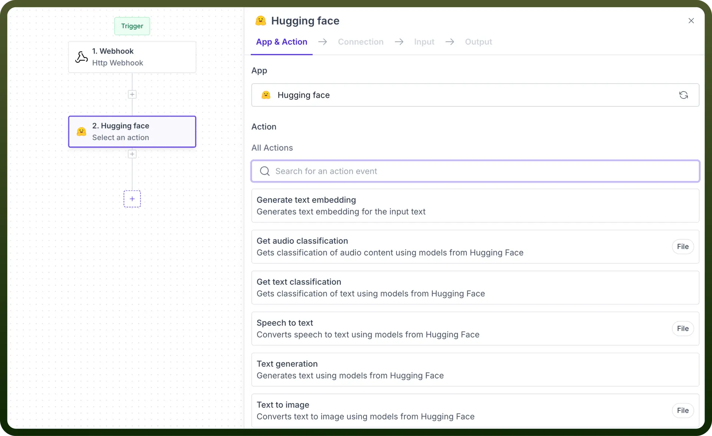

# Add Actions

Source: https://www.unifyapps.com/docs/unify-automations/add-actions
Section: automations

---

## Overview

We can define a series of actions in an automation that will allow you to specify what should happen when a trigger event occurs.

It involves configuring tasks such as **sending** notifications, **updating** records, or **creating** new entries, **enabling** you to automate repetitive processes.

## Types of actions

Actions can stem from:

- **Internal connectors** These actions include the ones in nodes like PII by UnifyApps, Unify AI, etc.

  

- **Application connectors** These actions are the various methods available in app connectors like Salesforce, Jira, etc.

  
