# Add your connector

Source: https://www.unifyapps.com/docs/unify-automations/add-your-connector-sdk
Section: automations

---

## Overview

The Connector SDK  is a powerful tool that allows you to create custom connectors for applications not directly supported by UnifyApps pre-built connectors library. It provides a framework for defining authentication methods, actions, and data schemas, enabling seamless integration with various APIs and services.

This article will guide you through the process of creating and configuring a custom connector using the Connector SDK.

## Create a Custom Connector

**Navigate to Connector SDK**

The Connector SDK can be accessed through the platform tools.

1. Go to the platform tools and Click on "`Connector SDK`".
2. You will see a list of all custom connectors created in the environment.

  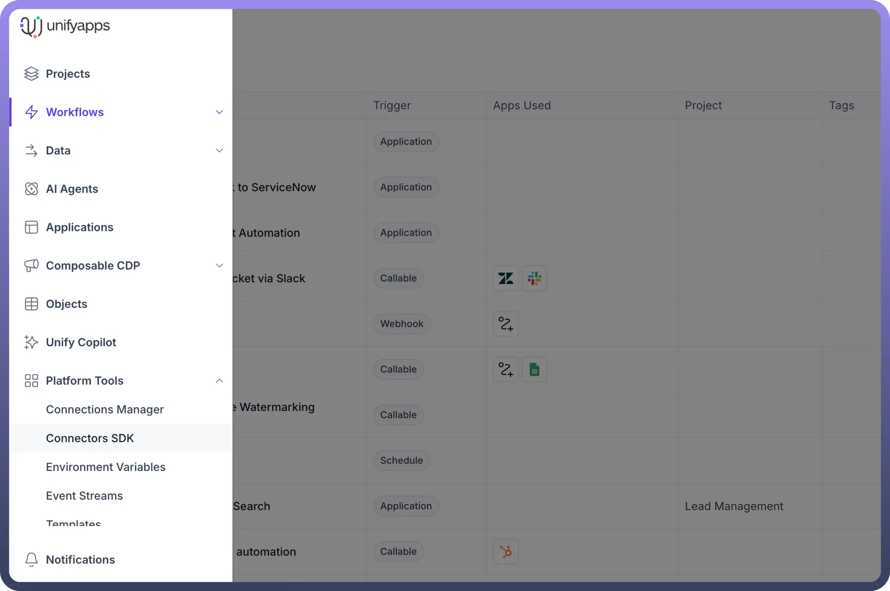

**Create a New Custom Connector**

Creating a new custom connector involves defining its basic properties. This step sets the foundation for your connector's identity and purpose.

1. Click on "`New Custom Connector`" in the top right corner.

  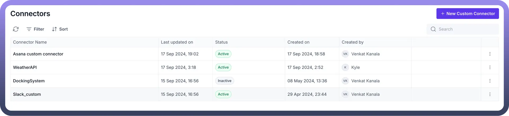

2. Enter the Connector Name (e.g., "Asana Custom Connector").
3. Provide a description for better understanding.
4. Enter the base URL (the consistent part or root of your website's address).
5. Click the "`Create`" button.

  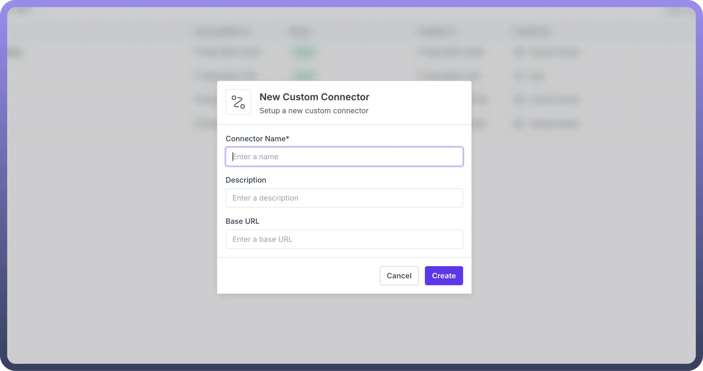

## Configure Authentication

Defining how your connector will authenticate with the target application involves:

1. In the Authentication tab, click on "`New Authentication`".

  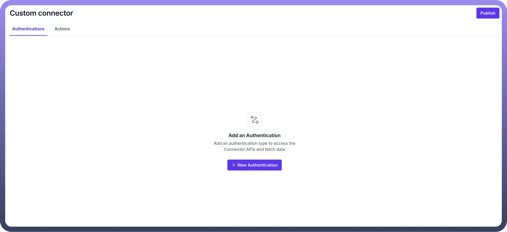

2. Provide a name for the authentication method (e.g., "API Key").
3. Define the authentication type for the API request (e.g., Access Token).
4. Click the "`Create`" button.

  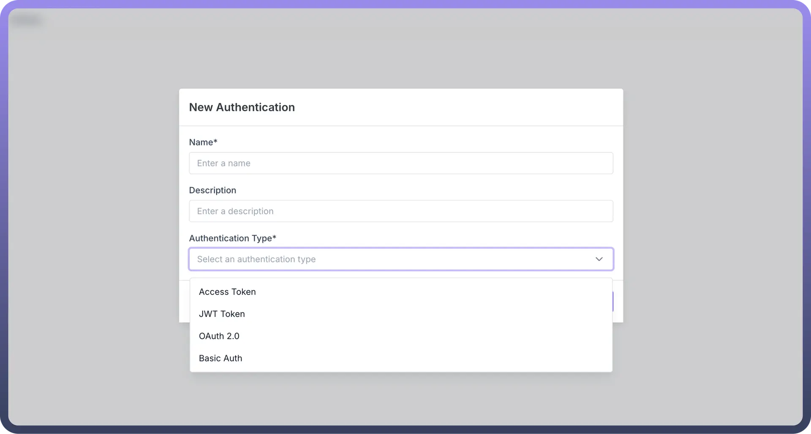

**Set Up Input Schema**

The input schema defines what information is required from the user for authentication.

1. In the Input tab, define the input required from the user to authenticate the API request.
2. You can set up the input schema through "`Setup using JSON`" or add fields manually.
3. Create a field (e.g., "Access Token") with the appropriate field type (e.g., String).

  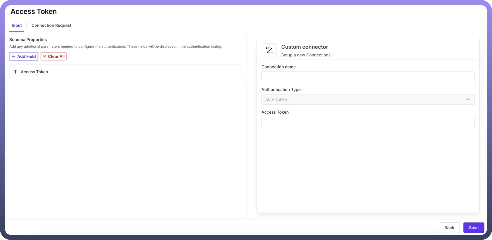

**Configure Connection Request**

The connection request specifies how the authentication information is sent to the API.

1. In the Connection Request tab, pass the Access Token in the header.
2. Provide the key for the header (e.g., "Authorization").
3. Set the value for the header (e.g., "Bearer {{access_token}}").
4. Click the "`Save`" button to establish authentication.

  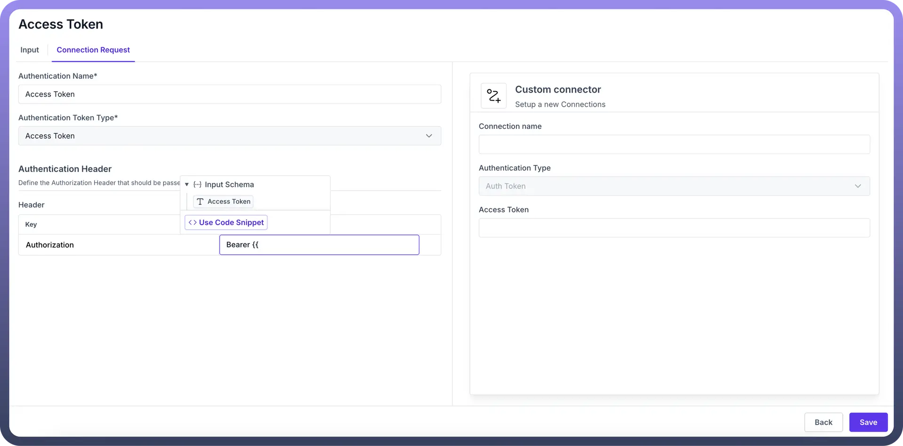

## Create an Action

**Create a New Action**

Each action represents a specific operation your connector can perform. This step allows you to define and name these operations.

1. Navigate to the Actions tab and click on “`New Action`”
2. Provide a name for the action (e.g., "Get Task Details").
3. Add a description (e.g., "Get task details using task ID in ASANA").
4. Click the "`Create`" button.

  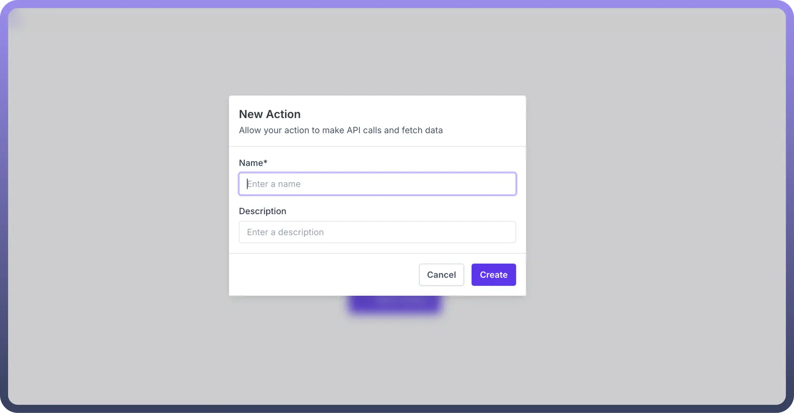

**Configure Action Input**

Action inputs define what necessary data from the user is needed to perform the action..

1. Create fields in the input schema as required (e.g., "Task ID" as a string).

  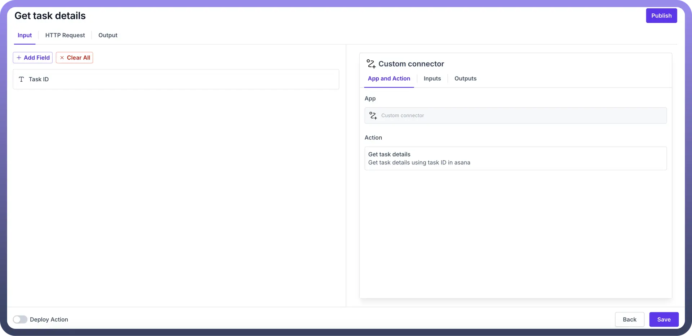

**Define HTTP Request**

The HTTP request specifies how your connector interacts with the API. This step is crucial for ensuring your action communicates correctly with the target application.

1. Define the schema of the API manually or import a curl command.
2. If you need to Map dynamic values that are being fetched from input as path or query parameter or as a header, then use double curly braces (e.g., {{task_id}}).

  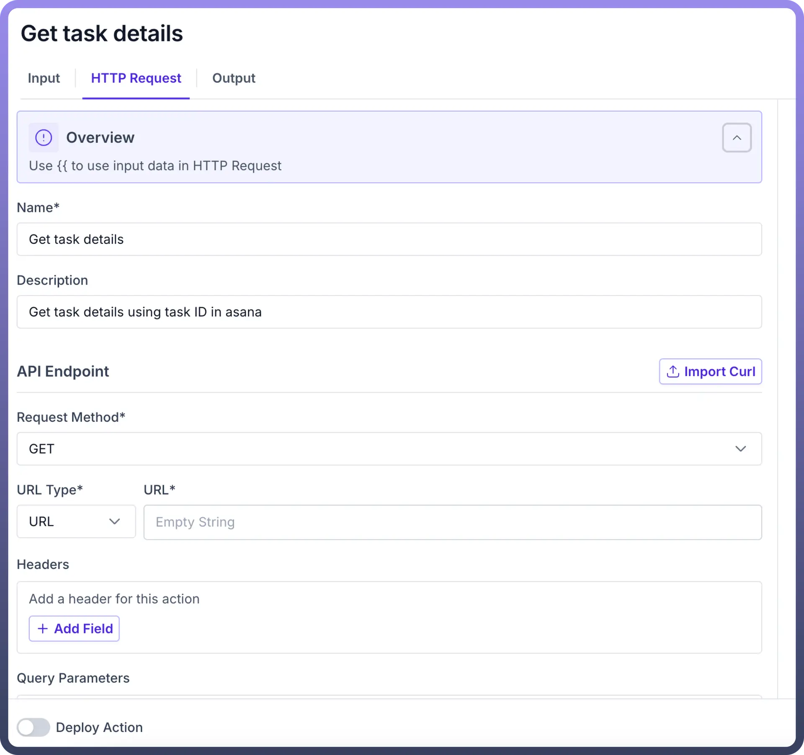

**Define Output Schema**

The output schema defines what data your action will return.

1. Click on the Output tab.
2. Set up fields manually or use "`Setup using JSON`" with a sample output JSON schema.
3. Click the "`Save`" button.

  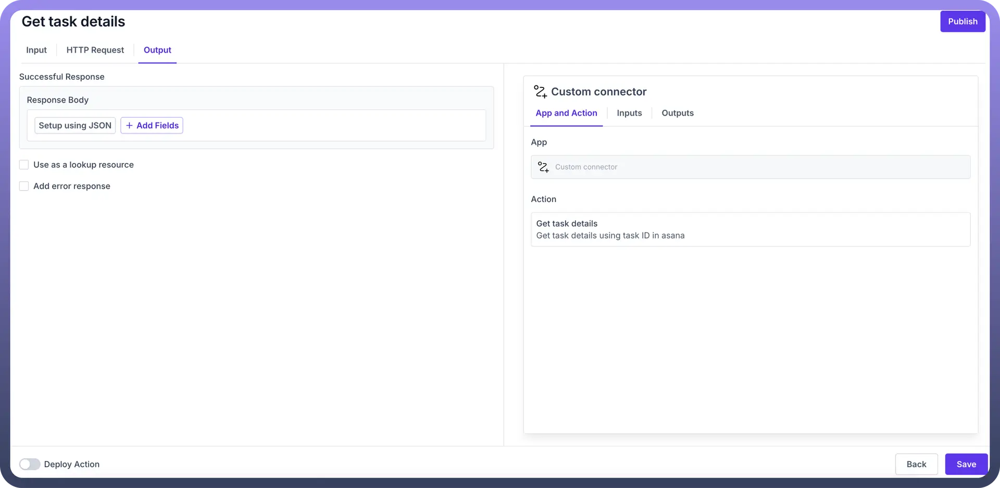

**Deploy and Publish**

Deploying and publishing makes your connector available for use. This final step brings your custom connector to life within the Unifyapps ecosystem.

1. Click the "`Deploy Action`" toggle to deploy the action.
2. Click the "`Publish`" button to make the custom connector available in the connector list.

## Test the Custom Connector

Custom connectors are exposed in automation builder as soon as they are published , users have the capability to control the access of specific connector or connector actions through platform roles. It is suggested that you test a newly created action in the automation builder by following below steps.

1. Create a new automation (e.g., "Get Task Details from Asana").
2. Select the trigger type (e.g., webhook).
3. Search for the custom connector and select the action that you have created.
4. Create a new connection by selecting the authentication type and provide the authentication information.
5. Provide the required inputs (e.g., Task ID).
6. Save the configuration.
7. Navigate to the Test tab and click "`Start New Test`".
8. Click the "`Run Test`" button to execute the automation.
9. View the input and output of your custom connector in the right pane.

By following these steps, you can successfully create, configure, and test a custom connector using the Connector SDK, allowing you to integrate with applications not directly supported by Unifyapps's pre-built connectors. The Connector SDK empowers you to extend the capabilities of your Unifyapps environment, enabling seamless connections with a wide range of APIs and services.
