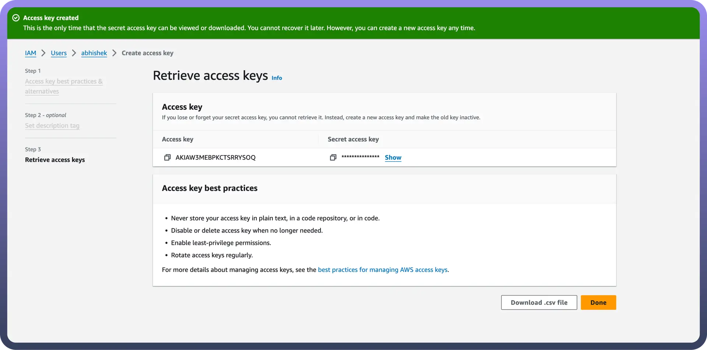
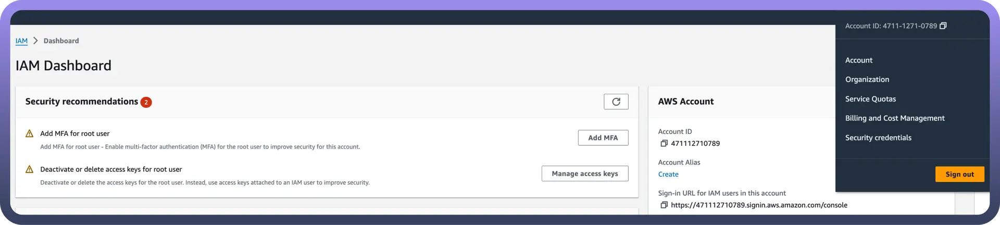
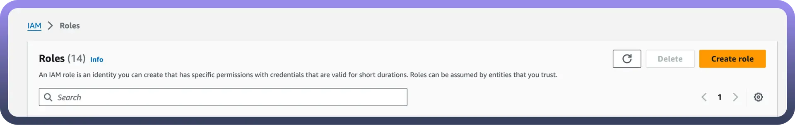
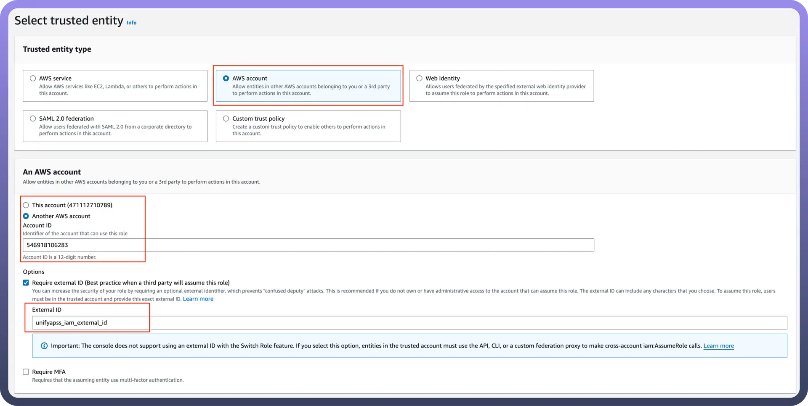

# Amazon S3

Source: https://www.unifyapps.com/docs/unify-automations/amazon-s3
Section: automations

---

Amazon S3 is a cloud-based storage service that offers scalable, secure, and reliable data storage.

Integrating your application with Amazon S3 revolutionises data storage and management, facilitating scalable, secure, and reliable cloud storage solutions.

## Authentication

Before you begin, make sure you have the following information:

- `Connection Name`**:** Choose a meaningful name for your connection. This name helps you identify the connection within your application or integration settings. It could be something descriptive like "MyAppAmazonS3Integration"
- `Authentication Type`**:** Select the type of authentication for connecting to your Amazon S3 account:
  - IAM Role
  - Access Key

### Access Key Based

1. Login into Amazon AWS Console and search for “`Users`” in the search bar present at the top of the console’s home page.
2. Click on “`Create user`” at the top right corner.
3. Sign in to the AWS Management Console by going to the AWS Management Console ([https://console.aws.amazon.com/](https://console.aws.amazon.com/)).
4. Navigate to the IAM (Identity and Access Management) dashboard by searching in the "`IAM`" search bar.
5. Provide the username and select permissions(AmazonS3fullaccess) policies by selecting “`Attach policies directly`” and click on create user button.
6. Once the user is created, click on the username of the user created and under the summary section click on create access key.
7. Select “`Command Line Interface`” as the use case and provide the description tag to the key and click on “create access key”.
8. Treat the access key and secret access key with high confidentiality, as it allows access to your Amazon S3 account.

  

### IAM Role Based

1. Sign in to AWS Management Console ([https://console.aws.amazon.com/](https://console.aws.amazon.com/)) and select security credentials.

  

2. Navigate to the IAM dashboard and click "`Roles`" > "`Create role`". ([https://docs.aws.amazon.com/IAM/latest/UserGuide/id_roles.html](https://docs.aws.amazon.com/IAM/latest/UserGuide/id_roles.html))

  

3. Under "`Trusted entity type`", choose the AWS account option.
4. Select "`Another AWS account`" and input the UnifyApps AWS account ID (contact support to obtain this).
5. Check the "`Require external ID`" box and enter the External ID provided by UnifyApps.

  

6. Assign the necessary permissions for UnifyApps to operate automated workflows within your account.
7. Give the IAM role a name and description.
8. Click the "`Select trusted entities`" Edit button to modify trusted entity policies if needed. (Optional)
9. Click the "`Add permissions`" Edit button to adjust permissions. (Optional)
10. If using object tags, select an appropriate tag for the IAM role. (Optional)
11. Click on Create Role to finalise the process.

### Create an IAM permissions policy

1. Go to the AWS Console and open the IAM console- [https://console.aws.amazon.com/iam](https://console.aws.amazon.com/iam)
2. Navigate to Access management and select Policies.
3. Choose Create Policy.
4. Locate and choose the AWS service that UnifyApps will access.
5. Select the required permissions under the Actions field.
6. Define the resources that the role will have access to.
7. Continue clicking Next until you reach the Review policy page.
8. Provide a Name for the policy.
9. Click Create policy once done.

### Retrieve IAM role ARN

1. Open the AWS Console and go to My Security Credentials > Roles.
2. Search for the IAM role you need for the connection.

  

3. Select the role to view its details.
4. Copy the Role ARN for use in the UnifyApps connection setup.

### Actions

| **Action** | **Description** |
|---|---|
| `Upload file` | Uploads a file into a bucket in Amazon S3 |
| `Create bucket` | Creates a bucket in Amazon S3 |
| `Delete file` | Deletes a file in Amazon S3 |
| `Download file` | Downloads contents of a specific file in Amazon S3 |
| `List files in bucket` | Retrieves the list of objects in a bucket from Amazon S3 |
| `Read file content as string` | Reads the contents of a file from a bucket and returns it as a string in Amazon S3 |

### Triggers

| **Trigger** | **Description** |
|---|---|
| `New file polling` | Triggers when a file is created or updated in amazon S3 via polling |
| `New file realtime` | Triggers when a file is created or updated in amazon S3 via webhook |
