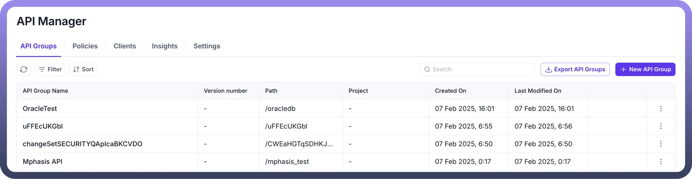
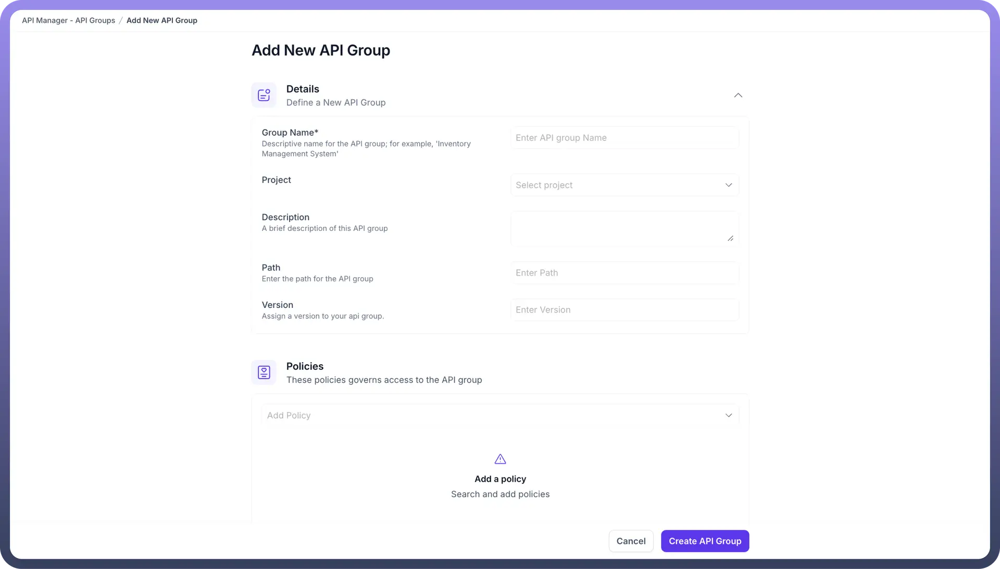
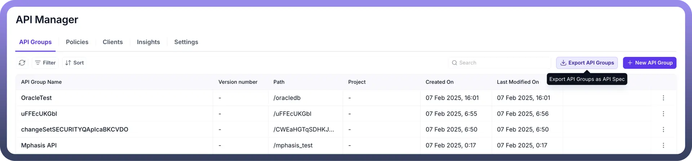

# API Groups

Source: https://www.unifyapps.com/docs/unify-automations/api-groups
Section: automations

---

## Overview

API Groups play a crucial role in organizing and managing API, grouping them according to their access patterns to streamline user interactions with APIs.

For example, a group of Salesforce endpoints configured for use by the Sales team should be organized into an API Group.

Each automation or process within your system can be transformed into a dedicated API, which gets executed whenever the API is called.

## Accessing API Groups

To view or create API Groups, navigate to the API manager section. Here, you will find all the groups available within your workspace.

## Creating your first API Groups

You can create your first API Group by clicking on “`New API Groups`” on the top right corner. Follow the prompts to create your API Groups. This may involve entering the following fields

1. **Name Your API Group:** Fill in the Group Name for your API collection. For instance, you can enter “UnifyApps task assignment”.
2. **Add Description:** Include a comprehensive description to define the purpose or functionality of your collection, enhancing clarity for future reference.
3. **Define Path**: Determine the URL path that will serve as the access point for your API group. For instance, entering "UnifyApps-task-assignment" results in a URL structure like "https://api-platform-global.ext-alb.qa.unifyapps.com/api/UnifyApps -task-assignment/{API path}".
4. **Specify Version:** Enter the Version you want to give to your collection. You can enter something like 1.0 or v1.
5. **Policies:** API Policies helps manage and govern the access of API. you can attach multiple policies to an API and can specify the order of execution of the policies by simply dragging the API policies.

  

## Exporting API Groups

To share or save the specifications of your API groups, use the "`Export API Groups`" at the top right of the API group’s page. This tool generates a YAML file containing all API details, making it convenient for sharing.

