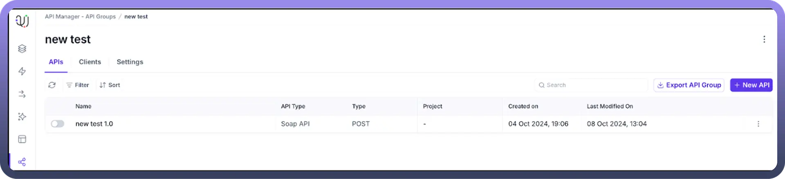
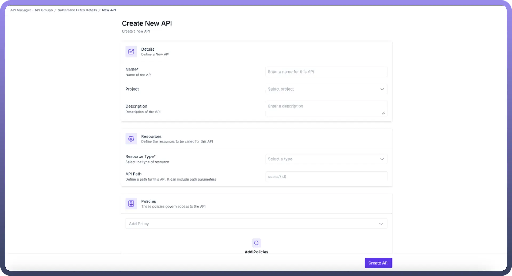
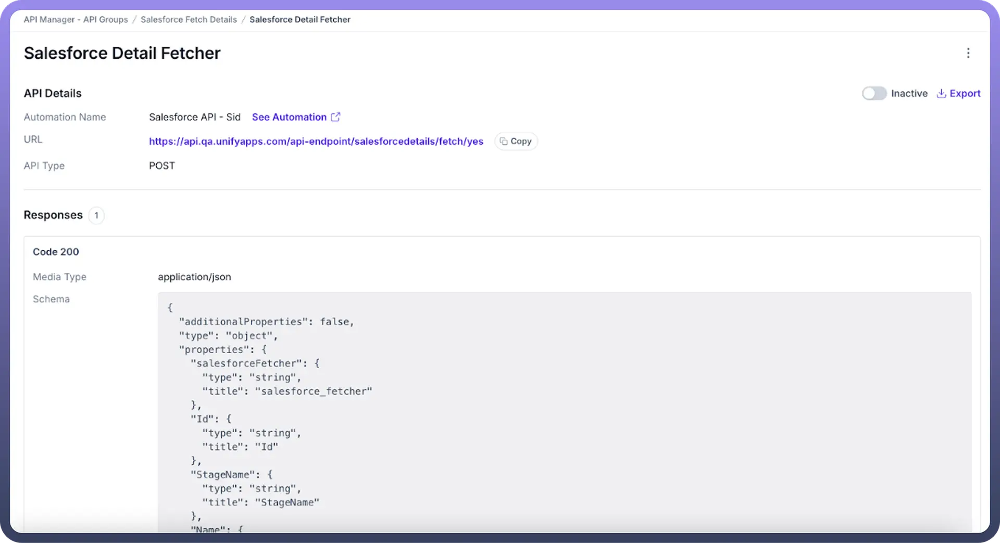
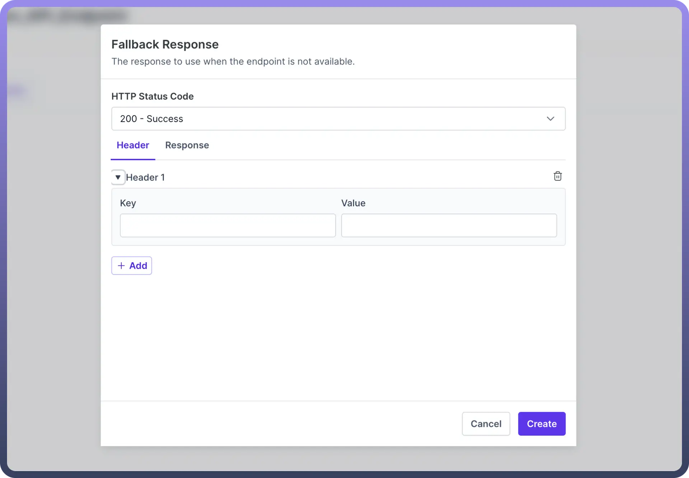

# API

Source: https://www.unifyapps.com/docs/unify-automations/api
Section: automations

---

## Overview

API acts as the gateways through which external applications interact with UnifyApps platform, allowing real-time data exchange.

These APIs are URLs pointing to specific operations or data within your system, making them accessible for automated processes or integrations

## Creating your first API

After you have created the API Group, you can create your first API by clicking on **“**`New API`**”** within the API Group. Follow the prompts to create your API. This may involve entering the following fields

1. **Name:** Provide a name to your API.
2. **Projec**t : Select the project where the API will be utilized
3. **Description:** Enter a concise explanation of what the API does.
4. **Resource Type:** It refers to the downstream resource you want to call through your API. The following are the different resource type available:
  - **Callable:**. Only automations with a "Trigger from an API endpoint" as trigger will appear in the API Automation selection After you have selected the callable as the resource type, you need to enter the following fields:
    - **API Path**: Specify the path for the endpoint URL, this can also include the path parameters
    - **Request type:** It refers to whether you want to call a Rest API or SOAP API based callable
    - **Automation:** Based on the resource type and request type, automation will be available in automation dropdown. Select an appropriate API automation from the available options
    - **Versions:** It represents the version of the automation you want to call while executing the API.
    - **HTTP Method:** Select the HTTP method (GET, POST, etc.) to be used for the API endpoint. **GET Method:** If you choose GET, you have the option to cache the response. You can enable caching by checking the "Cache Response" box and setting up the cache duration and key (which could be query parameters, path parameters, or headers). **POST Method and others:** If you need to send data in the request, select an appropriate method other than GET.
  - **Webhook:** Only automations with a "Trigger from webhook" as trigger will appear in the API Automation selection After you have selected the webhook as the resource type, you need to enter the following fields:
    - **API Path**: Specify the path for the endpoint URL, this can also include the path parameters.
    - **Automation:** Based on the resource type, automation will be available in dropdown. select an appropriate API automation from the available options.
    - **Versions:** It represents the version of the automation you want to call while executing the API.
    - **HTTP Method:** Select the HTTP method (GET, POST, etc.) to be used for the API endpoint.
      - **GET Method:** If you choose GET, you have the option to cache the response. You can enable caching by checking the "Cache Response" box and setting up the cache duration and key (which could be query parameters, path parameters, or headers).
      - **POST Method and others:** If you need to send data in the request, select an appropriate method other than GET.
      - **PUT :** If you need to update an existing resource, you can use the PUT method. When using PUT, you'll need to provide the complete updated representation of the resource in the request body. The API Client allows you to configure the request body, which could include JSON, XML, or other data formats, depending on the API's requirement
      - **Delete Method :** The DELETE method is used to remove a resource. When using DELETE, you typically include the ID or identifier of the resource you want to delete in the URL. The API Client allows you to specify the path parameters or query parameters needed for the DELETE request.
      - **Patch Method :** The PATCH method is used to partially update an existing resource. Unlike PUT, which requires the complete updated representation, PATCH allows you to send only the fields that need to be updated. The API Client supports setting the request body for PATCH requests, enabling you to send the partial update data
  - **LLM:** It enables direct interaction with AI models through your API endpoint After you have selected the LLM as the resource type, you need to enter the following fields:
    - **API Path**: Specify the path for the endpoint URL, this can also include the path parameters.
    - **LLM Model:** select the AI model to which you want to send the request to.
    - **LLM Request Type:** The API supports two primary request types for LLM interactions: **Chat**: Chat type is designed for interactive, conversational interactions where context and dialogue flow are important. **Completion**: Completion mode is optimized for single-shot, task-focused interactions where a specific output is required based on a single input
  - **External API:** It allows you to create proxy endpoints that connect to third-party APIs, enabling integration with external services After you have selected the External API as the resource type, you need to enter the following fields:
    - **API Path**: Specify the path for the endpoint URL, this can also include the path parameters.
    - **Downstream API URL:** Enter the target API endpoint that you want to call upon executing your API.
    - **HTTP Method:** Select the HTTP method to be used for the API endpoint from -
      - **GET Method:** If you choose GET, you have the option to cache the response. You can enable caching by checking the "Cache Response" box and setting up the cache duration and key (which could be query parameters, path parameters, or headers).
      - **POST Method:** If you need to send data in the request, select an appropriate method other than GET
      - **PUT :** If you need to update an existing resource, you can use the PUT method. When using PUT, you'll need to provide the complete updated representation of the resource in the request body. The API Client allows you to configure the request body, which could include JSON, XML, or other data formats, depending on the API's requirement
      - **Delete Method :** The DELETE method is used to remove a resource. When using DELETE, you typically include the ID or identifier of the resource you want to delete in the URL. The API Client allows you to specify the path parameters or query parameters needed for the DELETE request.
      - **Patch Method :** The PATCH method is used to partially update an existing resource. Unlike PUT, which requires the complete updated representation, PATCH allows you to send only the fields that need to be updated. The API Client supports setting the request body for PATCH requests, enabling you to send the partial update data.
  - **Event Stream :** Event stream facilitates decoupled, event-driven communication between systems, enabling flexible, scalable integration where publishers can trigger multiple consumers without modifications, supporting persistent message delivery and workflow orchestration**.** After you have selected the External API as the resource type, you need to enter the following fields:
    - **API Path** : Specify the path for the endpoint URL, this can also include the path parameters
    - **Event Stream** : Select the event stream that you want to execute
    - **HTTP Method** : Select the HTTP method (GET, POST, etc.) to be used for the API endpoint.
      - **GET Method:** If you choose GET, you have the option to cache the response. You can enable caching by checking the "Cache Response" box and setting up the cache duration and key (which could be query parameters, path parameters, or headers).
      - **POST Method and others:** If you need to send data in the request, select an appropriate method other than GET
      - **PUT :** If you need to update an existing resource, you can use the PUT method. When using PUT, you'll need to provide the complete updated representation of the resource in the request body. The API Client allows you to configure the request body, which could include JSON, XML, or other data formats, depending on the API's requirement
      - **Delete Method :** The DELETE method is used to remove a resource. When using DELETE, you typically include the ID or identifier of the resource you want to delete in the URL. The API Client allows you to specify the path parameters or query parameters needed for the DELETE request.
      - **Patch Method :** The PATCH method is used to partially update an existing resource. Unlike PUT, which requires the complete updated representation, PATCH allows you to send only the fields that need to be updated. The API Client supports setting the request body for PATCH requests, enabling you to send the partial update data
5. **Policies:** API Policies helps manage and govern the access of API. you can attach multiple policies to an API and can specify the order of execution of the policies by simply dragging the API policies. **Note:** GET requests cannot contain a body; if your automation requires sending data, use POST instead.

## API Details

Once you have created an endpoint, you can see the following attributes of the endpoint:

- **Automation Name:** This is the title of the automation process that gets activated when the specified API endpoint is accessed. Clicking on the "`See Automation`" link will take you to a preview page for this automation.
- **URL:** This is the address (endpoint) of the API that can be reached out to from outside sources.
- **API Type:** Indicates the HTTP request method (e.g., GET, POST) used by the API endpoint.
- **Response:**
  - **Code:** The status code that is sent back after the API has been successfully processed.
  - **Media Type:** Specifies the format of the data that will be returned.
  - **Schema:** Describes the structure of the output data.
- **Parameters:** Lists of query or path parameters that are part of the automation's configuration.

  

- **Fallback Response** It serves as a default reply when the API cannot fulfill a request due to issues like server errors, invalid input, or when no other specific response is applicable. Configuring a fallback back response:
  - **HTTP status code**: you can define the status code that will be sent along with the response, such as 500 - internal server error, etc.
  - **Headers**: headers are defined in key-value pairs. You can configure multiple headers for the response

    

  - **Response body:** define the response body in JSON format. You can also define the response body in different locales by clicking “`Add Another Response`”.
  - Finally, Click on the “`Create button`” to create the fallback response

## Activation and Access Control

Newly created endpoints within a collection are inactive by default. Activation is necessary for these endpoints to be callable. For activating the endpoint, the toggle associated with the endpoint needs to be turned on.

Additionally, manage who can access these collections by assigning them to a client's access profile, ensuring controlled and secure API access.

> **Note:** You can read more about API groups [here](https://www.unifyapps.com/docs/unify-automations/api-groups).

## Best Practices

1. **Naming Conventions:** Use clear, descriptive names for your endpoints. (e.g., /fetchUsers for a user resource).
2. **Version Your APIs:** Include version numbers in your endpoint paths (e.g., /api/v1/users).
3. **Performance Optimization**: Use caching judiciously for GET requests to improve response times.
