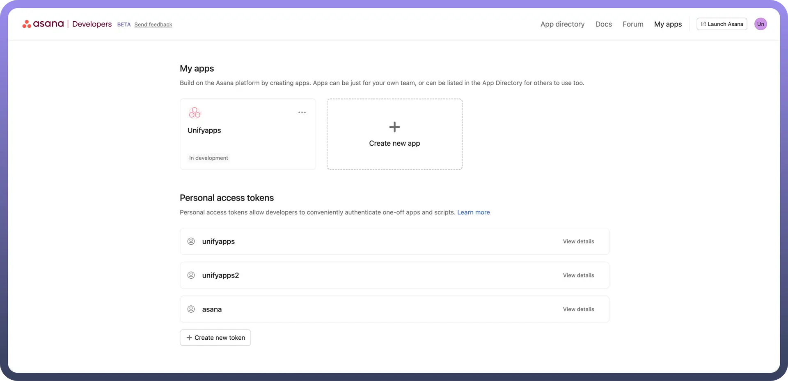
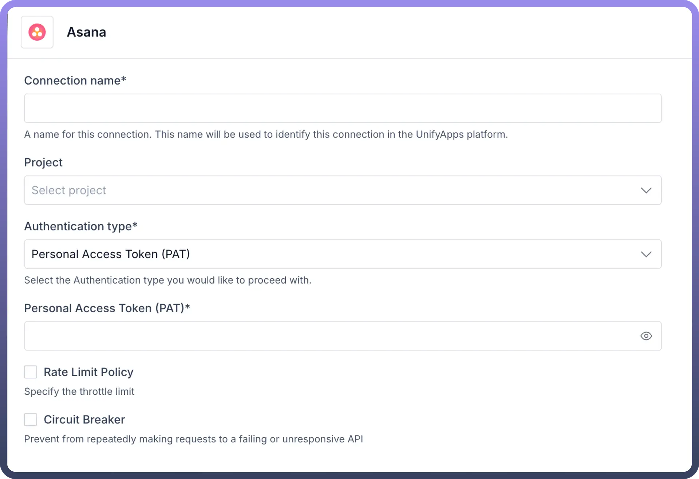
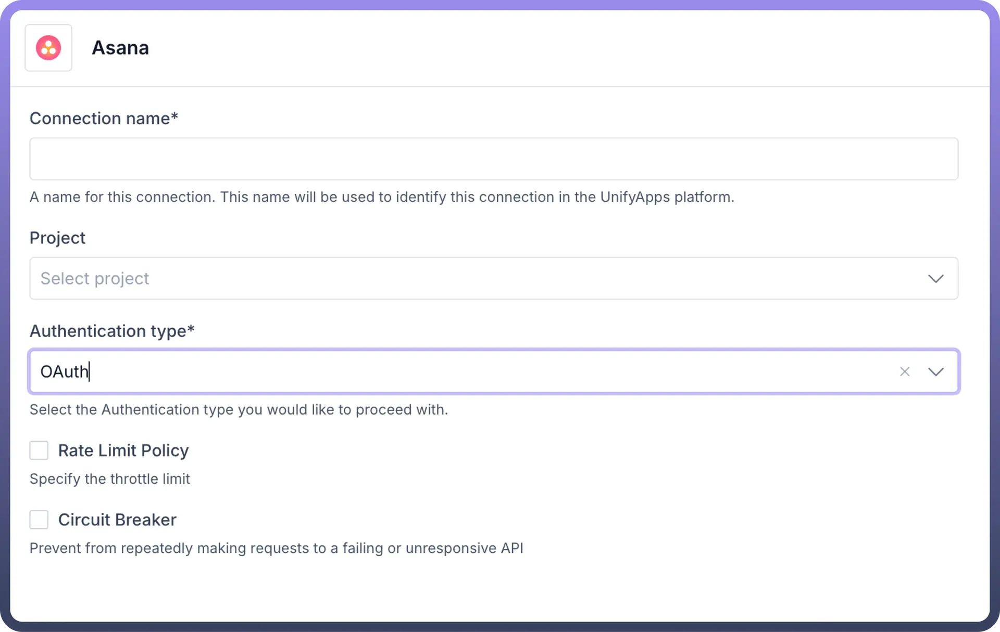

# Asana

Source: https://www.unifyapps.com/docs/unify-automations/asana
Section: automations

---

Using Asana makes managing tasks and projects easy and clear. It helps you **organize** work, **assign** tasks, and see how projects are moving along. Asana keeps all your project details safe with strong security. It's a great tool for working together smoothly and keeping everything on track.

Connecting your application to an Asana account enables you to interact with Asana's project management and tracking capabilities directly from your application.

## Authentication

Before begin, make sure you have the following information:

- `Connection Name`: The Connection Name is a unique identifier you choose for the connection between your application and your Asana account. It could be something descriptive like "MyAppAsanaIntegration"
- `Authentication Type`**:** Select the type of authentication for connecting to your Asana account:
  - OAuth based
  - Auth token based

#### Oauth based

To connect Asana using Oauth, first register your application with Asana to obtain a client ID and client secret. To do so, first visit the **developer console** and select `Create new app`, shown below:

To set up a proper OAuth flow, you need to provide your new application with two essential details:

1. `App Name` – This is the name of your application that users will see when it requests permission to access their account, as well as when they review the list of authorized apps.
2. `Redirect URL` – Also known as the callback URL, this is the address where the user will be redirected after a successful or failed authentication attempt. Native or command-line applications should use the special redirect URL urn:ietf:wg:oauth:2.0:oob. For security reasons, non-native applications must provide a URL that begins with "https".

After creating an app, you’ll find the OAuth tab in the sidebar, which will display your client ID (used to uniquely identify your app to the Asana API) along with the client secret.

Enter the following details on the Unifyapps platform

#### API Key based

You can generate a personal access token from the Asana [developer console](https://app.asana.com/0/my-apps).

Enter the personal access token obtained in the unifyapps platform to successfully connect to Asana

## Actions

The following actions are available to create custom automations on the Unifyapps platform:

| **Actions** | **Description** |
|---|---|
| `Add task to section` | Add a new task to section in Asana |
| `Attach file` | Attaches a file to a task in Asana |
| `Create a project` | Creates a project in Asana |
| `Create story` | Creates a story in asana |
| `Create subtask` | Creates a subtask in asana |
| `Create tag` | Creates a tag in asana |
| `Create task` | Creates a task in asana |
| `Get project details` | Gets project details from ID in asana |
| `Get project sections` | Gets all sections in the specified project from asana |
| `Get task details` | Gets task details by ID in asana |
| `Get user details` | Get user details by ID in asana |
| `List all tasks with tag` | List tasks with a tag from asana |
| `List people` | List people in asana |
| `List project tasks` | List tasks in a project in asana |
| `List workspaces` | List workspaces in asana |
| `Search projects` | Searches for projects in asana |
| `Search tags` | Searches for tags in asana |
| `Search tasks` | Searches for tasks in asana |
| `Update task` | Updates a task in asana |

## Triggers

The following actions are available to create custom automations on the Unifyapps platform:

| **Actions** | **Description** |
|---|---|
| `Create webhook in asana` | Create webhook on asana |
| `New membership` | Triggers when selected actions are performed on a membership in Asana |
| `New project` | Triggers when selected actions are performed on a project in Asana |
| `New section` | Triggers when selected actions are performed on a section in Asana |
| `New task` | Triggers when selected actions are performed on a task in Asana |
