# Audience Segments by UnifyApps

Source: https://www.unifyapps.com/docs/unify-automations/audience-segments-by-unifyapps
Section: automations

---

## Overview

**Audience Segments by UnifyApps** enables handling of multiple customer segments created in UnifyApps. This means you can fetch the Audience segments and take action on them like create a list of customers, modify segments, delete segment etc.

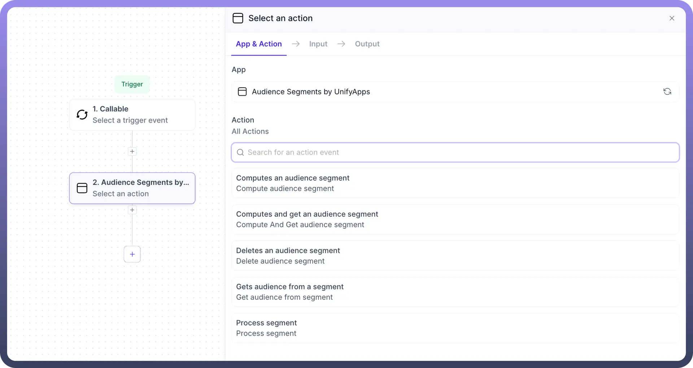

## Computes an Audience Segment

1. This node helps you to calculate the count/number of entries in any Audience segment.
2. Add the Audience Segment by UnifyApps node, select '`Computes an Audience segment`' option and provide below mentioned inputs.

  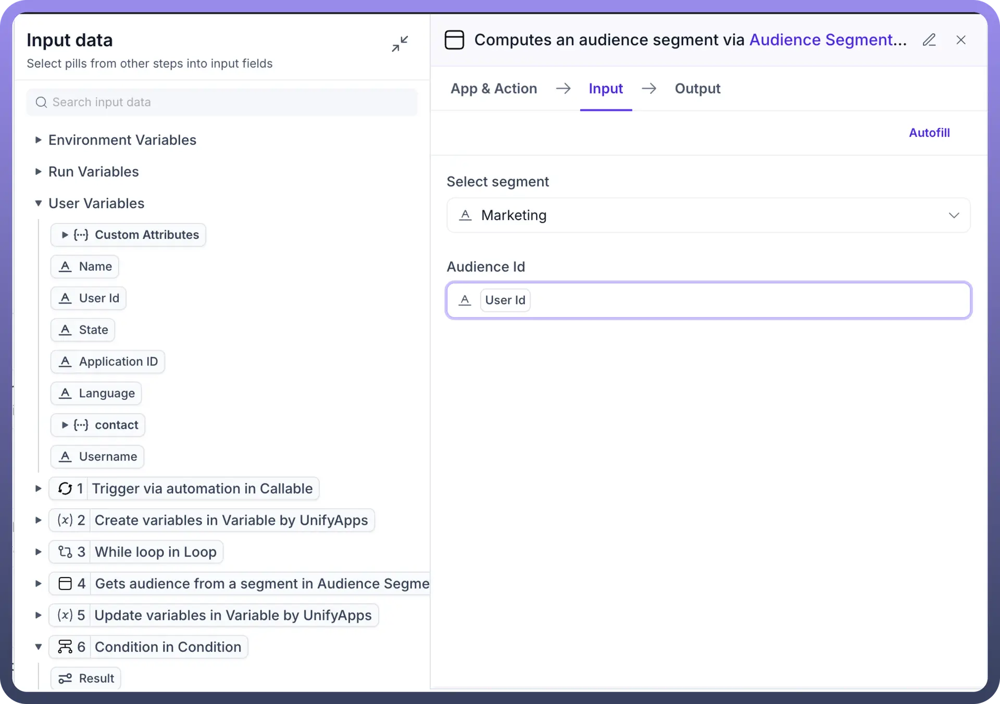

3. **Inputs**:
  - `Select Segment`: Select the segment from dropdown which you have already created earlier in Segment Manager
  - `Audience Id`: Select the mapping for Audience Id which will be used to fetch and count the audience. For e.g in this example, we have mapped it to “`UserId`”. This will be treated as the primary field to calculate the size of the segment and will give us the count of “`UserId`” in the segment
4. **Output**:
  - Once the Segment and Audience Id has been mapped, you can use the output to get the “`Count`” of the segment which will give you the number/count of users in this segment

    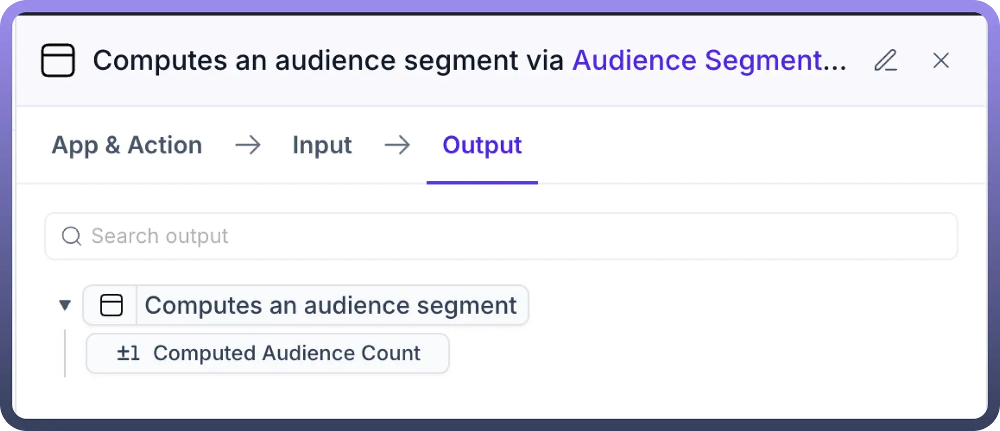

## Computes and get an Audience Segment

1. This node helps you to fetch all the values in the audience segment and also calculates the count/number of entries in any Audience segment.
2. Add the Audience Segment by UnifyApps node, select '`Compute and get an Audience segment`' option and provide below mentioned inputs.

  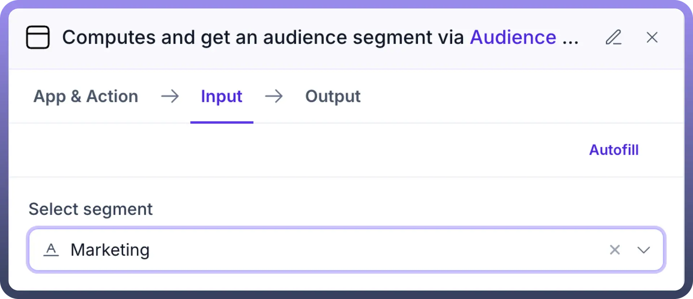

3. **Inputs**:
  - `Select Segment`: Select the segment from dropdown which you have already created earlier in Segment Manager
4. **Output**:
  - `Count`: You can use the output to get the “`Count`” of the segment which will give you the number/count of users in this segment
  - `Cursor`: Cursor helps you identify the last record/point at which the iteration has stopped. For e.g. if you are fetching the records from a segment in batches of 100, the value of Cursor will change to 100
  - `Object`: You can use the object to fetch and use all the values in this Audience segment. Following options are visible when the Object is expanded:
    - List of all entities, e.g Customers and leads in this case
    - Specific parameter values for the entities
    - For. eg. in this case, we can fetch for Customers -> their IDs, for Leads -> their customer Id, Creation date, status etc.
    - These values can then be used in future automation nodes for creating workflows, e.g Delete all leads for whose Creation data < 23rd March 2023

      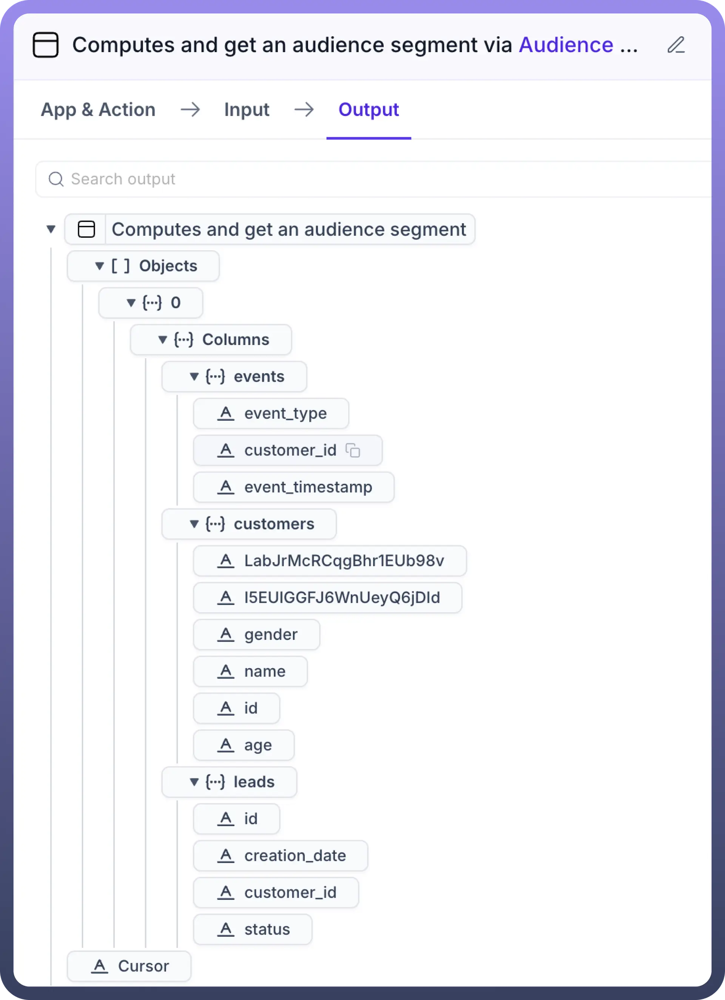

## Delete an Audience segment

1. This node helps you to delete an Audience segment.
2. Add the Audience Segment by UnifyApps node, select “`Delete an Audience segment`” and provide below mentioned inputs.

  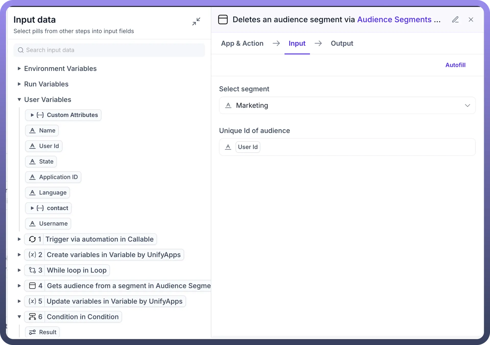

3. **Inputs**:
  - `Select Segment`: Select the segment from dropdown which you have already created earlier in Segment Manager
  - `Unique id of Audience`: Select the mapping for Unique Id which will be used to fetch and count the audience. For e.g in this example, we have mapped it to “UserId”. This will be treated as the primary field to delete the records in the segment
4. **Output**:
  - There is no consumable output in this node
  - This will delete the selected audience segment via Unique id and provide you a “Success” message in response

    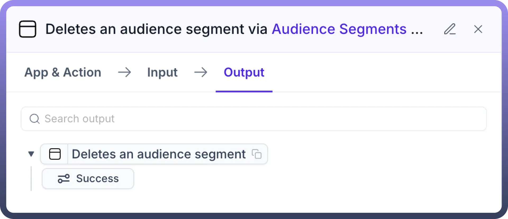

## Process an Audience segment

1. This node helps you to process an Audience segment
2. Add the Audience Segment by UnifyApps node ,select `“Process an Audience segment`” and provide below mentioned inputs.

  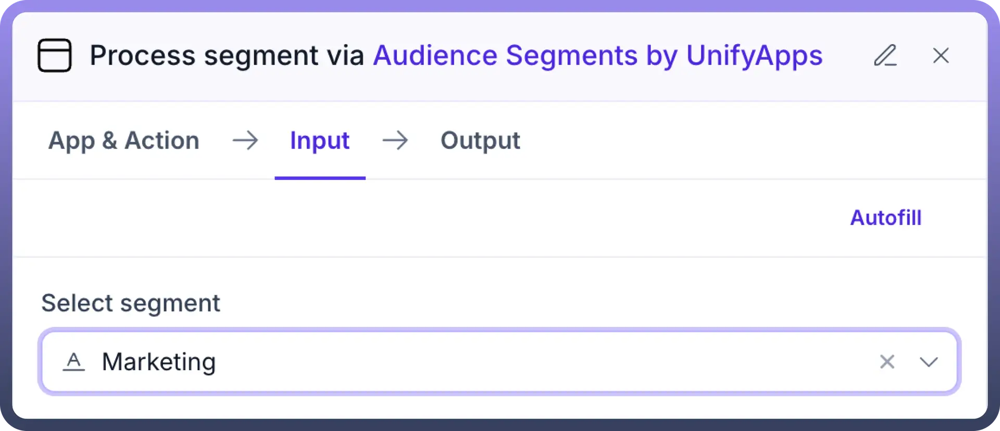

3. **Inputs**:
  - `Select Segment`: Select the segment from dropdown which you have already created earlier in Segment Manager
4. **Output**:
  - There is no consumable output in this node
  - This will process the selected audience segment via Unique id and provide you a “`Success`” message in response

    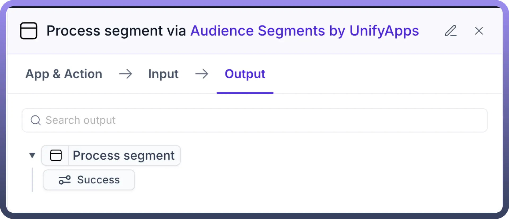

## Get audience from a segment

1. This node helps you to get data from an Audience segment
2. Add the Audience Segment by UnifyApps node ,select “Get audience from a segment” and provide below mentioned inputs.

  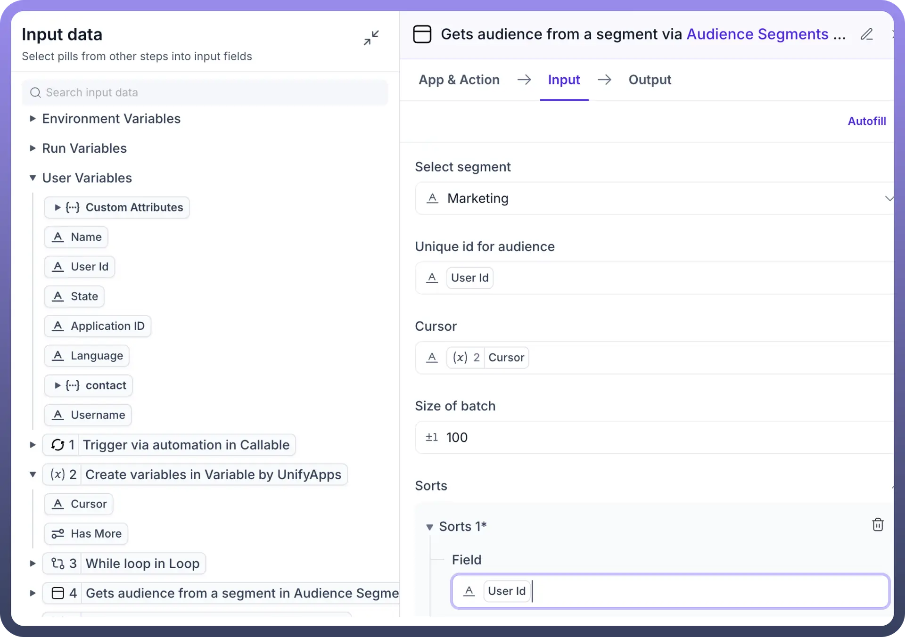

3. **Inputs**:
  - `Select Segment`: Select the segment from dropdown which you have already created earlier in Segment Manager
  - `Unique id of Audience`: Select the mapping for Unique Id which will be used to fetch the audience. For e.g in this example, we have mapped it to “UserId”. This will be treated as the primary field to delete the records in the segment
  - `Cursor`: Cursor helps you identify the last record/point at which the iteration has stopped. For e.g. if you are fetching the records from a segment in batches of 100, the value of Cursor will change to 100
  - `Size of batch`: This helps to define the batch size in which the audience will be fetched from the segment. For e.g. if someone specifies a batch of 100 , audience will be fetched in batches of 100
  - `Sort`: Sorting helps you define the order in which the records from the segment will be sorted. You can choose any variable and select ASC or DESC for sorting
4. **Output**:
  - `Count`: You can use the output to get the “Count” of the segment which will give you the number/count of users in this segment
  - `Cursor`: Cursor helps you identify the last record/point at which the iteration has stopped. For e.g. if you are fetching the records from a segment in batches of 100, the value of Cursor will change to 100
  - `Object`: You can use the object to fetch and use all the values in this Audience segment. Following options are visible when the Object is expanded:
    - List of all entities, e.g Customers and leads in this case
    - Specific parameter values for the entities
    - For. eg. in this case, we can fetch for Customers -> their IDs, for Leads -> their customer Id, Creation date, status etc.
    - These values can then be used in future automation nodes for creating workflows, e.g Delete all leads for whose Creation data < 23rd March 2023.

      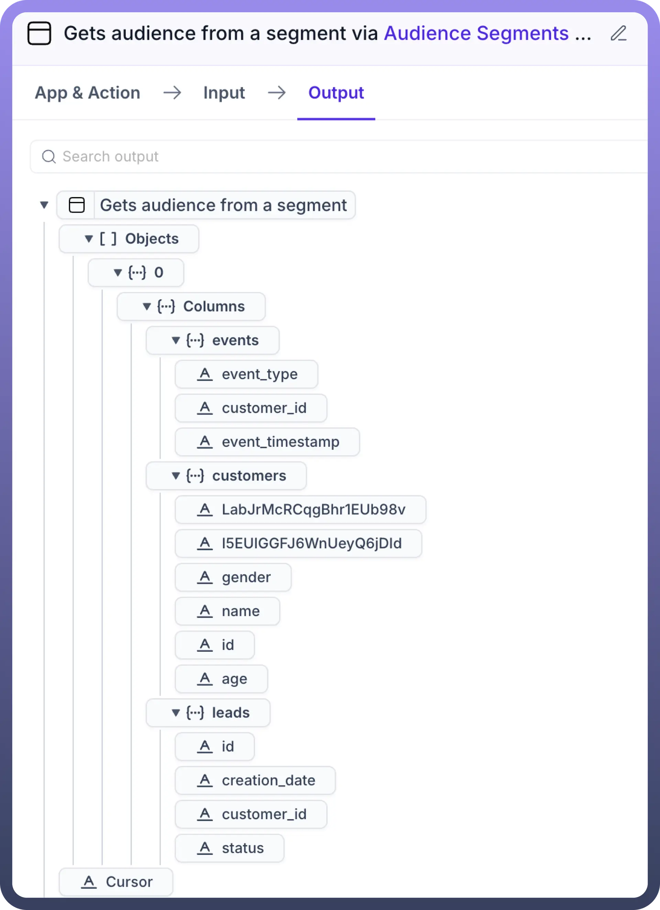
