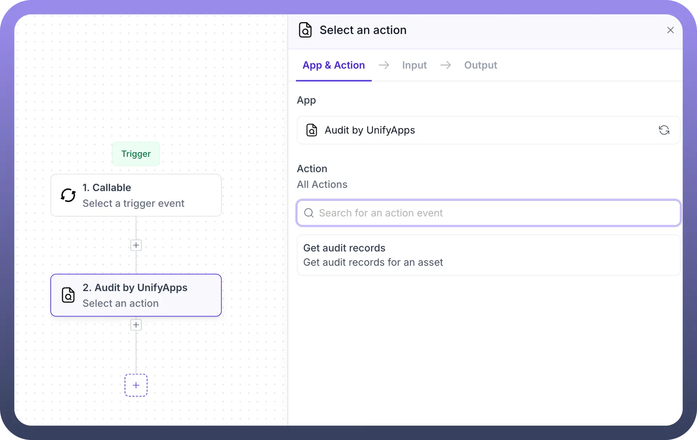
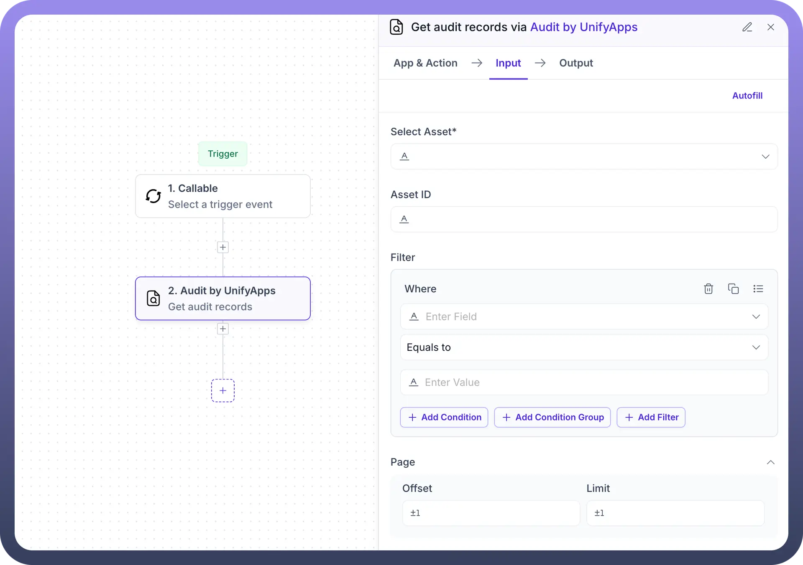
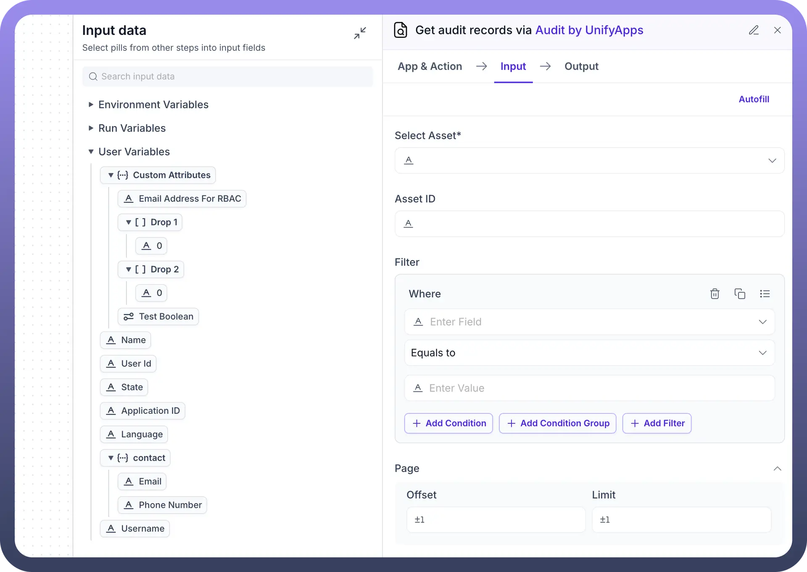
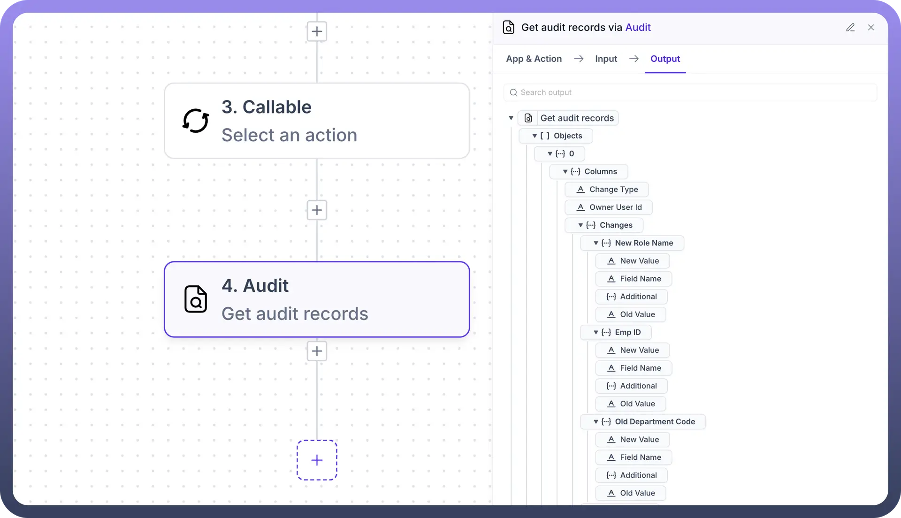

# Audit by UnifyApps

Source: https://www.unifyapps.com/docs/unify-automations/audit-by-unifyapps
Section: automations

---

## Overview

Audit by UnifyApps enables monitoring and tracking of changes across your system with detailed audit records. This means you can access a comprehensive history of data modifications, view who made changes, when they occurred, and what exactly was altered, making it ideal for compliance, accountability, and troubleshooting.

## Use Cases

**Compliance Monitoring:** Track all changes made to critical business data using Get audit records. This helps organizations maintain detailed logs for regulatory compliance and enables them to demonstrate accountability during audits.

**Data Change Investigation:** When unexpected data changes occur, use filters in Get audit records to identify when the change happened, who made it, and what exactly was altered. This allows for quick resolution of data issues and accountability for changes.

**Security Audit Trail:** Maintain a comprehensive history of all system changes with filtered audit records. Security teams can monitor for unusual activities, investigate potential security breaches, and ensure that all modifications follow company policies.

## Get audit records

The Get audit records action in Audit by UnifyApps allows users to retrieve and analyze detailed logs of changes made across the system. This provides visibility into who modified data, what changes were made, and when they occurred.

**Input Fields:**

**For general audit records:**

- `Filter`**:** Define conditions to narrow down audit records
  - **Where:** Specify field name for filtering (e.g., Change Type, Owner User Id)
  - **Condition:** Select operators like "Equals to"
  - **Value:** Enter specific value to match
  - Additional options include:
    - **Add Condition:** Add another condition in the same group
    - **Add Condition Group:** Create logical groups with AND/OR operators
    - **Add Filter:** Combine multiple filters for complex queries

**For asset-specific audit records:**

- `Select Asset`**:** Choose the specific asset to audit
- `Asset ID`**:** Provide the unique identifier for the selected asset
- `Filter`**:** Same filtering capabilities as general audit records

  

**Pagination:**

- `Offset`**:** Starting point for retrieving records
- `Limit`**:** Maximum number of records to retrieve

**Sort order:**

- Choose between Ascending or Descending
- Records are sorted based on the time they were captured

**Output:**

The action returns detailed audit records with a hierarchical structure:

- **Objects:** Collection of audit records
  - **Columns:** Key metadata for each record
    - **Change Type:** Type of change (create, update, delete)
    - **Owner User Id:** User who made the change
  - **Changes:** Detailed information about modifications
    - **Date:** When the change occurred
      - **New Value:** Updated value
      - **Field Name:** Name of the modified field
      - **Additional:** Extra context information
      - **Old Value:** Previous value before change
    - **Country:** Geographic information if applicable
      - Same structure as Date with New Value, Field Name, etc.
    - **Line Item Id:** Identifier for specific line items
      - Same structure as above fields

This action provides comprehensive visibility into all system changes, enabling users to monitor activity, investigate issues, and maintain compliance.

## Get audit records for an asset

This specialized action allows users to retrieve audit records specific to a particular asset or resource within the system. This is useful when you need to focus on the change history of a single important entity.

**Input Fields:**

- `Select Asset`**:** Choose the asset type from the dropdown
- `Asset ID`**:** Specify the unique identifier for the selected asset
- `Filter`**:** Apply conditions to narrow down audit records for the asset
  - Same filtering capabilities as the general Get audit records action

**Pagination and Sorting:** Same options as the general Get audit records action

**Output:** Similar structure to the general Get audit records action, but results are filtered to include only changes related to the specified asset.
