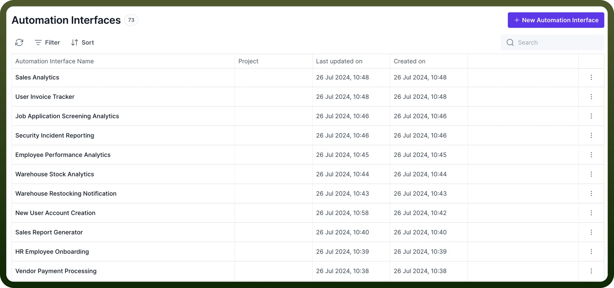
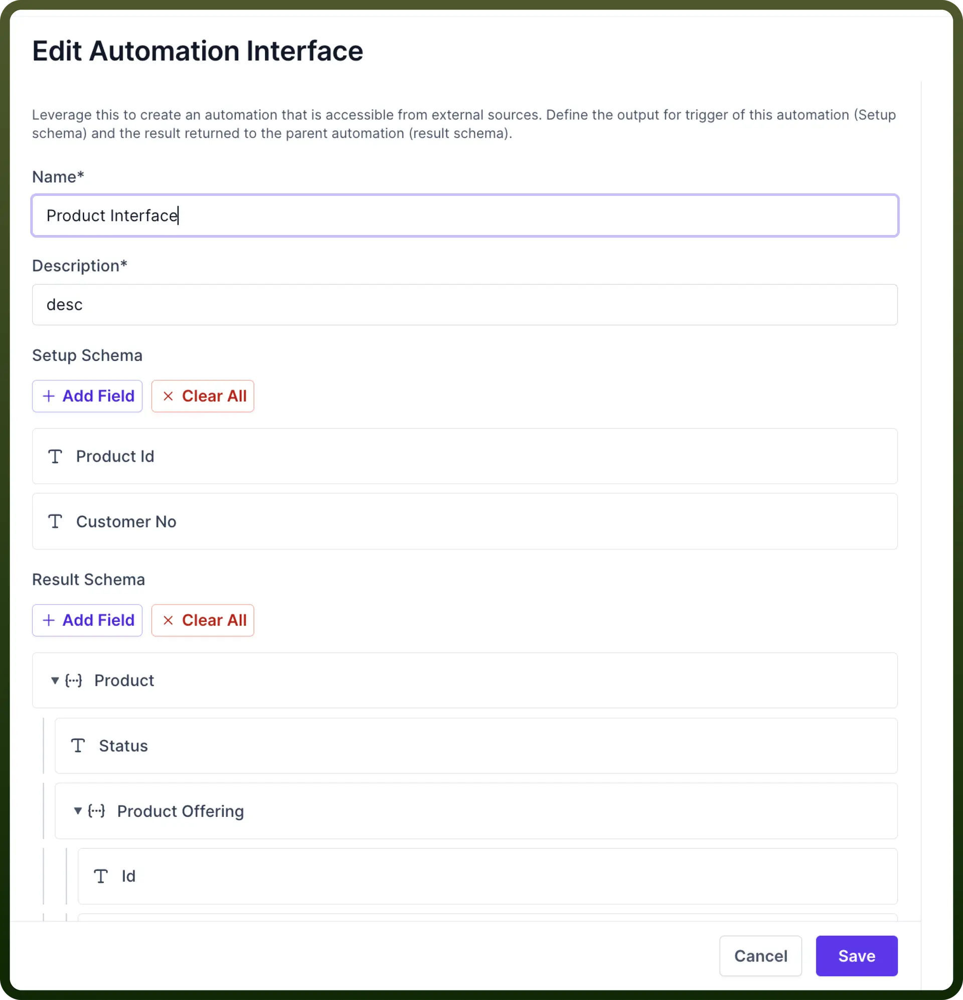
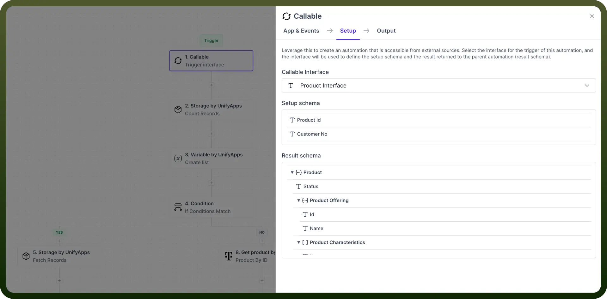
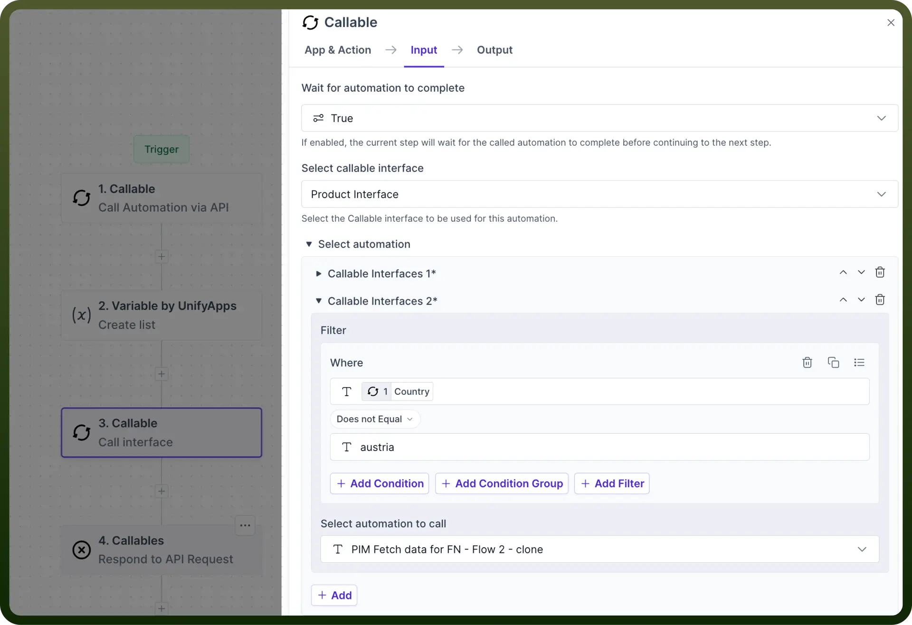
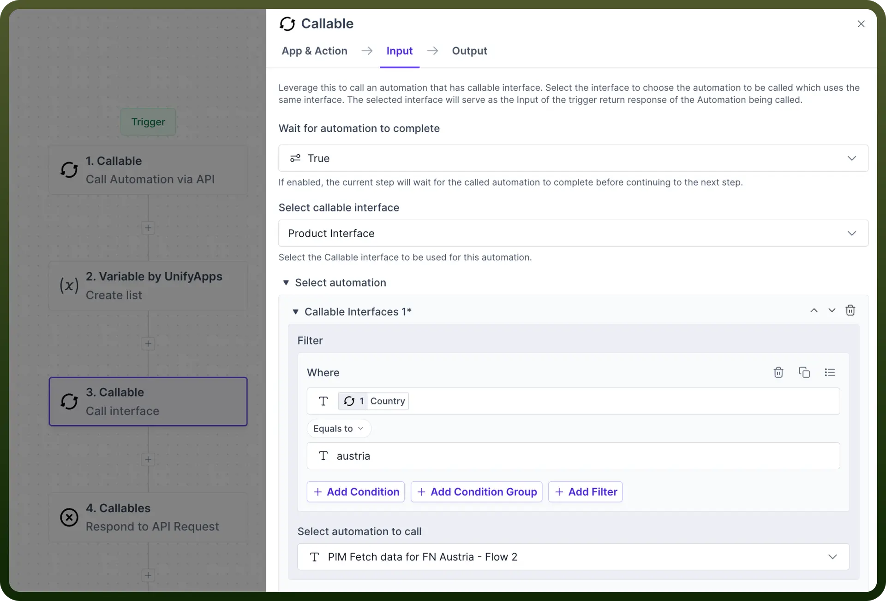

# Automation Interfaces

Source: https://www.unifyapps.com/docs/unify-automations/automation-interfaces
Section: automations

---

## Introduction

In callable automation, we have to **configure** the schema for each callable automation and we might need to define the **same schema** for **multiple callable** automation.

To **reduce manual effort** and ensure **scalability**, define a schema once using an automation interface and reuse it across automations.

## Create Automation Interface

- To **create** a New Automation Interface go to the automation interface in the left navigation pane.
- Click on create “`New Automation Interface`” button to create a new Interface
- Provide the **name** and **description** for the Automation interface.
- You can create **setup** and **result schema** by uploading JSON schema or manually configuring the setup and result schema fields.
- The `Setup schema` of the interface will serve as the setup schema for callable automation.
- The `Result schema` will serve as the result schema for the callable automation.

## Use Automation Interface as Trigger in Automation

- Set up **trigger** as a callable interface.
- Select the **interface** in the Setup tab which you want to use, from the available interfaces in the dropdown.
- Once the interface is selected, the **setup** and **result** **schema** of the interface are populated in the automation trigger.
- The `Setup schema` of the interface defines the parameters the parent automation will pass to the child.
- The `Output schema` of the interface defines the parameters that will be returned to the parent automation.

## Call an Automation Interface

Users can call an automation interface by using the call an interface action within callable Node.

- Users can select which callable Interface you want to refer.

  

- Now users have the capability to call different automation using the same interface based on conditional criteria as shown in the example below.
- Using this you can call **multiple different automations** using same interfaces which helps in achieving scalability.
- You can also select one **Default/ fallback automation** when none of the criteria above it matches. This automation will be called when the rest of them don’t match.
- You can map the input for the automation to be called below in the same node.

  
