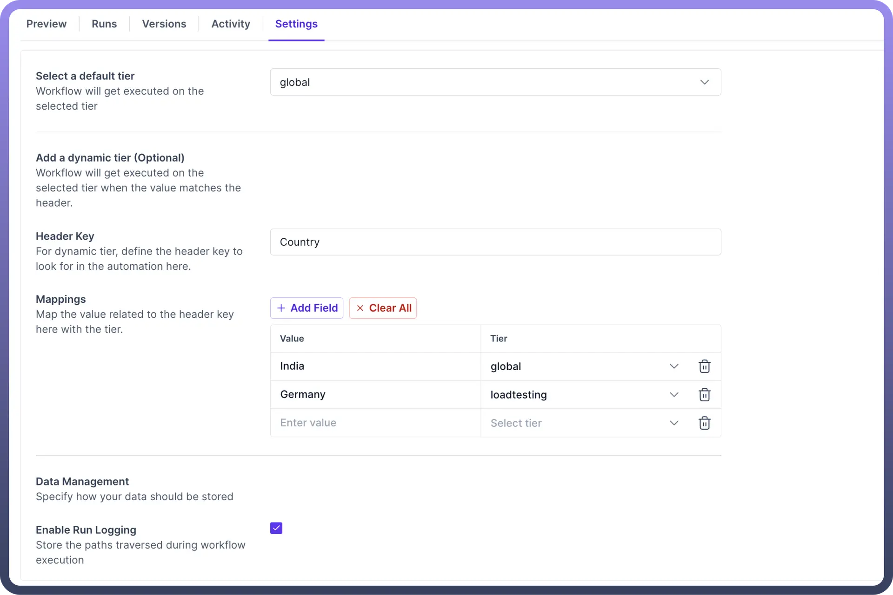
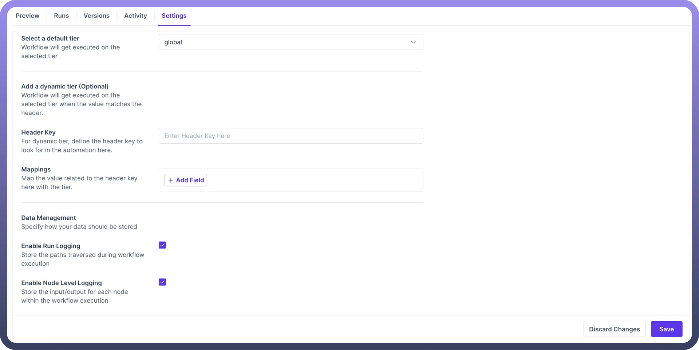

# Automation Settings

Source: https://www.unifyapps.com/docs/unify-automations/automation-settings
Section: automations

---

## Introduction

Automation settings in UnifyApps cover two major elements related to an automation i.e

1. **Execution tier** : Ability to define where a specific automation run should be executed based on various checks.
2. **Data Management** : Ability to define what part of the automation run should be logged for tracking purposes.

## Settings

- **Define Execution Tier:** Users have the capability to decide an execution tier for each automation. This functionality helps segregate the high workload automations from the rest to preserve their performance.
  - We must first select a tier that will automatically be executed as the `default tier`. We can define a default execution tier for every automation so that it only gets executed in that tier.
  - We can also define **dynamic tiers** based on values specified in headers. Let us try to understand this using an example.
    - For the automation shown in the example below, we have selected a default tier to execute the automation in this tier.
    - Upon calling this automation, we get key-value pairs from its headers. We set our required header key as a country**.**
    - Now, we define **country-tier** pairs for each value of the country. We set it such that if the value is India, we execute the automation in the global tier. In contrast, if the value is Germany, we execute it in the load testing tier.
    - If we receive any other value, we will continue to execute the automation in the default tier.

      

- **Data management:** Users have the capability at each automation to decide what data we want to capture into logs. By **default**, in any automation, we store both the traversed path and the I/O of each node; hence, the checkboxes are selected by default. But if you don't need either of these details to be logged, you can simply uncheck the respective box.

  
