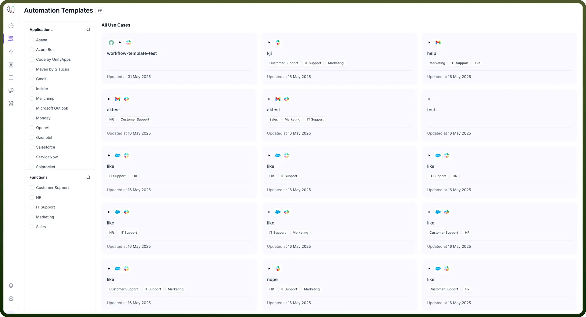
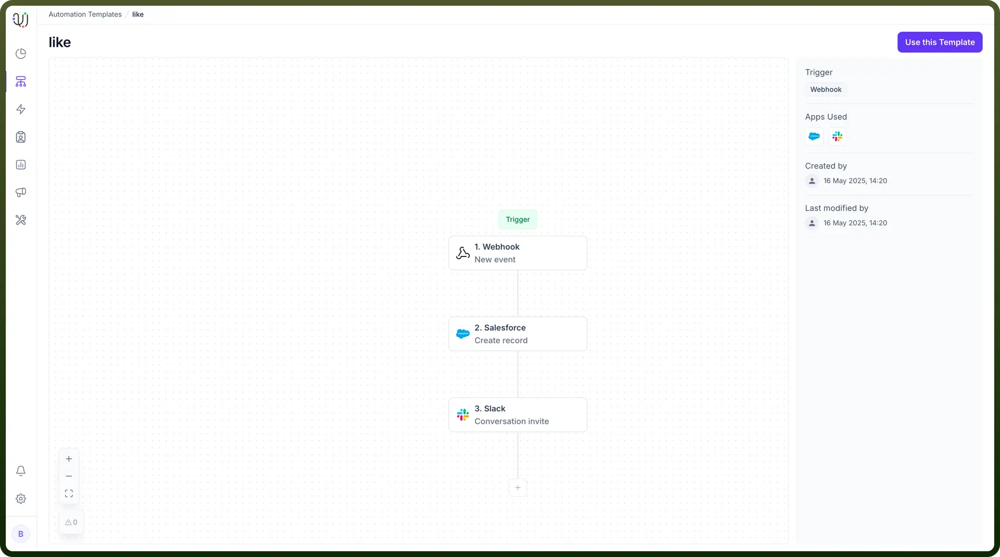

# Automation Templates by UnifyApps

Source: https://www.unifyapps.com/docs/unify-automations/automation-templates-by-unifyapps
Section: automations

---

## Overview

Automation Templates by UnifyApps allow users to create, manage, and reuse pre-configured workflows across various business functions and applications. Each template defines a sequence of automation steps, including triggers and actions across tools like Salesforce, Slack, and others.

Templates can be filtered by application (e.g., Gmail, Salesforce, Ozonetel) or business function (e.g., HR, IT Support, Marketing), enabling quick discovery and deployment of relevant automations.

The platform includes over **200 pre-built templates** spanning use cases in hospitality, finance, operations, and communications. These templates can be customized visually using a drag-and-drop builder, and GenAI assistance is available to streamline template creation and enhancement.

## Use Cases

Automation Templates can be used to:

- Standardize frequent workflows such as lead onboarding or customer alerts
- Coordinate actions across tools like Slack, Salesforce, and Gmail
- Enable quick reuse of workflows across HR, IT support, marketing, and sales teams

Some examples include:

- **Hospitality:** Guest request handling, maintenance task routing, operations approval
- **Financial Services:** Loan processing, onboarding journeys, compliance tracking
- **Enterprise Ops:** System syncs, approval chains, internal notifications
- **Communication:** Omnichannel alerts via email, SMS, MS Teams, or push

For instance, in the template titled **"like"**, a webhook trigger initiates:

1. Record creation in Salesforce
2. Followed by a Slack conversation invite

## Browsing Automation Templates

From the Automation Templates dashboard:

- Templates are displayed in a card layout under “All Use Cases”
- Each card shows:
  - Template name
  - Associated apps (e.g., Gmail, Salesforce, Slack)
  - Assigned functions (e.g., HR, IT Support, Marketing)
  - Last updated date

**Filter Options**

Use the left panel to filter templates by:

- **Applications:** (e.g., Asana, OpenAI, ServiceNow)
- **Functions:** (e.g., Customer Support, Marketing, Sales)

Templates are organized for fast discovery and deployment, with support for both **industry-specific workflows** and customizable messaging formats.

## Using and Customizing Templates

To use a prebuilt automation template:

1. Click on the template card (e.g., **"**`like`**"**)
2. Review the workflow layout on the canvas
3. Click **“**`Use this Template`**”** on the top right to begin configuration

Templates can be tailored using the **Visual Workflow Builder**, which provides a drag-and-drop interface to modify nodes and logic. Standardized message formats can also be adapted to suit campaign-specific needs, ensuring consistent but flexible automation delivery.

## Template Structure Example

For the template titled **"**`like`**"**, the structure includes:

- **Trigger:** Webhook (New event)
- **Step 1:** Salesforce – Create record
- **Step 2:** Slack – Send a conversation invite

Additional metadata shown:

- Apps used: Salesforce, Slack
- Created on: 16 May 2025, 14:20
- Last modified: 16 May 2025, 14:20
