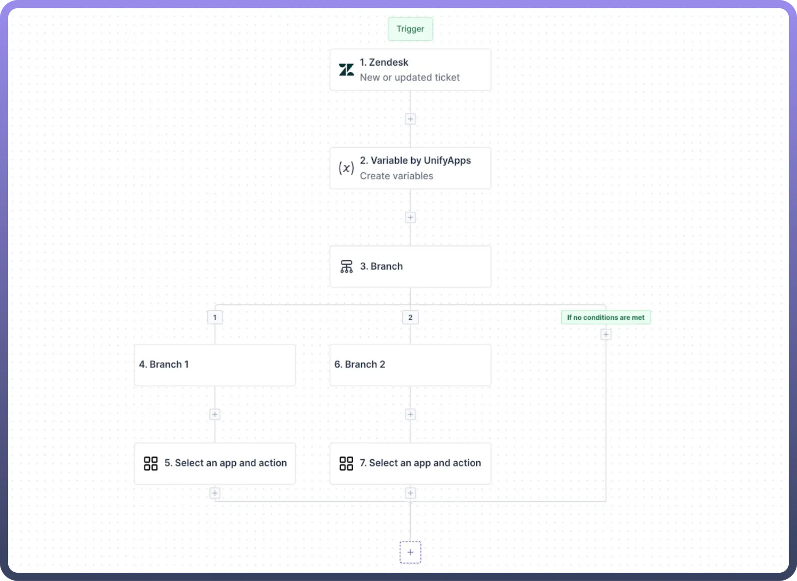
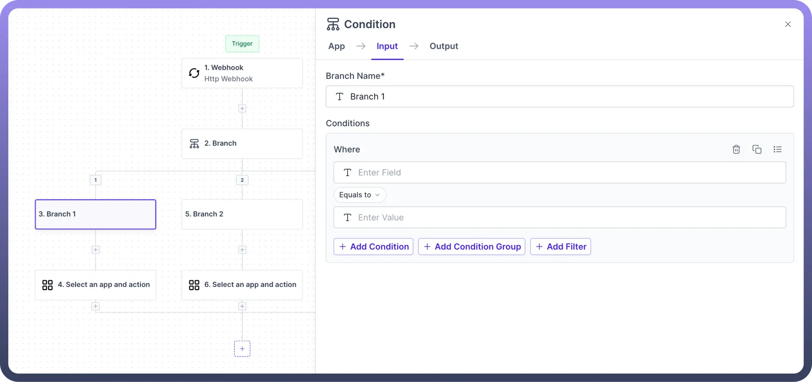
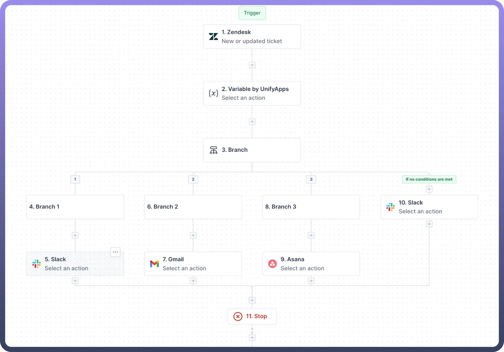
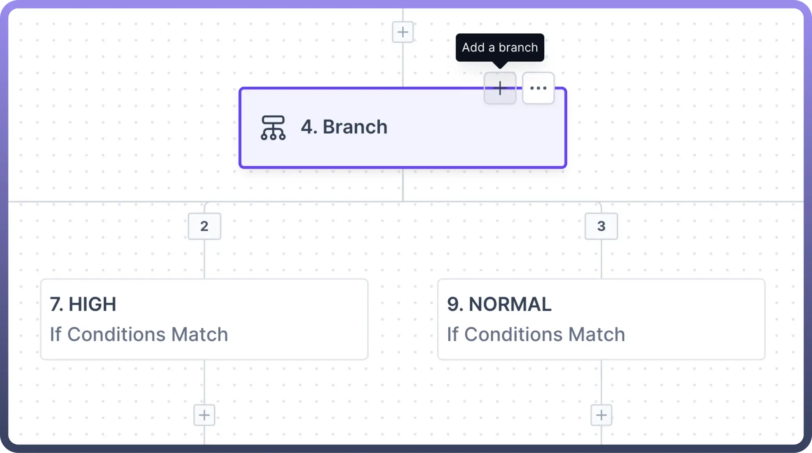
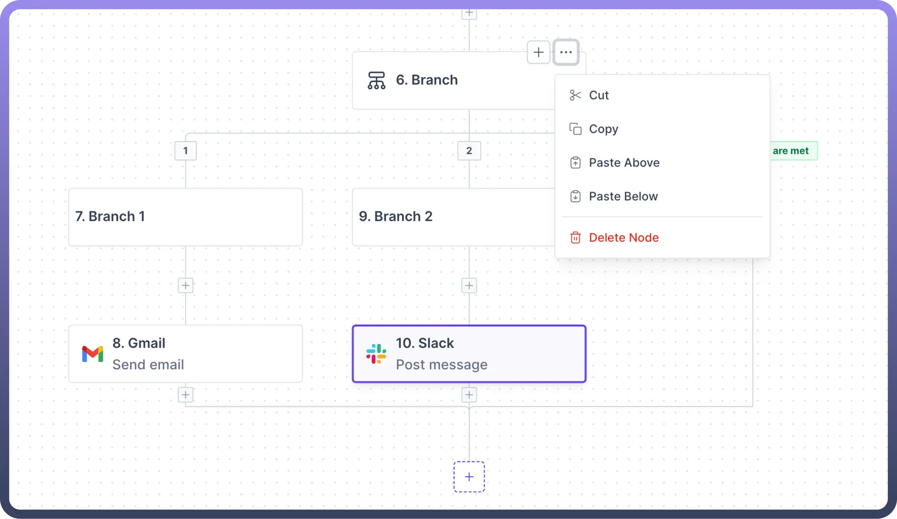

# Branch

Source: https://www.unifyapps.com/docs/unify-automations/branch
Section: automations

---

## Overview

The branch node is essential for **executing multiple actions** sequences simultaneously based on defined conditions within a branch.

Each branch can be configured with specific conditions that determine when it activates, using conditional logic: 
"**If** `A happens` **in your condition node, then** `do X`**. If** `B happens`**, then** `do Y`**."**

The branch node offers robust functionality for managing complex automations and clubbing multiple conditions at a single node.

> **Note:** Branch Node accommodates between **3** and **11** branches, with three branches initially available. Additional branches can be added using the plus icon on the node.

## Use Cases

Let's define an example where we will bucketise [Zendesk](/docs/unify-automations/branch) tickets based on their priorities and be able to leverage [Slack](/docs/unify-automations/slack), [Gmail](/docs/unify-automations/branch) or [Asana](/docs/unify-automations/branch) to get their notifications.

This setup triggers when a new ticket is created or an existing ticket is updated in Zendesk.

1. Set a branch node where we **compare the ticket priority** in different branches and perform tasks accordingly.

  

2. In each branch, set the respective priority conditions and add the corresponding app actions: Slack, Gmail, and Asana.
3. Also, define the branch action for the "`If no conditions are met`" branch, with a Slack message as **'**`Default`**'**.

  

## Additional Features

1. **No-condition branch**: It includes an automatically added "`If no conditions are met`" branch, which executes when none of the other conditions are satisfied.
2. **Branch Addition**: Using the `add` button on the branch node, you can add a branch to accommodate another set of conditions.

  

3. **Branch Deletion**: All branches, except the initial two and the "If no conditions are met" branch, can be removed by deleting the respective branch's condition node.

  

4. **Branch Copying**: Branches can be copied and pasted into other nodes directly, eliminating the need to rebuild the entire logic from scratch.
5. **Branch Pasting**: Branch nodes allow two pasting options for copied nodes:
  - "`paste above`" to insert the copied node above the current branch node
  - "`paste below`" to place it below the current branch node within the same branch.

## Advanced Logic, Routing, and Execution Capabilities

Beyond simple branching, UnifyApps’ Workflow Engine is engineered to support highly flexible and intelligent workflow orchestration through the following extended features:

- **Switch-Style Conditional Logic**: Easily configure multi-path decisions using intuitive switch-case constructs, ideal for routing based on distinct, predefined values.
- **Support for Deep Decision Trees**: Design complex, multi-level branching flows that evaluate numerous data conditions sequentially or hierarchically, allowing fine-grained personalization and control.
- **Extensive Logical Utilities Library**: Leverage a collection of 40+ built-in logical operations, including list containment, pattern matching, boolean combinators (AND/OR/NOT), numerical comparisons, and more—reducing the need for custom expressions.
- **Parallel Branch Execution**: Run multiple branches of a workflow concurrently to improve processing speed and reduce latency in high-throughput scenarios.
- **Workflow Merging Functionality**: After executing tasks in parallel branches, workflows can be intelligently merged back into a unified path, enabling continuity and consolidated decision-making.
- **Synchronization Points**: Add coordination checkpoints that ensure all parallel branches complete execution before the workflow advances, maintaining data integrity and execution logic.
