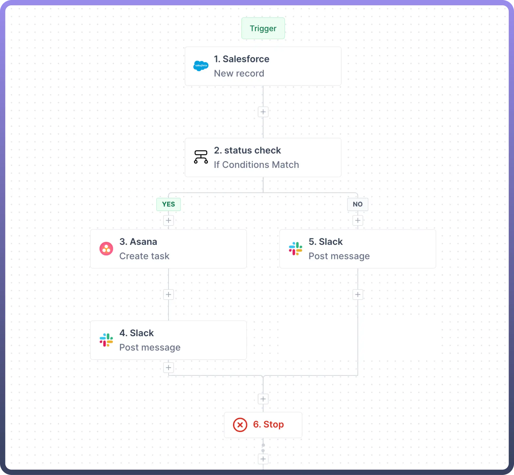

# Build your first automation

Source: https://www.unifyapps.com/docs/unify-automations/build-your-first-automation
Section: automations

---

## Overview

Unify Automations lets organizations **automate** complex and manual processes quickly, reducing effort and cost. It supports advanced business logic, instant custom connector deployment, and ensures enterprise-grade security and performance.

Each Automation consists of 2 major components, i.e. **Trigger** and **Action(s)**.

- `Trigger`: A trigger is an event that initiates an automation process. It occurs when specific data changes/events are detected, prompting the automation to start.
- `Action`: An action is a task executed in the automation . This can include API calls, data transformations, and logical operations necessary to complete the automation.

## Trigger types

- **Connector-based:** These triggers detect events in various applications such as Gmail, Zendesk, ServiceNow, Salesforce, etc.
- **API-based:** This set of triggers is oriented around reacting to API calls. There are two types of this:
  - [Callable](/docs/unify-automations/callable)
  - [Webhook](/docs/unify-automations/build-your-first-automation)
- **Scheduler:** This trigger is used to set recurring events in defined periods.

## Action Types

- **Logic tools**
  - [Condition](/docs/unify-automations/condition)
  - [Branch](/docs/unify-automations/branch)
  - [Loop](/docs/unify-automations/loop)
  - [Delay](/docs/unify-automations/build-your-first-automation)
- **UnifyApps actions**
  - [Storage by UnifyApps](/docs/unify-automations/storage-by-unifyapps)
  - [Variables by UnifyApps](/docs/unify-automations/variable-by-unifyapps)
  - [Code by UnifyApps](/docs/unify-automations/build-your-first-automation)
- **Connector Actions**
  - [Salesforce](/docs/unify-integrations/salesforce): Create record
  - [Slack](/docs/unify-automations/slack): Post message
  - [Zendesk](/docs/unify-automations/build-your-first-automation): Create ticket

## How to Create a New Automation?

1. **Log** in to your UnifyApps account.
2. **Navigate** to the Automations section within Unify Automations.
3. **Click** on the "`New Automation`” button on the top right corner.
4. **Choose** a `trigger type` for your automation.
5. **Configure** the `trigger settings`.
6. **Add** `actions` to your automation by dragging and dropping from the available options.
7. **Configure** each action's settings and parameters.
8. **Test** your automation using the built-in test module.
9. **Save** and `activate` your automation.
