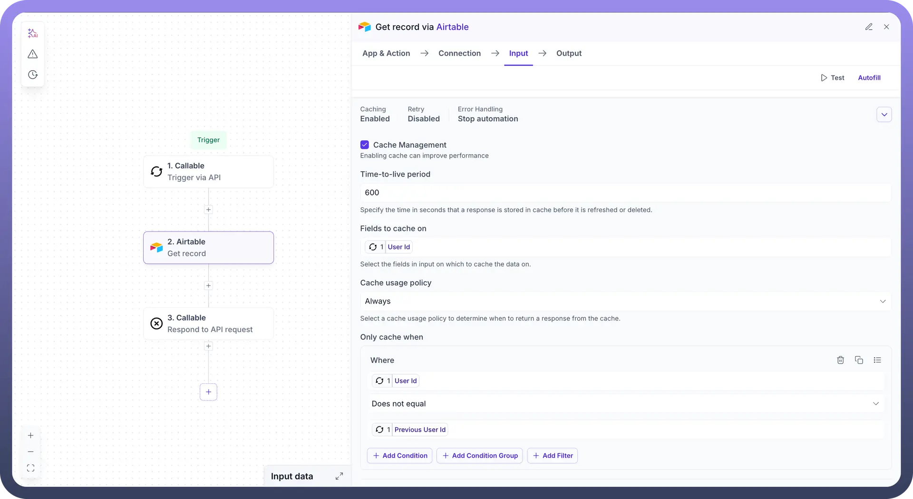
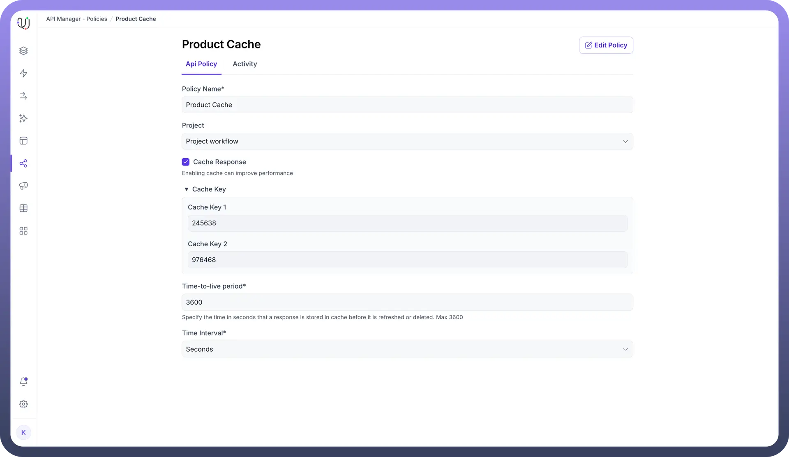
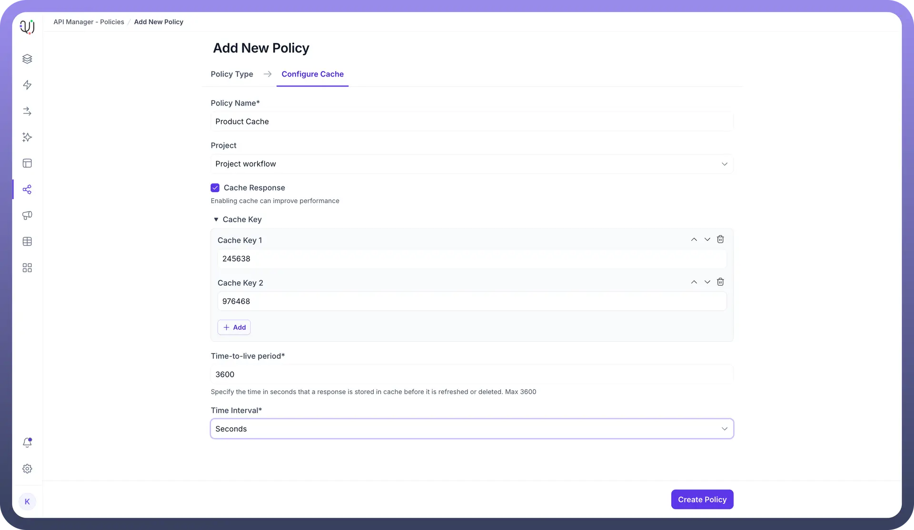

# Cache Management

Source: https://www.unifyapps.com/docs/unify-automations/cache-management
Section: automations

---

## Overview

Caching reduces redundant processing and improves response times by temporarily storing frequently accessed data. In Unifyapps, caching can be configured at the workflow level (Automation Builder) and the API level (API Manager). By leveraging cache management, users can minimize external system calls, reduce latency, and ensure seamless performance.

## Cache Management in Automation Builder

The Automation Builder allows you to configure caching for workflow nodes to store responses temporarily. Below are the key configuration options:

**Features**

- **Time-to-live Period:**
  - Specifies how long (in seconds) a cached response remains valid.
  - Example: A TTL of 3600 seconds ensures the response is cached for 1 hour.
- **Fields to Cache On:**
  - Defines the input fields that uniquely identify cache entries.
  - Example: Caching based on user_id ensures unique responses for each user.
- **Cache Usage Policy:**
  - Determines when cached responses should be used:
    - *Always***:** Use cached data whenever available.
    - *On Error***:** Use previous cached data in case of Errors.
- **Only Cache When:**
  - Allows users to define conditions for caching.
  - Example: Cache responses only when status = completed.
- **Evit Cache:**
  - Provides options to manually clear specific cache entries.
- **Clear All Cache:**
  - Clears all the stored cache for that node.

## Cache Management in API Manager

In the API Manager, caching can be configured as part of policies to optimize API performance. A single cache policy can also be reused across multiple APIs, ensuring consistency and reducing configuration overhead.

**Features**

- **Policy Name and Project:**
  - Assign a unique name to the policy and associate it with a project.
- **Cache Response:**
  - Enable this option to activate caching for API responses.
- **Cache Key:**
  - Specify one or more keys that uniquely identify cached responses.
  - Example: Use Cache Key 1 as user_id to cache user-specific data.
- **Time-to-live Period:**
  - Define how long the cached response remains valid.
  - Maximum TTL: 3600 seconds (1 hour).
- **Time Interval:**
  - Define the units of time-to-live period (seconds, minutes, hours or days).
- **Create Policy:**
  - Save your configuration as a reusable policy for managing cache across APIs.
- **Reusability Across APIs:**
  - A single cache policy can be applied to multiple APIs within the same project or across projects. This ensures consistent caching behavior and simplifies management.
  - Example: A policy con
  - figured with a Cache Key of product_id can be used across all APIs fetching product details, reducing redundant configurations.

    

## Clearing Cache

- To clear a specific cache entry, enter the key in the "Evict Cache" field and click "Clear Cache."
- To clear all cache entries, click the "Clear all cache" button.

## Best Practices

- Set TTL values based on how frequently your data changes.
- Use specific fields (e.g., user_id, order_id) as cache keys to ensure unique entries.
- Regularly monitor and clear outdated cache entries to optimize storage and performance.
- Leverage reusable policies in the API Manager to maintain consistency across APIs while reducing setup time.

## Conclusion

By effectively utilizing these features, you can streamline workflows, enhance API performance, and deliver an optimized user experience in Unifyapps.
