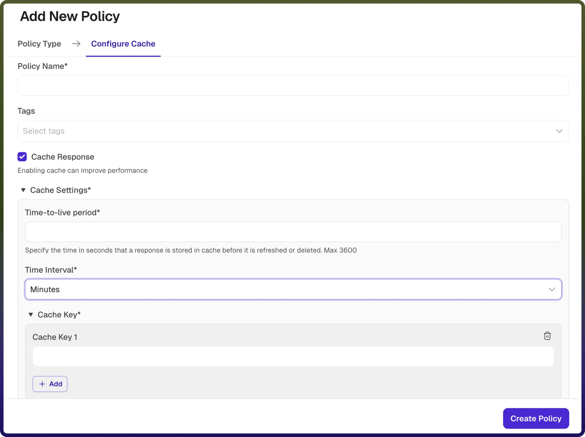

# Cache policy

Source: https://www.unifyapps.com/docs/unify-automations/cache-policy
Section: automations

---

### **Overview**

A Cache Policy stores API responses temporarily to: 
 1. Improve performance 
 2. Reduce backend load 
 3. Decrease response time 
 When enabled, repeated requests can be served from cache instead of calling the backend. 
 Each cached response is stored for a fixed **Time-to-Live (TTL)**. 
 After TTL expires, the cache is cleared and a fresh response is fetched.

| **Field Reference** | **Description** |
|---|---|
| `Policy Name` | A unique identifier for the policy, used across logs, dashboards, and API group configurations. **Required** |
| `Tags` | Custom labels to organize and filter the policy by environment, team, or functionality. **Optional** |
| `Cache Response` | Enables or disables caching of API responses. When enabled, responses are stored and reused based on the defined cache settings. (Enabled by default when configuring cache) **Required** |
| `Time-to-Live (TTL) Period` | Specifies how long a cached response is stored before it expires and is refreshed or removed. The value is defined in seconds, with a maximum allowed limit (e.g., 3600 seconds). **Required** |
| `Time Interval` | Defines the unit of time for the TTL period (e.g., Seconds, Minutes, Hours) **Required** |
| `Cache Key` | Defines the unique key used to identify cached responses. The cache key determines how requests are matched to cached data. You can configure one or more cache keys (e.g., query parameters, headers, or request attributes). **Required** |

## How It Works

1. `Request arrives`**:** The gateway receives an API request.
2. `Cache key generation`**:** A cache key is created using configured parameters.
3. `Cache lookup`**:** The system checks if a cached response exists.
4. `Cache hit`**:** Cached response is returned immediately (no backend call)
5. `Cache miss`**:** No cached response found → request is sent to backend
6. `Response caching`**:** Backend response is stored in cache.
7. `Cache expiration`**:** After TTL expires, cache is removed and refreshed on next request.

## Attaching a Policy to an API Group

Once a Cache Policy is created, it can be attached to one or more API Groups. 
 Multiple policies can be applied to an API Group, and their execution order can be configured by arranging them in the desired sequence.
