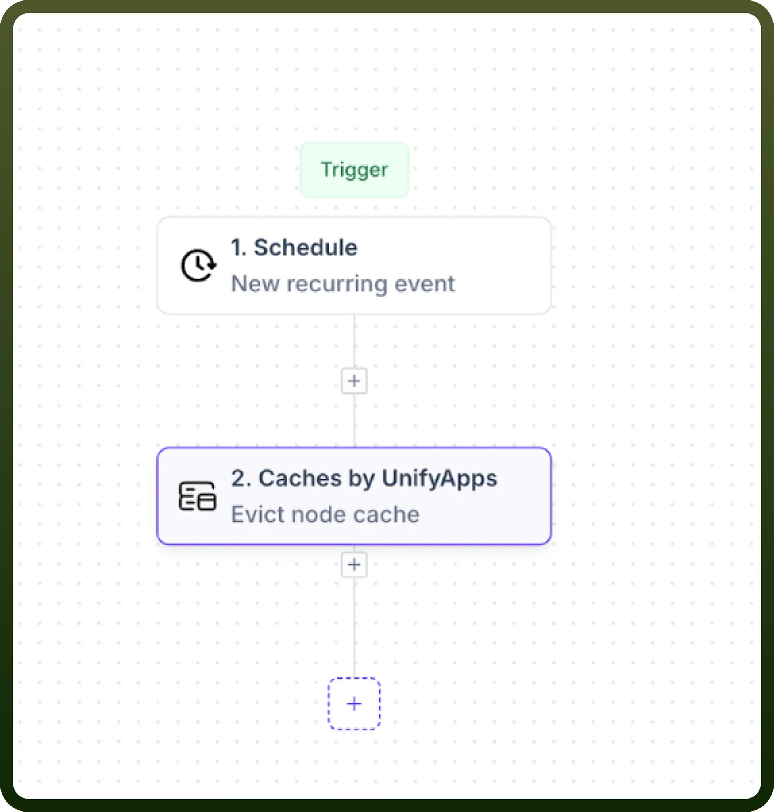
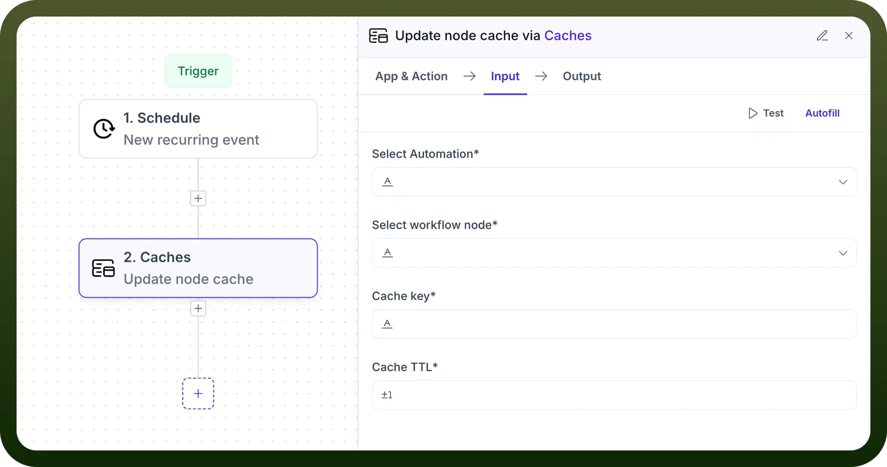
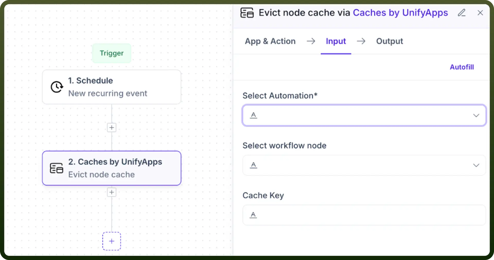

# Caches by UnifyApps

Source: https://www.unifyapps.com/docs/unify-automations/caches-by-unifyapps
Section: automations

---

## Overview

Caches by UnifyApps provides powerful caching capabilities for automations and workflows. This means you can update, evict, and manage cached values for specific nodes in your automation, improving performance, reducing computation time, and enabling more efficient data handling in your applications.

## Use Cases

1. **Performance Optimization:** Use Update Node Cache to store frequently accessed data, reducing computation time for subsequent workflow executions. This ensures faster response times for critical automations that rely on previously processed data.
2. **Automated Cache Management:** Schedule regular cache evictions using the Evict Node Cache action triggered by a recurring event. This can help maintain optimal performance by clearing outdated cached data at specific intervals, ensuring your automations always work with the most relevant information.
3. **Workflow-Specific Data Persistence:** Maintain important values between automation runs by caching key workflow outputs. This allows subsequent steps or future automation executions to access previously computed results without repeating resource-intensive operations.
4. **Selective Cache Refreshing:** Use the Update Node Cache action to refresh specific cache values without rebuilding the entire automation cache. This targeted approach ensures critical data stays current while preserving other cached values, optimizing both performance and accuracy.

## Update Node Cache

The Update Node Cache action in Caches by UnifyApps enables users to set or refresh cached values for specific nodes within an automation. This powerful feature improves performance by storing frequently accessed data and reducing redundant computations.

**Input Fields:**

1. **Select Automation:**
  - Choose the target automation from the dropdown menu.
  - Required field that identifies which automation's cache to update.
2. **Select Workflow Node:**
  - Specify which node's cache you want to update.
  - Required field for targeting a specific component within the automation.
3. **Cache Key:**
  - Enter the unique identifier for the cached data.
  - Required field that serves as the access point for retrieving this data later.
4. **Cache TTL:**
  - Set the time-to-live value (how long the cache remains valid).
  - Optional field with a default value (typically ±1).
  - Determines when the cache entry will automatically expire.

**What It Does:**

The Update Node Cache action "`Updates the cached value for a specific node in an automation`". This means it stores data at the specified location (defined by automation, node, and key) for later retrieval, improving workflow efficiency by eliminating repeated calculations.

## Evict Node Cache

The Evict Node Cache action in Caches by UnifyApps allows users to remove cached data from specific nodes or across an entire automation. This functionality helps maintain cache freshness and manage memory resources effectively.

**Input Fields:**

1. **Select Automation:**
  - Choose the target automation from the dropdown menu.
  - Required field that identifies which automation's cache to manage.
2. **Select Workflow Node:**
  - Specify which node's cache you want to evict.
  - Optional field - if not selected, will evict caches for all nodes in the automation.
3. **Cache Key:**
  - Enter the specific cache key to evict.
  - Optional field - if not provided, will evict all cached keys for the specified node(s).

**What It Does:**

The Evict Node Cache action "`Evicts cache for a specific node or all nodes in an automation."` This means it removes stored data from the cache, freeing up resources and ensuring subsequent workflow executions will generate fresh data rather than using previously cached values.

## Implementation Example

A common implementation pattern involves scheduling regular cache updates or evictions:

1. Create a new automation with a "`Schedule`" trigger (recurring event)
  - Set the appropriate frequency (hourly, daily, etc.)
2. Add "`Caches by UnifyApps`" as the second step
  - Choose either "`Update node cache`" or "`Evict node cache`" based on your requirements
3. Configure appropriate parameters:
  - Select the target automation
  - Specify the workflow node (optional for eviction)
  - Define cache key (optional for eviction)
  - Set cache TTL (for update operations)
4. Save and deploy the automation
  - The cache will now be managed automatically according to your schedule

## Additional Settings

Both Update and Evict operations offer additional configuration options:

- **Caching:** Enable/disable caching of the operation itself
- **Retry:** Configure retry behavior for failed cache operations
- **Error Handling:** Set actions to take when errors occur (e.g., "`Stop automation`")

## Best Practices

1. **Strategic Cache Placement:**
  - Only cache data that is expensive to compute or frequently accessed
  - Avoid caching rapidly changing data unless absolutely necessary
2. **Appropriate TTL Values:**
  - Set cache TTL based on how frequently your data changes
  - Use shorter TTLs for volatile data and longer TTLs for stable data
3. **Regular Maintenance:**
  - Schedule periodic cache evictions to prevent stale data accumulation
  - Consider implementing a cache warming strategy for critical workflows
4. **Selective Updates:**
  - Target specific nodes and keys rather than clearing all caches when possible
  - Balance cache freshness with performance considerations
5. **Error Handling:**
  - Enable appropriate error handling for cache operations
  - Implement fallback mechanisms for cache misses or failures
