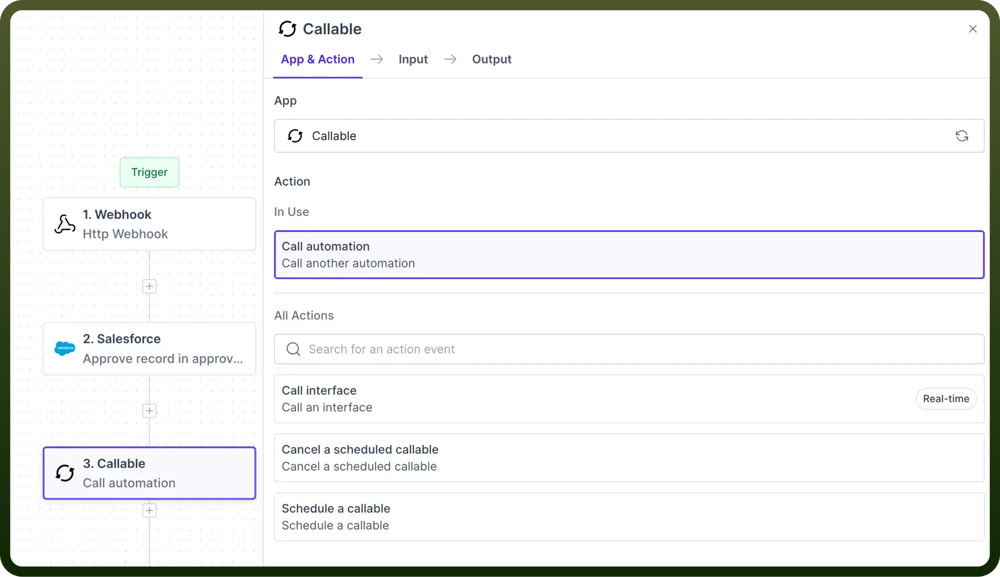
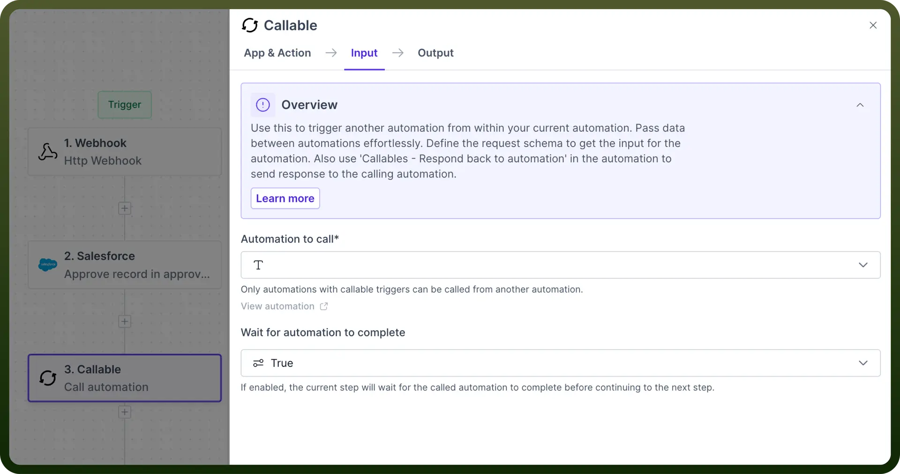
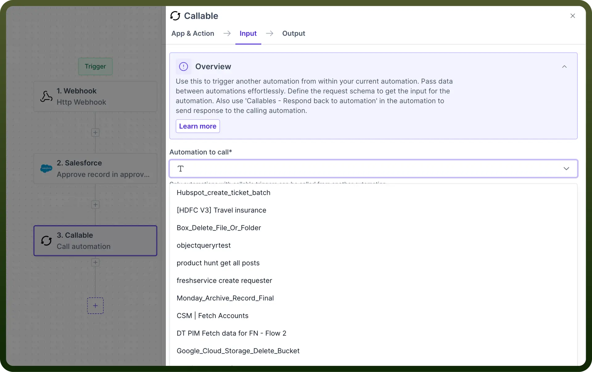
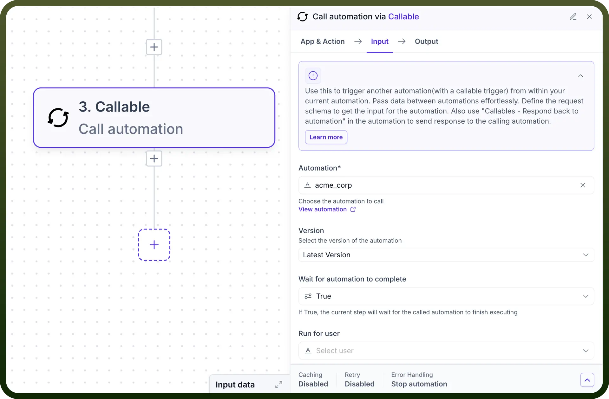
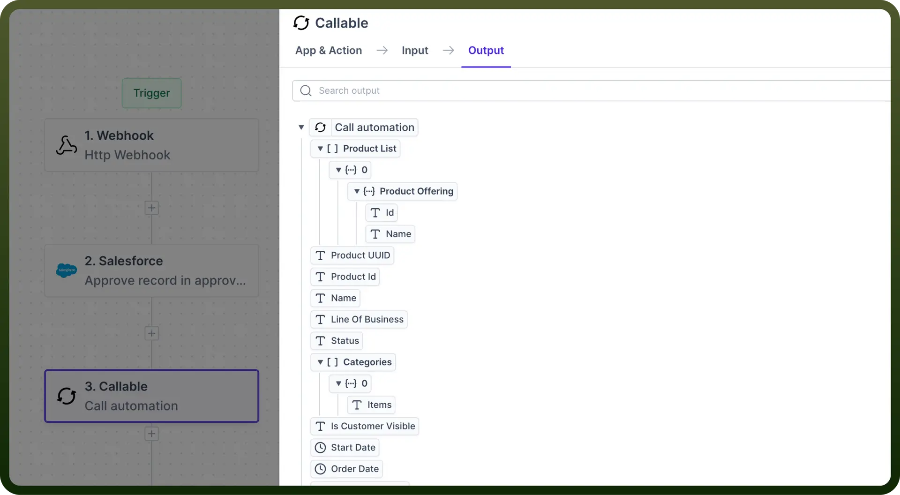

# Call another Automation

Source: https://www.unifyapps.com/docs/unify-automations/call-another-automation
Section: automations

---

## Overview

Integrating child automation into a parent automation **enhances reusability** in your automation processes.

## How to Call Child Automation?

It involves configuring an automation that is calling another automation.

Here's a step-by-step guide to call a child automation:

**Step 1: Insert Callable Action Node**

- Within the parent automation, select the “`call another automation`” action within the “`callable`” node.

  

**Step 2: Select Child Automation**

- In the configuration settings of the Callable node, you'll be prompted to choose which child automation to execute.
- Only Automation with "`Call from another automation`" as trigger are available in the dropdown.

**Step 3: Configure Execution Behavior**

Determine how the parent automation should proceed after calling the child automation.

**Wait for Completion**

- If `True`, the parent automation will pause until the child automation finishes executing. This is useful when the parent automation depends on the child automation’s output.
- If `False`, the parent automation will proceed without waiting for the child automation to finish. This is suitable for independent or parallel processes.

  

**Step 4: Map Input Parameters**

For every parameter outlined in the child automation's input schema, assign corresponding values from the parent automation. These values can be:

- Static data predefined in the automation
- Outputs from earlier steps in the parent automation
- Dynamic values calculated at runtime

  

**Step 5: Handle Child Automation Output**

- If the parent automation waits for the child automation to complete, you can utilise the child's output in subsequent steps of the parent automation.
- Map the output from the child automation to variables in the parent automation or directly incorporate it into further actions as needed.

  
