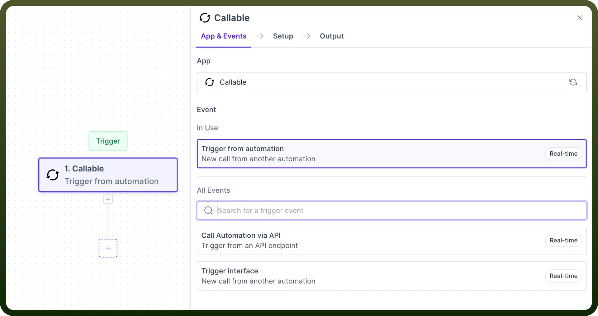
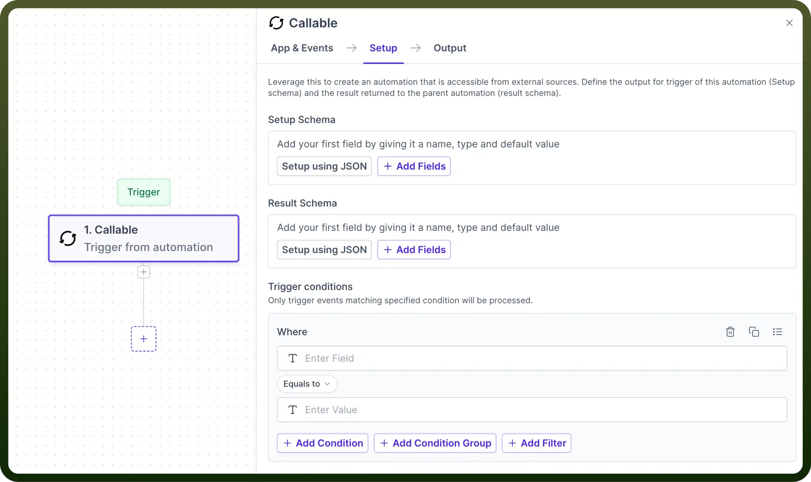
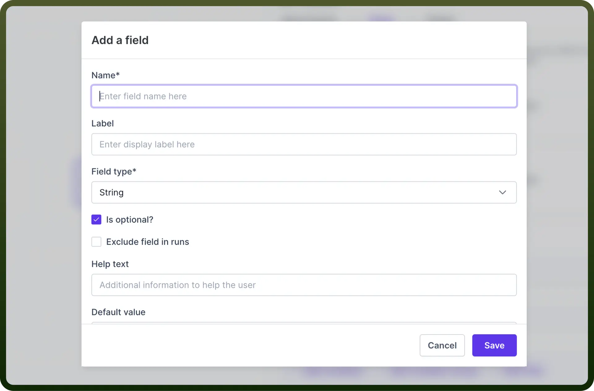
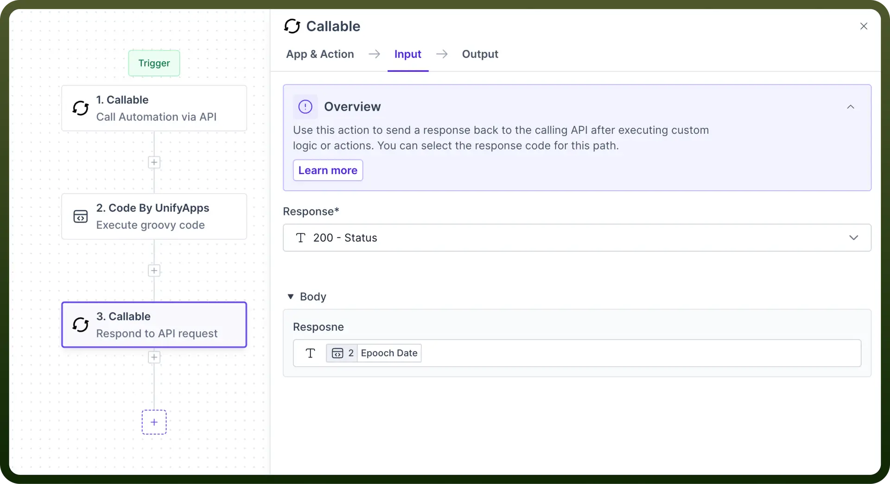

# Callable: Trigger from another Automation

Source: https://www.unifyapps.com/docs/unify-automations/callable-trigger-from-automation
Section: automations

---

## Overview

Trigger from Automation allows you to trigger one automation from another automation. It helps you to break complex automation into simpler, reusable components.

## How to Create Child Automation?

It involves configuring an automation that can be called via another automation(the **parent** automation in this case). This setup allows you to create reusable components in your automation processes.

Here's a step-by-step guide to setting up a child automation:

**Step 1: Add Trigger**

Select Callable Trigger, and from the available event types, select “`Trigger from automation`”.

**Step 2: Define setup Schema**

The input schema defines the parameters the parent automation will pass to the child. It ensures both automations communicate effectively.

For each field expected from the parent automation, provide the following details:

- `Name`**:** Assign a clear and **descriptive** name (e.g., "customerId", "orderDetails").
- `Field Type`**:** Specify the **type** of data (string, number, boolean, object, array).
- `Is optional`**:** Indicate if the **parameter** is required or optional.
- `Exclude field in runs`**:** Indicates if the field would be included in output **JSON** or not.
- `Help text`**:** Offer a brief **explanation** for clarity and future reference.

  

**Step 3: Define setup Schema**

The Output schema defines the parameters that will be returned to the parent automation. The Result Schema fields are configured in the same manner as mentioned above for setup schema.

**Step 4: Perform operations**

Define the sequence of actions that will be executed once the automation has been triggered by the parent automation. For example, using [Code by UnifyApps](/docs/unify-automations/callable-trigger-from-automation) to transform the date in Epoch format.

**Step 5: Returning Data to Automation**

The final step is to return the data to the parent automation. To return the data, map the data pill to the corresponding field in the "`Result Schema`" section of the "`Return data to Automation`" action within the callable node.

## How to Call child automation?

It involves configuring an automation that is calling another automation.

> **Note:** To know more refer to this [article](/docs/unify-automations/call-another-automation).
