# Callable via API

Source: https://www.unifyapps.com/docs/unify-automations/callable-via-api
Section: automations

---

## Overview

API-based callable allows users to trigger automations **through external API requests**, effectively bridging the gap between the UnifyApps automation platform and other system.

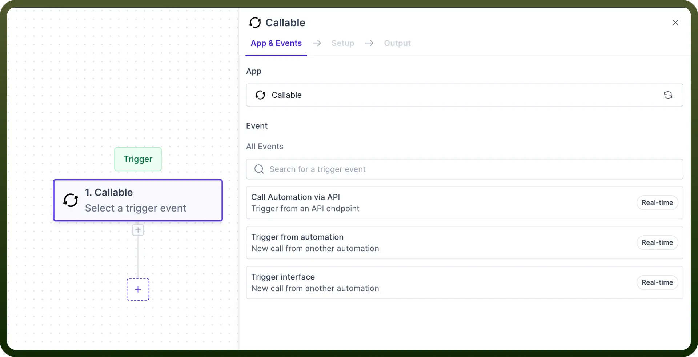

## Use Case

**API Integration for Data Processing**:

Let’s consider if you want to search a ticket in [Zendesk](/docs/unify-automations/callable-via-api), create a [salesforce](/docs/unify-automations/salesforce) case if the ticket exists in Zendesk, and then expose it as a `REST` endpoint. Anyone can use this endpoint to access and consume data without requiring access to the UnifyApps Account.

- Start by creating automation with “`Call Automation via API`” as a trigger
- Define the **request** and **response** structures for the endpoint by defining the API request trigger parameters required for searching a ticket in Zendesk. **For example**: Email address or ticket ID. (refer to the [link](/docs/unify-automations/callable-via-api) to know more about configuring request and response structure)

  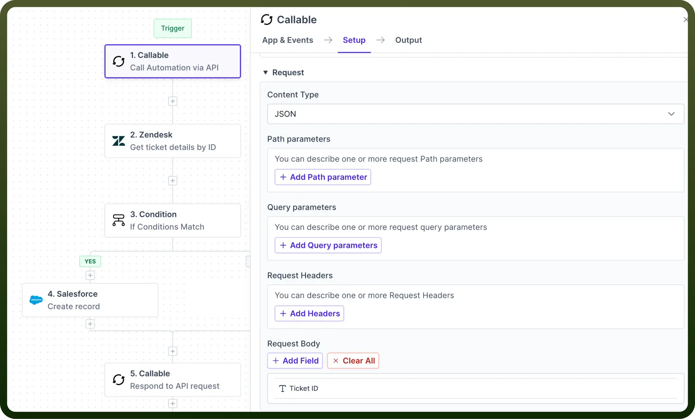

- Select the “`Get ticket details by ID`” action in Zendesk and map the “`Ticket ID`” to the “`Call Automation via API`” output.
- If the ticket exists then create a **Case** in Salesforce using the “`Create Record`” action in Salesforce.
- Select the “`Respond to API request`” action to ensure our API endpoint returns a response that indicates if the actions were successful.
- In the Response Schema section, **map** the appropriate data to the schema fields.
- **For example**, we want to return the created Case’s ID in the response, so we'll map our response field to the Case ID datapill returned from the Create record in Salesforce action.

  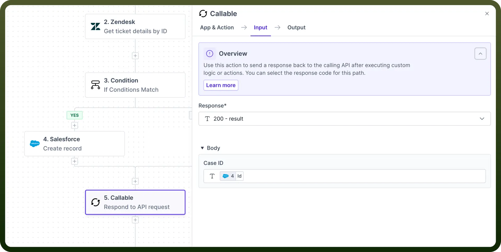

## How to Create Child Automation?

It involves configuring an automation triggered by calling an API from external system. Here's a step-by-step guide to setting up a API - based callable :

### Trigger Setup

To configure an API-based callable, follow these detailed steps after selecting the action type as `Trigger automation via API` under the callable trigger.

- **Import OpenAPI Spec:** Streamline API setup by uploading your existing OpenAPI 3.0 specification file directly into the Automation Builder's configuration interface.

  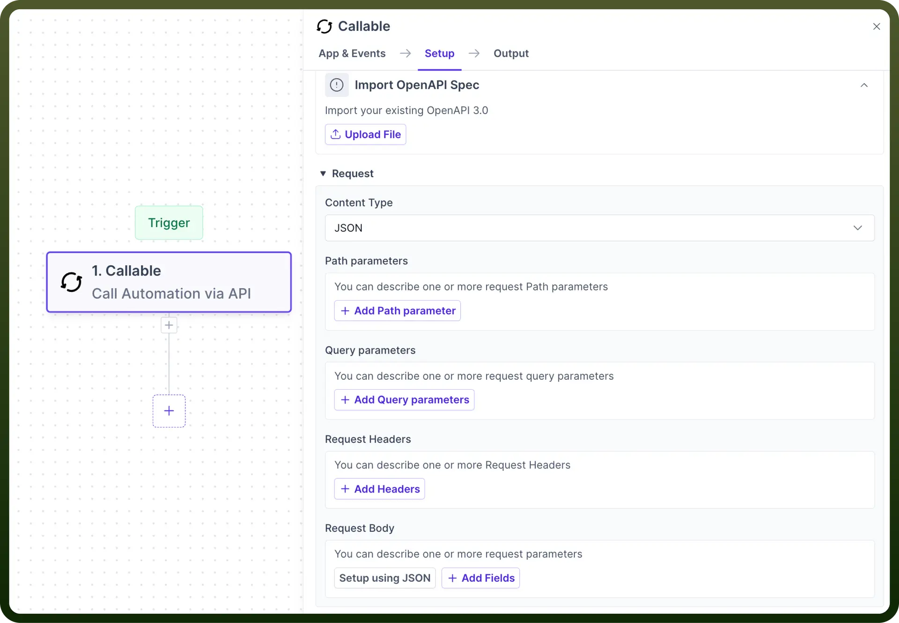

- **Upload File:** select your file from your system to configure the API endpoint automatically.

  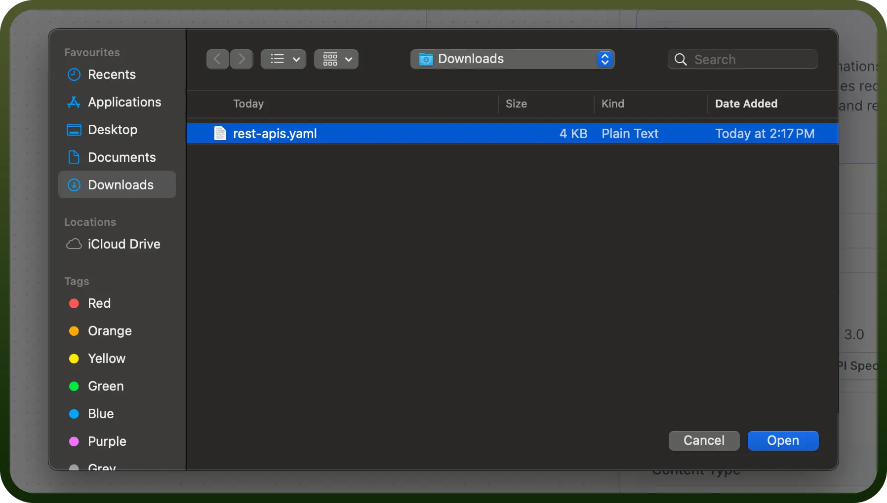

- If your file contains **multiple API endpoints** within your file, then all the endpoint will be avaible for selection. Select the endpoint that you want to import in request and response schema.

  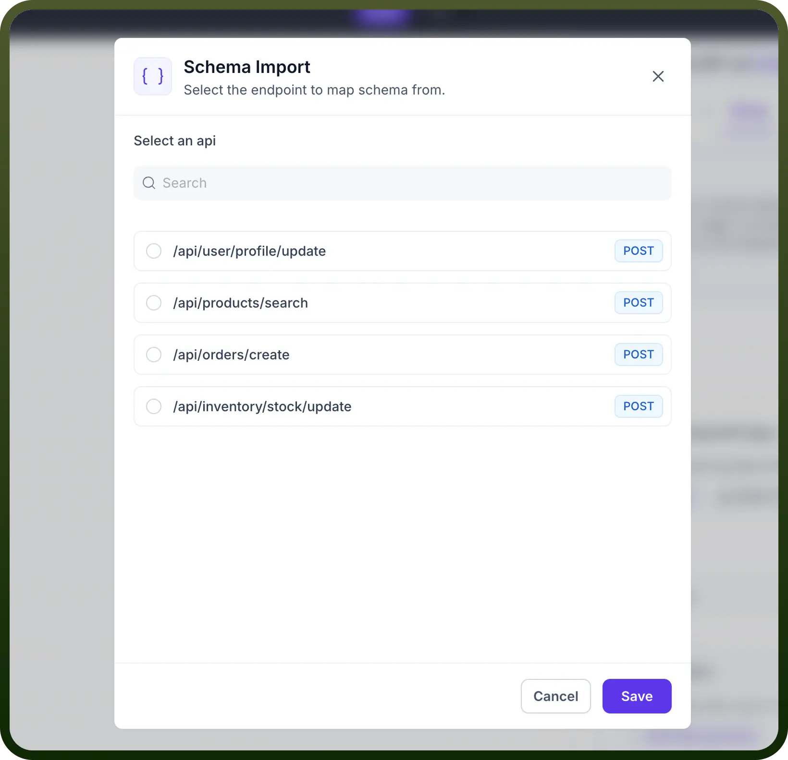

- After you are selected the endpoint, the request and response schema are mapped automatically.

  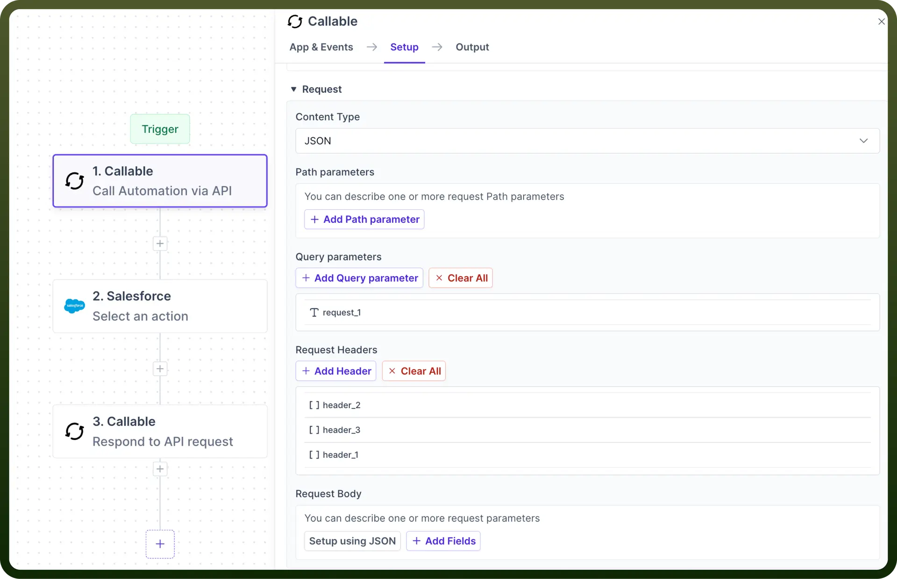

### Request

The input schema defines the parameters the External system will pass to the automation. It ensures both external system and automations communicate effectively.

For each field expected from the external system, provide the following details:

**Content Type:** Choose the format for your request body**.**

- **JSON (application/json)**: Structured data in key-value pairs, ideal for complex objects.
- **Form URL Encoded (application/x-www-form-urlencoded)**: Simple key-value pairs suitable for basic form submissions.
- **XML (application/xml)**: Hierarchical data format used in some legacy systems.
- **Multipart (multipart/form-data**): Supports mixed content types, often used for file uploads.

  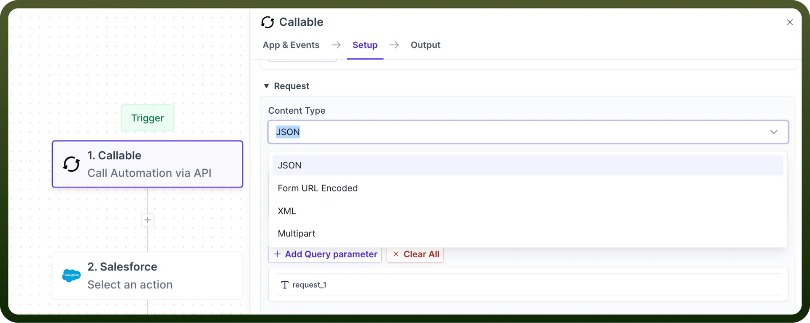

**Path Parameters**: Define dynamic parameter in your API URL by inserting variables into the URL structure.

- Specify each variable's name and data type (string, integer, etc.).
- Customize the API endpoint for each request.

**Example**:  API/users/orders, "`users`" and "`orders`" are path parameters.

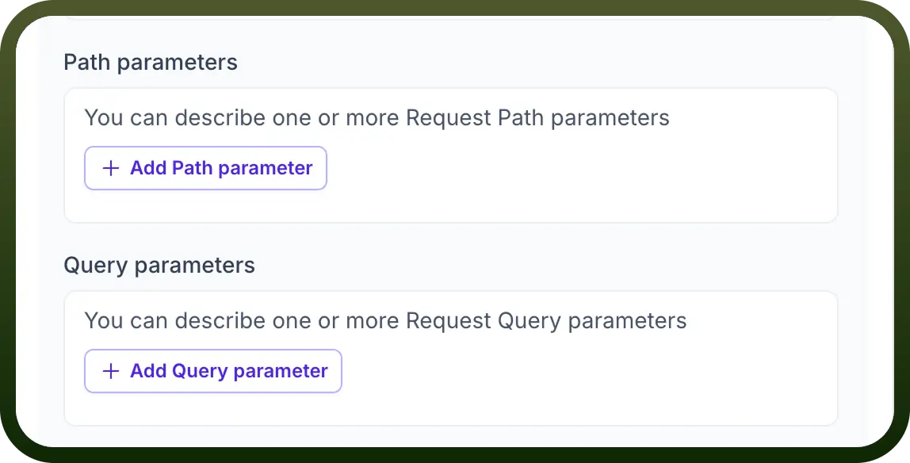

**Query Parameters:** Customize API requests by appending data to the URL using key-value pairs after the '`?`' in the URL.

- Specify parameter names, data types, and whether they're required.

These parameters fine-tune your request without altering the base URL structure.

**Example**: /api/products?category=electronics&sort=price_asc, Category is the Query parameter

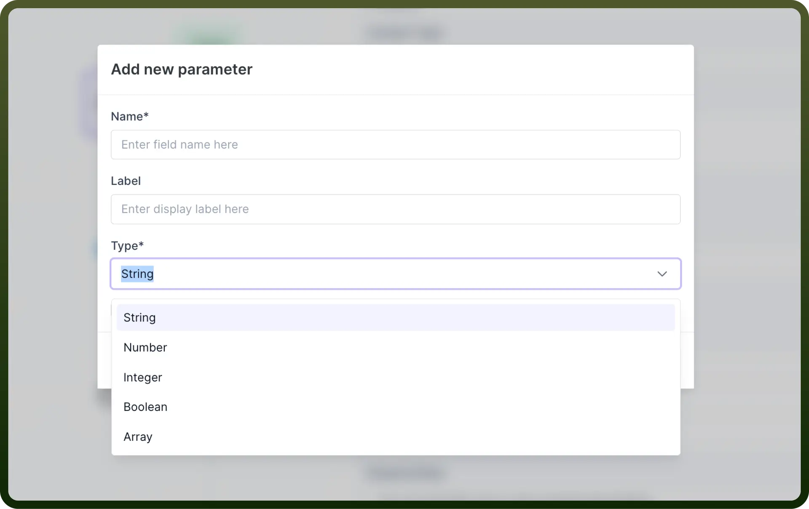

**Request Headers**: Set up metadata for your API request to provide context and control. Configure HTTP headers for various purposes, such as:

- **Authorization**: Secure access using API keys or tokens.
- **Content-Type**: Specify the request format, which is automatically set based on your earlier choices.
- **Accept**: Define your preferred response format.

Additionally, you can add custom headers to meet specific API requirements.

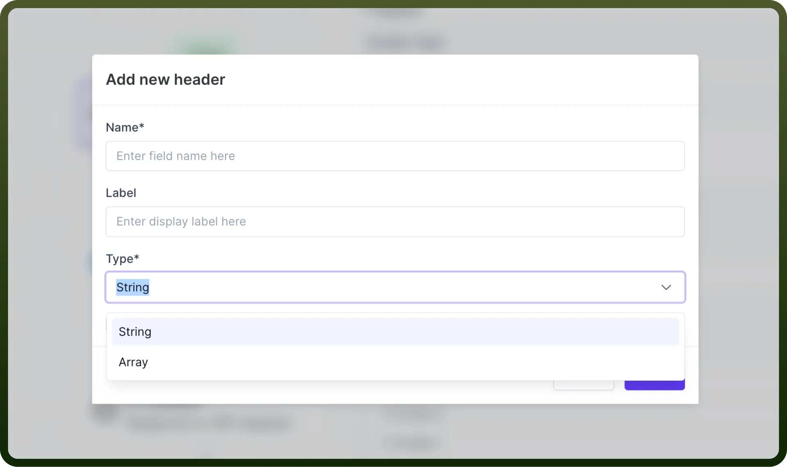

**Request Body**: Define the structure of the data you send in the request body.

- Provide a JSON schema that outlines the expected structure of the data.
- Specify each field's name, data type, and whether it is required.

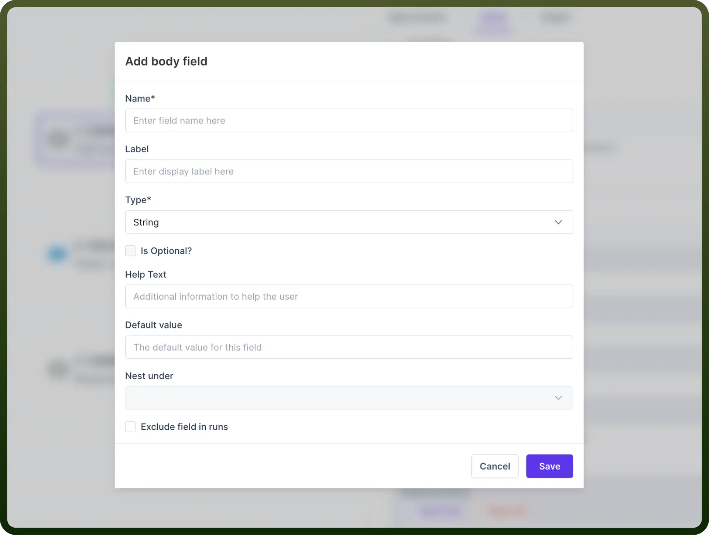

**Responses:** Defining how your API communicates with clients under different conditions is crucial when developing APIs. This involves specifying the responses your API sends back to the client.

Here's a simplified guide on how to set these responses up effectively:

- **Identify Scenarios**: First, identify the various scenarios your API will encounter. These typically include successful operations, validation errors, and server errors.
- **Assign HTTP Status Codes**: Each scenario should correspond to an appropriate HTTP status code. Common codes include:
  - **200 OK** Indicates a successful operation.
  - **400 Bad Request** Used when the client sends incorrect or incomplete data.
  - **500 Internal Server Error** Signals a problem on the server side.
- **Define Response Body Structure**: Use JSON schema to outline the structure of the response body. This ensures consistency and makes it easier for clients to parse the responses.
- **Include Descriptions and Examples**: Provide clear descriptions and examples for each response. This aids in understanding the purpose of each response and how to handle it.

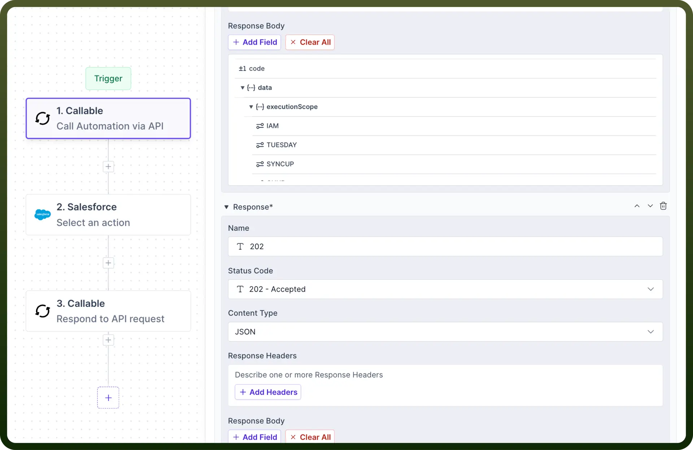

**Configure Trigger Conditions (Optional)**:

You can set up trigger conditions to enhance the efficiency and precision of your automation processes. These conditions determine when an automation should activate based on the content of API requests.

Here's a simplified guide to configuring trigger conditions effectively:

- **Determine When Automation Should Run**: Identify scenarios in which you want the automation to execute. This could be based on specific query parameters, values in the request body, or header information such as API keys.

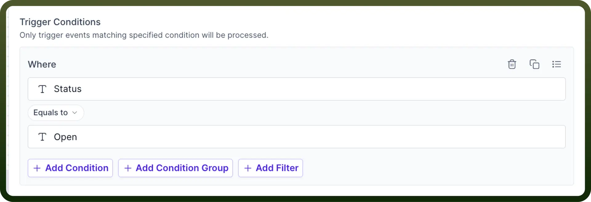

**Returning Data to API Request**

The final step is to return the data to the API Request. To return the data, map the data pill to the corresponding field in the "`Result Schema`" section of the "`Return data to API Request`" action within the callable node.

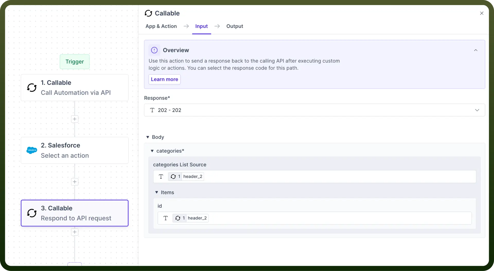
