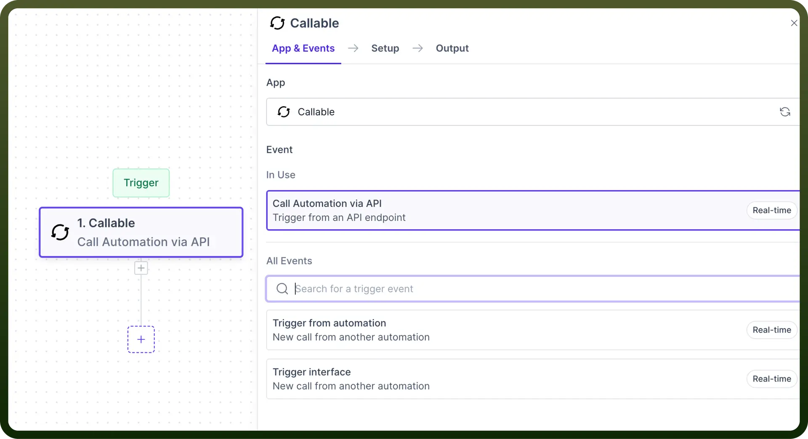
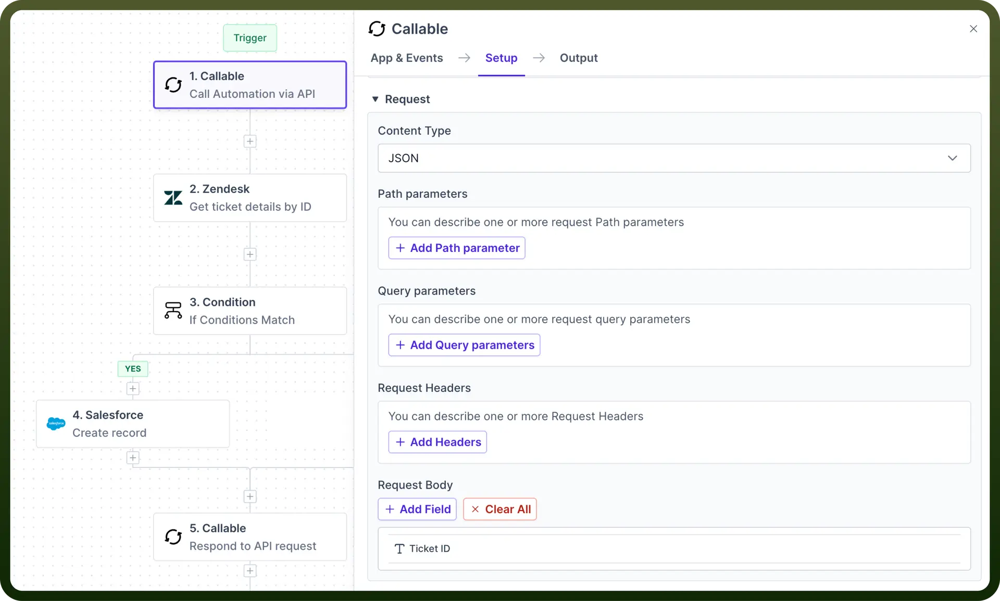
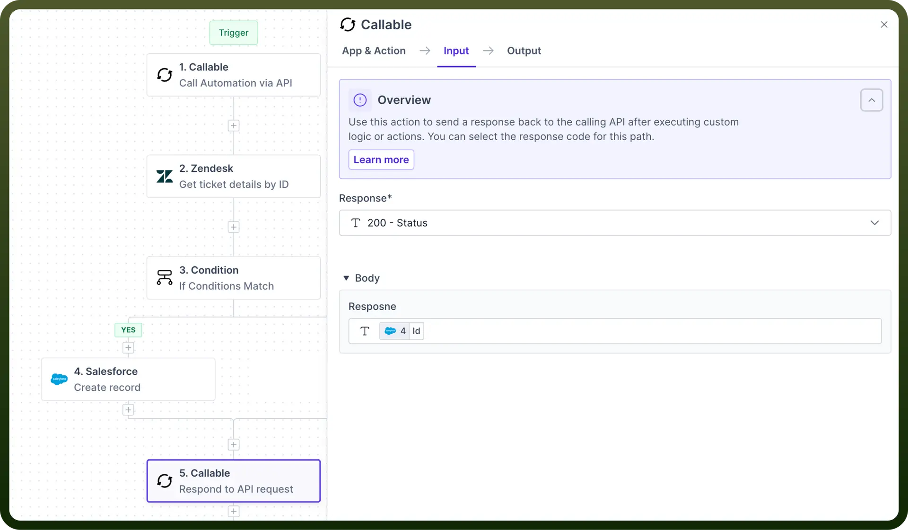

# Callable

Source: https://www.unifyapps.com/docs/unify-automations/callable
Section: automations

---

## Overview

Callables by UnifyApps enable the creation of reusable automations that can be **triggered externally** via **APIs** or from **other automations**.

"It allows you to seamlessly integrate with third-party systems, support dynamic automation selection based on runtime conditions, and implement conditional execution based on trigger parameters."

## Key Features

- **Initiate automation via external API calls:** Expose Automations via an API Endpoint that can be called from external systems. Explore more regarding API Endpoint creation [here](/docs/unify-automations/api-endpoint).
- **Trigger child automation from parent automation:** Allows you to build automations that can be called from other automations. It helps to create repeatable sets of actions that can be reused in other automations.
- **Create standardized interfaces for modular automation design:** Establish consistent input/output structure for your automations and drastically reduce the time taken to configure and maintain the callable automation.
- **Enable dynamic automation selection based on runtime conditions:** Create automation that can choose and execute different automation (interface based) in real-time, based on changing variables or user inputs

## Use Case

**API Integration for Data Processing**:

Let’s consider if you want to search a ticket in [Zendesk](/docs/unify-automations/callable), create a [Salesforce](/docs/unify-automations/salesforce) case if the ticket exists in Zendesk, and then expose it as a `REST` endpoint.

Anyone can use this endpoint to access and consume data without requiring access to the UnifyApps Account.

- Start by creating automation with “`Call Automation via API`” as a **trigger**.
- Define the request and response structures for the endpoint by defining the API request trigger parameters required for searching a ticket in Zendesk. For example: **Email address or ticket ID** **Note:** Refer to this [article](/docs/unify-automations/callable-via-api) to know more about configuring request and response structure.

  

- Select the “`Get ticket details by ID`” action in Zendesk and map the “`Ticket ID`” to the “`Call Automation via API`” output.
- If the ticket exists then create a Case in Salesforce using the “`Create Record`” action in Salesforce.
- Select the “`Respond to API request`” action to ensure our API endpoint returns a response that indicates if the actions were successful.
- In the Response Schema section, **map** the appropriate data to the schema fields.
- For example, we want to return the created Case’s ID in the response, so we'll map our response field to the Case ID datapill returned from the Create record in Salesforce action.

  

## Detailed Breakdown

**API-based Callable**

API-based callables allow you to trigger automation through external API requests.

> **Note:** You can read more about API-based callable [here](/docs/unify-automations/callable-via-api).

**Callable from Another Automation**

Allows you to build automations that can be called from other automations.

> **Note:** You can read more about Callable from Automation [here](/docs/unify-automations/callable-trigger-from-automation).

**Interface-based Callables**

It allows you to create standardized interfaces for your automation, enabling dynamic selection and execution of automations based on conditions.

> **Note:** You can read more about Interface based callable [here](/docs/unify-automations/automation-interfaces).
