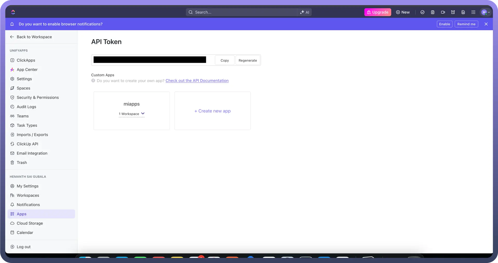

# ClickUp

Source: https://www.unifyapps.com/docs/unify-automations/clickup
Section: automations

---

ClickUp is a comprehensive tool designed to streamline work organization and tracking. It enhances productivity by enabling teams to manage tasks efficiently, stay on schedule, and maintain high standards of security.

Connecting your application to a ClickUp account enables integration of project management, automation, and task tracking.

## Authentication

Before you begin, ensure you have the following information:

- `Connection Name`**:** Choose a meaningful name for your connection. This name helps you identify the connection within your application or integration settings. It could be something descriptive like "MyAppClickUpIntegration".
- `Authentication Type`**:** Clickup supports API Token for authentication. This method ensures secure access to Clickup’s functionalities and data.

### Token Based Authentication

- L og into the account and navigate to the profile icon located in the top-right corner and select the settings options.
- In the left navigation pane, Navigate to the "`Apps`" section.
- Under the API token section , click on Generate button to generate your API token.
- You can directly access the following link to fetch the API token [Here](https://ap.clickup.com/9016254081/settings/apps).
- Treat this API Key with high confidentiality, as it allows access to your account.

  

## Actions

| Action | Description |
|---|---|
| `Create a checklist` | Creates a checklist for a task in ClickUp |
| `Create a checklist item` | Creates a checklist item in ClickUp |
| `Create a folder` | Creates a folder in ClickUp |
| `Create a folderless list` | Creates a folderless list in ClickUp |
| `Create a goal` | Creates a goal in ClickUp |
| `Create a list` | Creates a list in ClickUp |
| `Create a space` | Creates a space in ClickUp |
| `Create a space tag` | Creates a new space tag in ClickUp |
| `Create a task` | Creates a task in ClickUp |
| `Delete a checklist` | Deletes a checklist in ClickUp |
| `Delete a checklist item` | Deletes a checklist item in ClickUp |
| `Delete a comment` | Deletes a comment in ClickUp |
| `Delete a folder` | Deletes a folder in ClickUp |
| `Delete a goal` | Deletes a goal in ClickUp |
| `Delete a list` | Deletes a list in ClickUp |
| `Delete a space` | Deletes a space in ClickUp |
| `Delete a space tag` | Deletes a space tag in ClickUp |
| `Delete a target` | Deletes a target in ClickUp |
| `Delete a task` | Deletes a task in ClickUp |
| `Delete a task dependency` | Deletes a task dependency in ClickUp |
| `Delete task tag` | Deletes a task tag in ClickUp |
| `Delete time tracked` | Deletes time tracked in ClickUp |
| `Get folder details` | Retrieves the details of a folder via its ID from ClickUp |
| `Get goal details` | Gets details of a goal from ClickUp |
| `Get list details` | Retrieves the details of a list via its ID from ClickUp |
| `Get a space details` | Retrieves the details of a space via its ID from ClickUp |
| `Get a task Details` | Retrieves the details of a task  its ID from ClickUp |
| `Get details of specific view` | Gets details of a specific view in ClickUp |
| `Search custom fields` | Searches for custom fields in ClickUp |
| `Search folder views` | Searches for folder views in ClickUp |
| `Search folderless lists` | Searches for folderless lists in ClickUp |
| `Search folders in ClickUp` | Searches for folders in ClickUp |
| `Search goals` | Searches for goals in ClickUp |
| `Search list members` | Searches for list members in ClickUp |
| `Search list views` | Searches for list views in ClickUp |
| `Search lists in ClickUp` | Searches for lists in ClickUp |
| `Search space tags` | Searches for space tags in ClickUp |
| `Search space views` | Searches for space views in ClickUp |
| `Search spaces in ClickUp` | Searches for spaces in ClickUp |
| `Search task members` | Searches for task members in ClickUp |
| `Search task templates` | Searches for task templates in ClickUp |
| `Search tasks in ClickUp` | Searches for tasks in ClickUp |
| `Search team views` | Searches for team views in ClickUp |
| `Search teams` | Searches for teams in ClickUp |
| `Search view tasks` | Searches for view tasks in ClickUp |
| `Update a checklist` | Updates a checklist in ClickUp |
| `Update a checklist item` | Updates a checklist item in ClickUp |
| `Update a folder` | Updates an existing folder in ClickUp |
| `Update a goal` | Updates a goal in ClickUp |
| `Update a list` | Updates an existing list in ClickUp |
| `Update a space` | Updates an existing space in ClickUp |
| `Update a space tag` | Updates a space tag in ClickUp |
| `Update a task` | Updates an existing task in ClickUp |
| `Upload Attachment` | Uploads an attachment to a task in ClickUp |

## Triggers

| Triggers | Descriptions |
|---|---|
| `New event` | Triggers when an event occurs in ClickUp |
