# Code By UnifyApps

Source: https://www.unifyapps.com/docs/unify-automations/code-by-unifyapps
Section: automations

---

## Overview

**Code by UnifyApps** is a powerful automation component that allows users to execute custom code as part of their automation workflows. It serves as a flexible action step that supports multiple programming languages including Groovy, Java, JavaScript, Python, and custom snippets, enabling developers to implement complex logic and integrations that might not be feasible with standard pre-built actions.

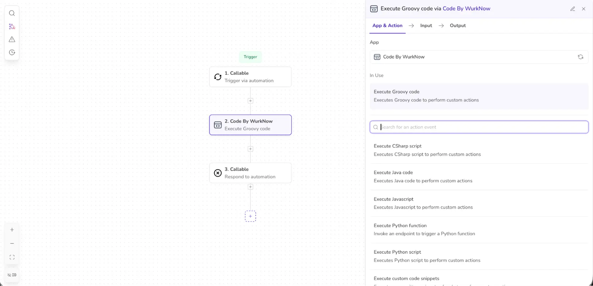

## Actions supported

Code by UnifyApps enables the execution of the following actions:

| **Action** | **Description** | **Common Use Cases** |
|---|---|---|
| `Execute groovy code` | Executes Groovy code to perform custom actions | Data transformation, complex string manipulation, integration with Java libraries |
| `Execute javascript` | Executes JavaScript to perform custom actions | Web API integrations, JSON manipulation, frontend interactions |
| `Execute python script` | Executes Python script to perform custom actions | Data analysis, machine learning, scientific computing, complex calculations |
| `Execute method from classpath` | Invokes a method from the specified classpath | Accessing existing business logic, reusing enterprise methods, legacy system integration |
| `Execute Java code` | Executes Java code to perform custom actions | Enterprise integrations, high-performance operations, using Java libraries |
| `Execute custom code snippets` | Executes pre-written snippets of code to perform custom actions | Reusing common logic patterns, standardized operations, team-shared functions |
| `Execute playwright script` | Executes playwright scripts to perform browser actions and returns the result | Web scraping, UI testing, form automation, screenshot capture |

## Libraries Supported

Code by UnifyApps provides access to numerous libraries across different programming languages to help you build powerful automations.

### Python Libraries

The following Python libraries are available on the platform:

**LangChain Ecosystem**

| **Library** | **Description** |
|---|---|
| `langchain` | Framework for developing applications powered by language models |
| `langchain-openai` | OpenAI integration for LangChain |
| `langchain-experimental` | Experimental features for LangChain |
| `langchain-community` | Community-contributed LangChain integrations |
| `langchain-huggingface` | Hugging Face integration for LangChain |

**Data Science & Machine Learning**

| **Library** | **Description** |
|---|---|
| `pandas` | Data analysis and manipulation tool |
| `numpy` | Scientific computing with Python |
| `torch` | Machine learning framework |
| `transformers` | NLP for PyTorch and TensorFlow |
| `scikit-learn` | Machine learning for Python |
| `boto3` | AWS SDK for Python |
| `sentence_transformers` | Sentence, text and image embeddings |
| `spacy` | Natural language processing |
| `nltk` | Natural language toolkit |

**Security & Document Processing**

| **Library** | **Description** |
|---|---|
| `presidio-analyzer` | Context aware PII identification |
| `presidio-anonymizer` | Anonymize detected PII entities |
| `pymupdf` | PDF document processing |
| `ebooklib` | E-book handling library |
| `bcrypt` | Password hashing |
| `msoffcrypto-tool` | MS Office document encryption |
| `cryptography` | Cryptographic recipes and primitives |

**Utilities & Helpers**

| **Library** | **Description** |
|---|---|
| `openpyxl` | Read/write Excel files |
| `requests` | HTTP library |
| `pytz` | World timezone definitions |
| `unstructured` | Extract data from documents |
| `unstructured[pdf,ppt,docx]` | Document format extensions |
| `markdownify` | Convert HTML to Markdown |
| `beautifulsoup4` | Screen-scraping library |
| `lxml` | XML and HTML processing |
| `xlrd` | Extract data from Excel files |
| `faker` | Generate fake data |

**Framework Support**

| **Library** | **Description** |
|---|---|
| `aiofiles` | File support for asyncio |
| `aiobotocore` | Async client for AWS services |
| `pydantic` | Data validation using Python type hints |
| `pydantic-mongo` | Pydantic and MongoDB integration |
| `parso` | Python parser |
| `cohere` | Access to Cohere's language models |

**Java & Groovy Libraries**

The platform supports all commonly used Java, Javascript and Groovy libraries. Users can raise a request to [support@unifyapps.com](mailto:support@unifyapps.com) for queries regarding any library.

## Use case

Let's demonstrate how to properly set up a code using Code by UnifyApps. In this example, our automation is triggered via a new mail in our Outlook account. We will capture the subject of the email and extract certain components from it using Regex.

- Start off by defining the input parameters for the code block. In our scenario, we will just need to take in the subject from the upstream automation.
- Since we are expecting to extract certain elements from the subject, go ahead and define your necessary output parameters. **Note:** Ensure that you are using appropriate casing since these input/output parameters will be used in your code as well. Good practice is to either use snake casing or camel casing for the keys of the variables.

  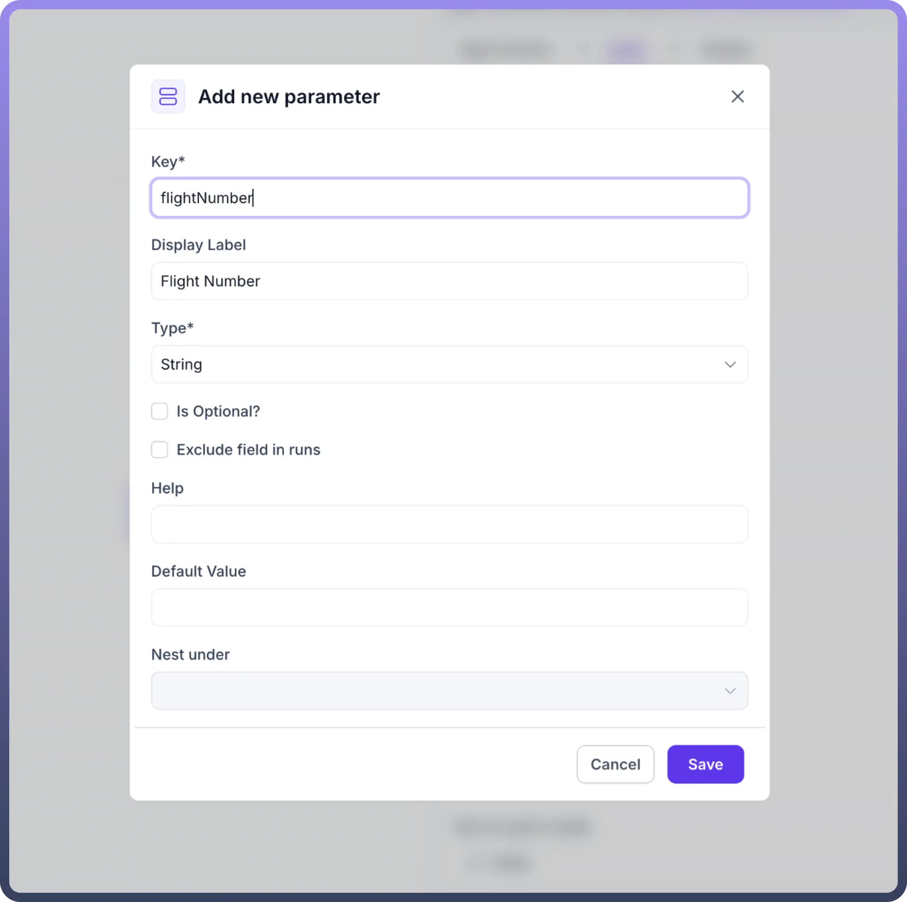

- Next, we can write the code as required in the editor. We can also expand the editor for easier use.
- Remember to return the desired output statements using a return statement. **Note:** It is essential to return the output of the code so as to be able to use it in the downstream automation. You have to map the variables in your code against the output parameters defined and then write a return statement.

  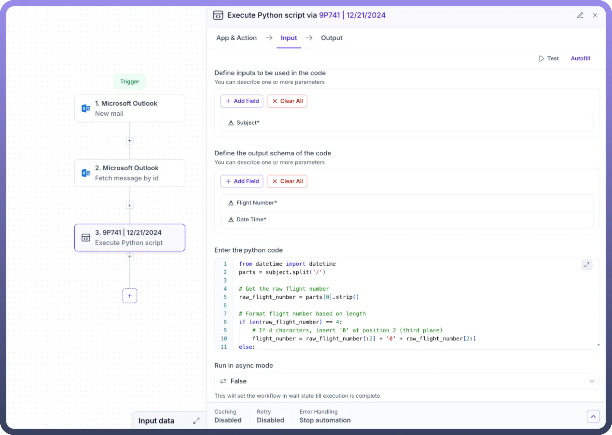

- We also have the ability to run the code in an asynchronous mode, i.e., that the workflow won’t wait for the code to finish and simply move on to the next steps.
- Finally, you have to map the input parameters with their respective data pills and the code is then ready to execute.

## Implementing Groovy Code

Let’s demonstrate how to properly set up a groovy code using Code by UnifyApps.

It is a simple example of converting the entered number to string by using the groovy code.

1. We will first define the setup schema as well as the output schema.

We took a number as the input in this example.

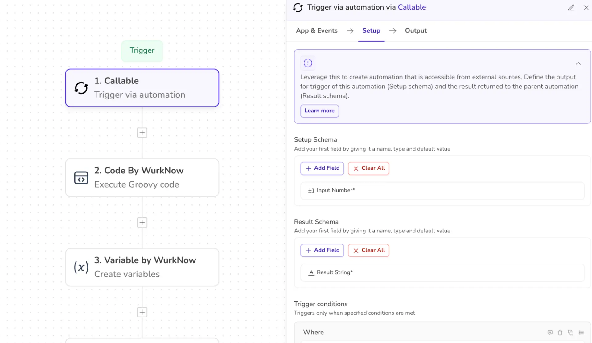

2. Selecting the app as “*CODE BY UNIFYAPPS”* and action as “*EXECUTE GROOVY CODE”.*
- Define the input schema as well as the desired output schema.
- Enter the code snippet of the function in the section “ENTER THE GROOVY CODE”.
- Also, map the input from the previous step to this step so that the code knows where the input value is.

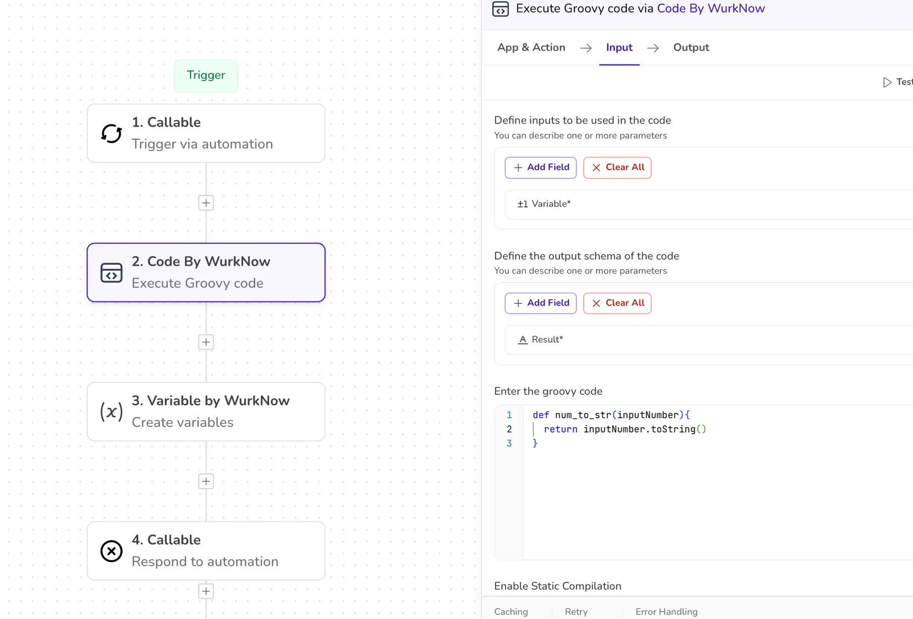

The platform has a feature to autofill the input parameters from the previous steps.

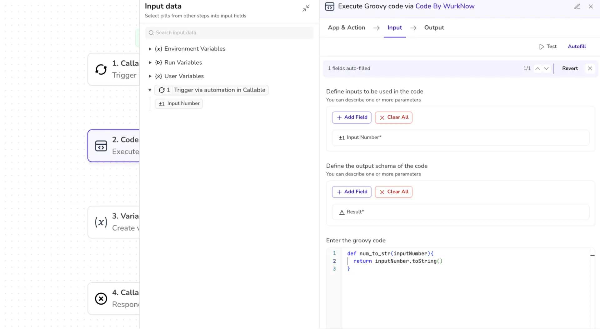

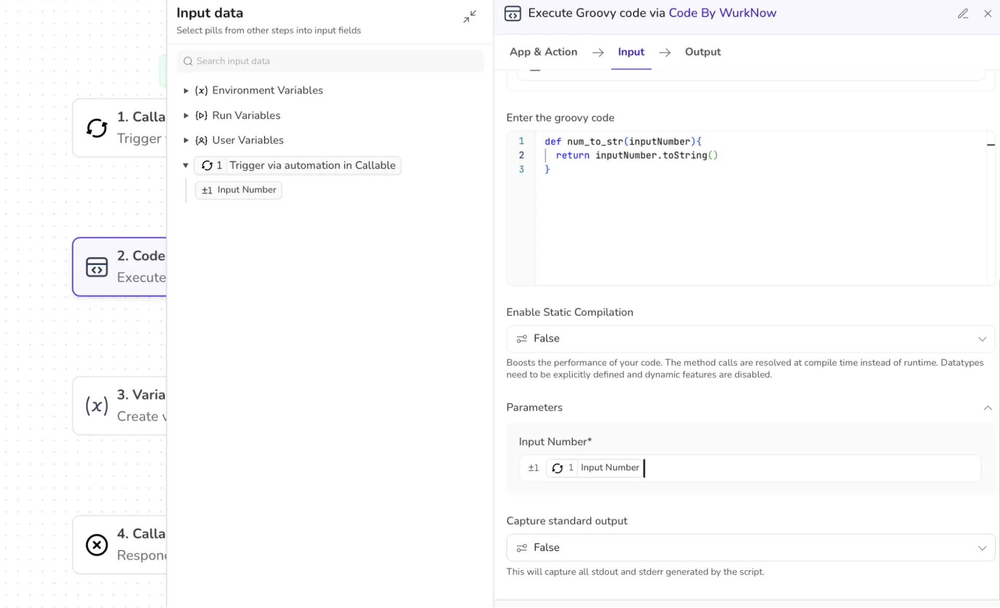

3. The output of this code returns the typecasted value (number ⇒ string) and the data pill is made available to be further used in the workflow.

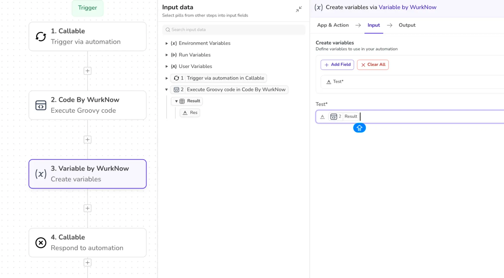

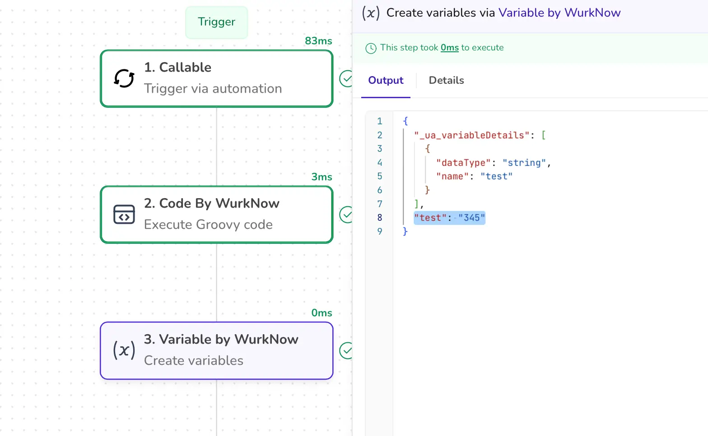

4. Map the output pill to the next step to continue the workflow or to return the result.

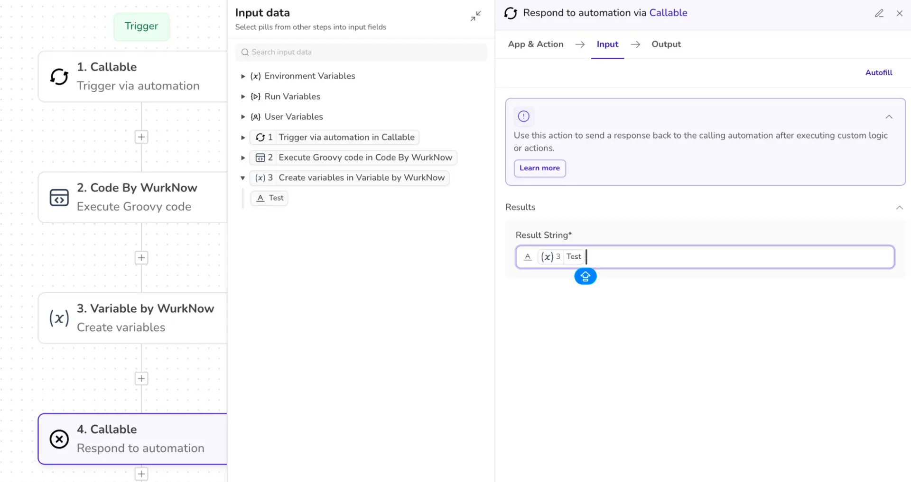

5. Now whenever this automation is being triggered and run, it will return the result as a “STRING”.

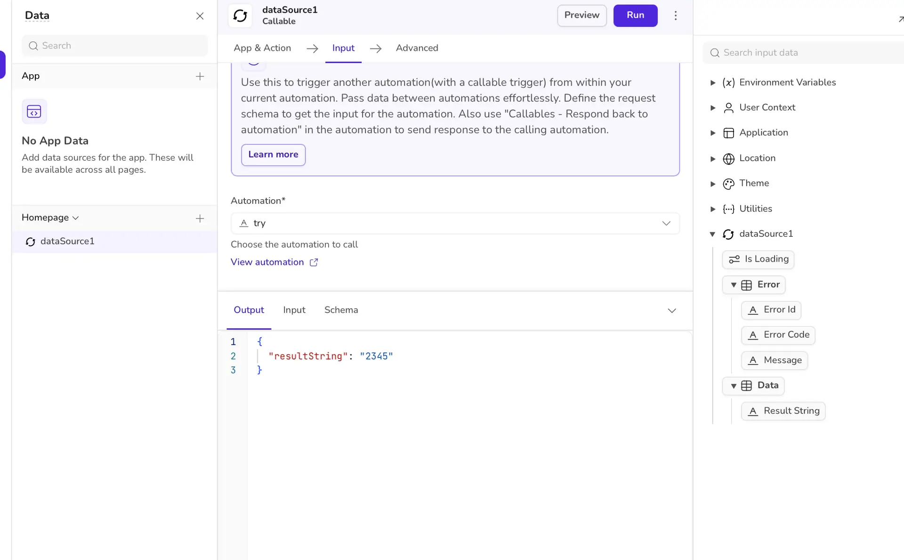

## Implementing Python Script

Let’s demonstrate how to properly execute Python Script using Code by UnifyApps.

1. The first step remains the same. We will first define the setup schema as well as the output schema.
- In the SETUP SCHEMA, add the variables that you want to input in the automation.
- In the RESULT SCHEMA, add the format/data that you wish to get as an output. The output of this step will be available for further usage in the workflow.

We took a number as the input in this example.

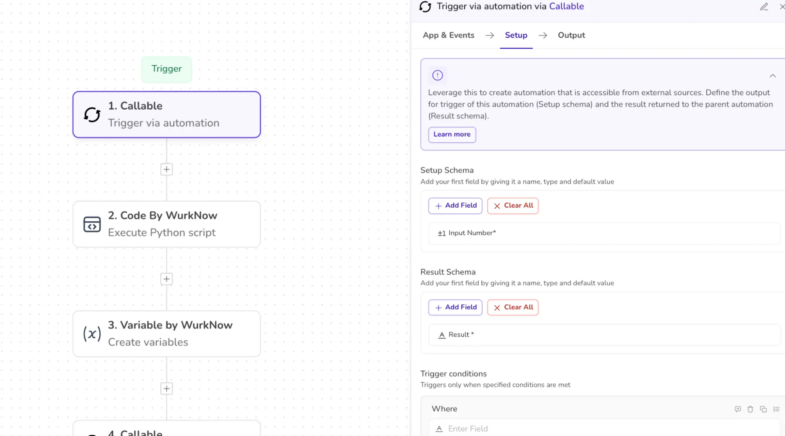

2. Selecting the app as “*CODE BY UNIFYAPPS”* and action as “*EXECUTE PYTHON SCRIPT”.*
- Define the input schema as well as the desired output schema.
- Enter the code snippet of the function in the section “ENTER THE PYTHON CODE”.
- Also, map the input from the previous step to this step so that the code knows where to get the input value from.

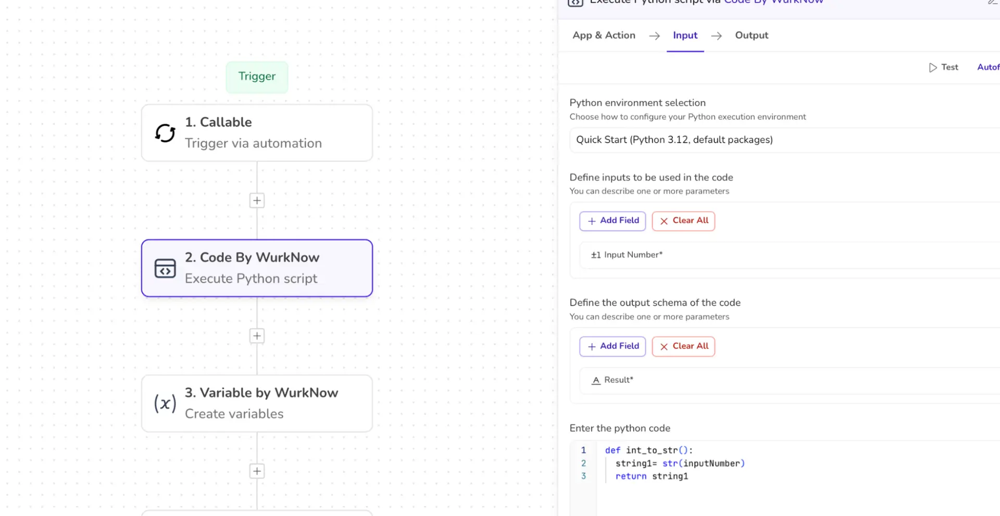

3. The output of this code returns the typecasted value (number ⇒ string) and the data pill is made available to be further used in the workflow.

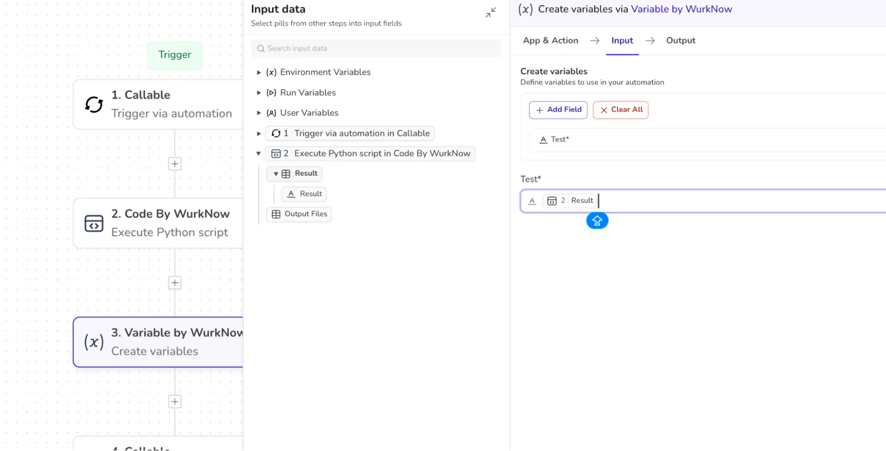

4. Map the output pill to the next step to continue the workflow or to return the result.

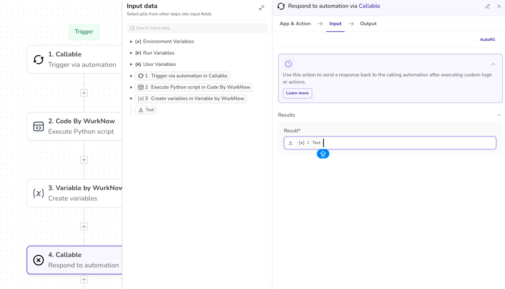
