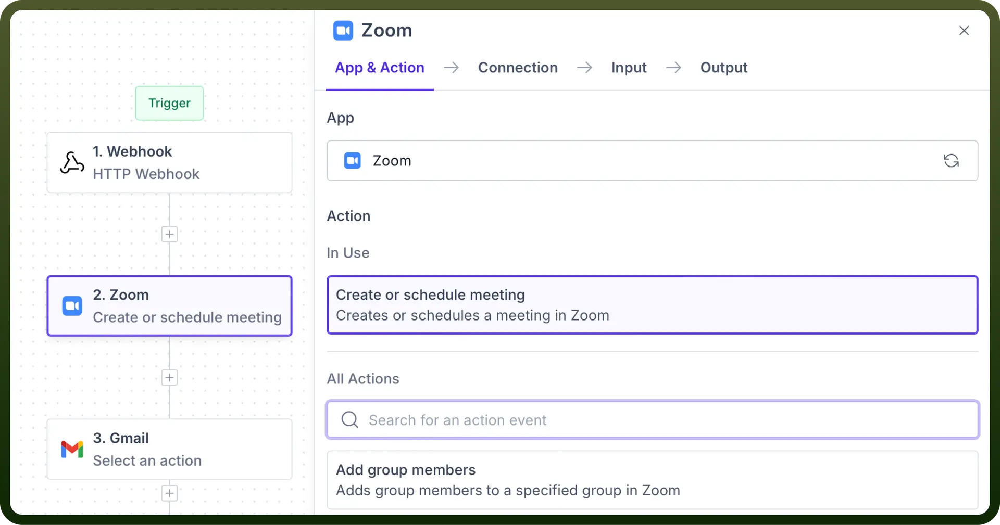

# Collaboration

Source: https://www.unifyapps.com/docs/unify-automations/collaboration
Section: automations

---

Collaboration connectors in UnifyApps enable integration between **conferencing platforms** thus automating workflows to enhance meeting scheduling, follow-ups, and information sharing.

## Use Case

To ensure that every new lead captured on our website is promptly followed up with personalised emails, we use a Collaboration connector to automate the process.

1. We configure a webhook to trigger the automation whenever a new lead fills up a form on our website.
2. We then create a new meeting link through our collaboration App(In this case Zoom).
3. We can then send a personalised email to our new lead using Gmail or any email marketing tool with the meeting link attached to it.
