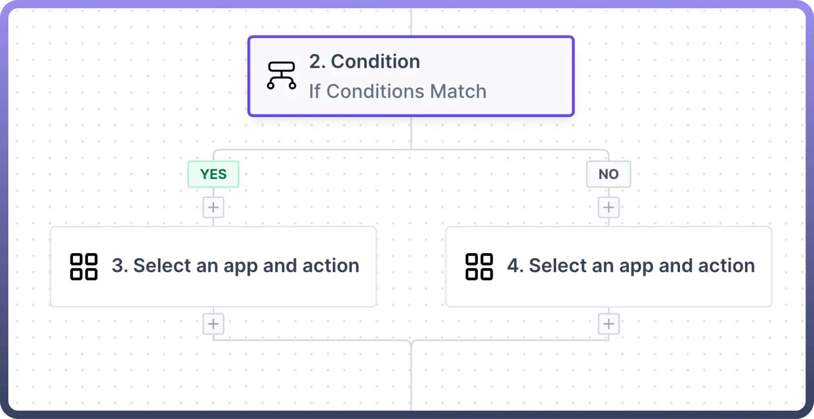
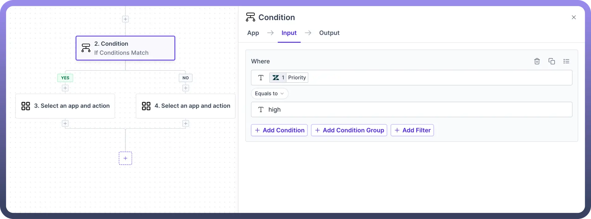
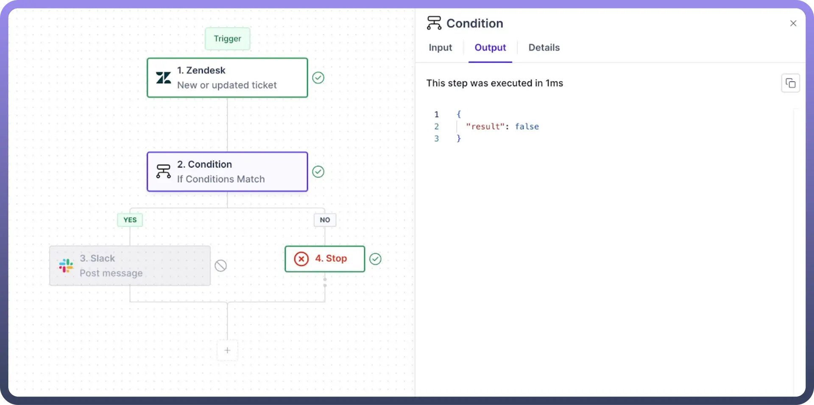
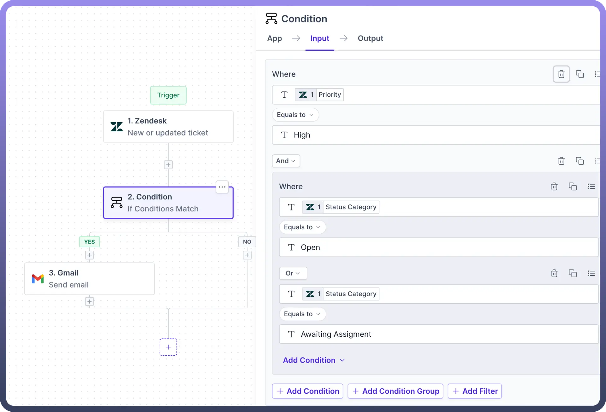

# Condition

Source: https://www.unifyapps.com/docs/unify-automations/condition
Section: automations

---

## Overview

The condition node enables **conditional logic** within the automation, allowing automations to branch based on specified criteria, similar to an **if-else** statement in programming.

Users can define conditions that, when met, triggers action in the "`yes`" branch, while alternative actions can be initiated from the "`no`" branch if the conditions are not met.

> **Note:** By default, each branch of the condition node contains a blank node. These can be deleted if necessary, but **at least one branch** must contain a node.

## Operations Supported

The condition node allows you to perform the following conditional operations:

| **Operators** | **Description** |
|---|---|
| `Equals to` | Checks if the field value is exactly equal to the specified value. |
| `Does not equal` | Checks if the field value is not equal to the specified value. |
| `Contains` | Checks if the field value contains the specified substring. |
| `Does not contain` | Checks if the field value does not contain the specified substring. |
| `Match Regex` | Checks if the field value matches the specified regular expression pattern. |
| `Does not match regex` | Checks if the field value does not match the specified regular expression pattern. |
| `Starts with` | Checks if the field value begins with the specified substring. |
| `Ends with` | Checks if the field value ends with the specified substring. |
| `Less than` | Checks if the field value is less than the specified value. |
| `Less than or equal to` | Checks if the field value is less than or equal to the specified value. |
| `Greater than` | Checks if the field value is greater than the specified value. |
| `Greater than or equal to` | Checks if the field value is greater than or equal to the specified value. |
| `Is present` | Checks if the field value is present (not null or empty). |
| `Is not present` | Checks if the field value is not present (null or empty). |

## Use Case

Let's take an example of how you can get notified via [Slack](/docs/unify-automations/slack) for all the high-priority tickets in [Zendesk](/docs/unify-automations/condition).

Here, we receive ticket details from Zendesk whenever any new ticket is created, or an existing ticket is updated.

1. Set a condition on the node where the '`priority`' field is compared using the '`equals to`' operator with '`high`' to filter out the high-priority tickets.
2. Select '`Slack`' as the app in the `yes` branch of the condition node. Then, choose '`Post Message`' as the action for the app to send a message.
3. In the `no` branch of the condition node, choose the '`stop`' node to terminate the conditional flow when ticket priority is not high.

  

## Input Features

1. **Flexible Conditions:** Define criteria based on text, numbers, dates, boolean values, and other data types.
2. **Conditional Operators:** When grouping two conditions, use `AND` to require both conditions for a true result, or use `OR` to require only one condition for a true result.
3. **Grouping**: Use the group button to combine multiple conditions, condition groups are useful when you want to implement a complex logic including both OR and AND .
  - For Example , When a ticket is created in Zendesk, if the ticket priority is “`High`” and status of the ticket is either “`Open`” or “`Awaiting Assignment`”, then send an email to the support team.

    

  - In the above scenario, the condition for the ticket's status being either "`Open`" or "`Awaiting Assignment`" will be grouped with "`OR`" operator, while the requirement for the ticket priority to be "`High`" will be grouped alongside the status condition using “`AND`” operator.
4. **Deletion**: Use the `delete` button to delete any condition or group of conditions directly.
5. **Cloning**: Use the `clone` button to duplicate any condition or group of conditions without manually re-entering them.
6. **Filtering**: Filtering for specific variables can be added to the condition node to provide filtered results to the node.
7. **Nested Conditions:** Create hierarchies of conditions within nodes to handle diverse automation scenarios effectively.

## Output Parameters

The output of a condition node is specified as a boolean parameter, resulting in either **true** or **false**. These outcomes determine the execution paths for the yes and no branches of the node, respectively.
