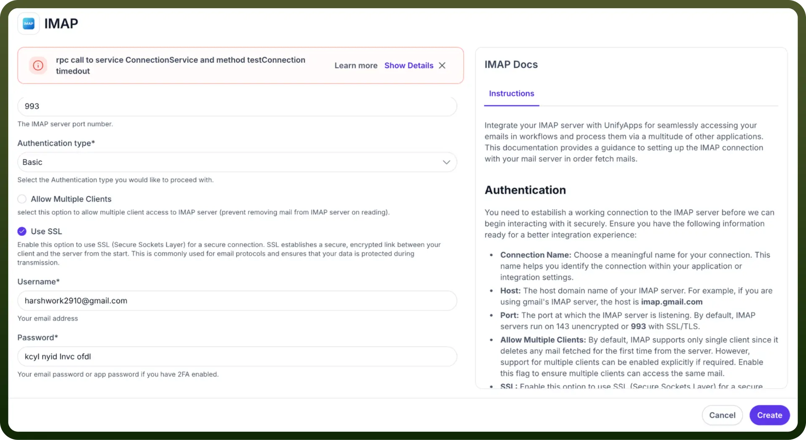
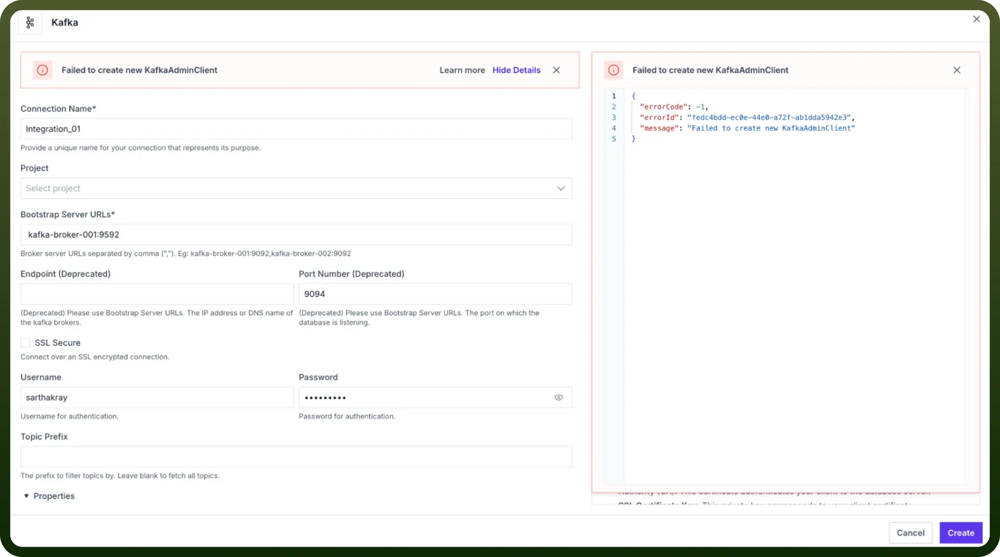
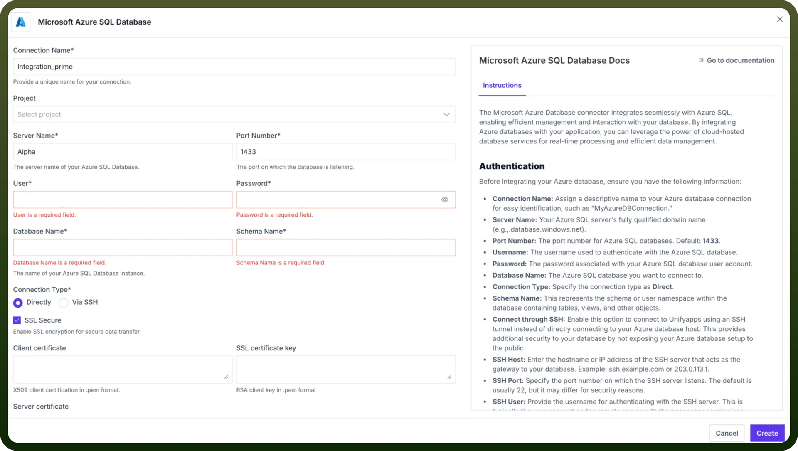
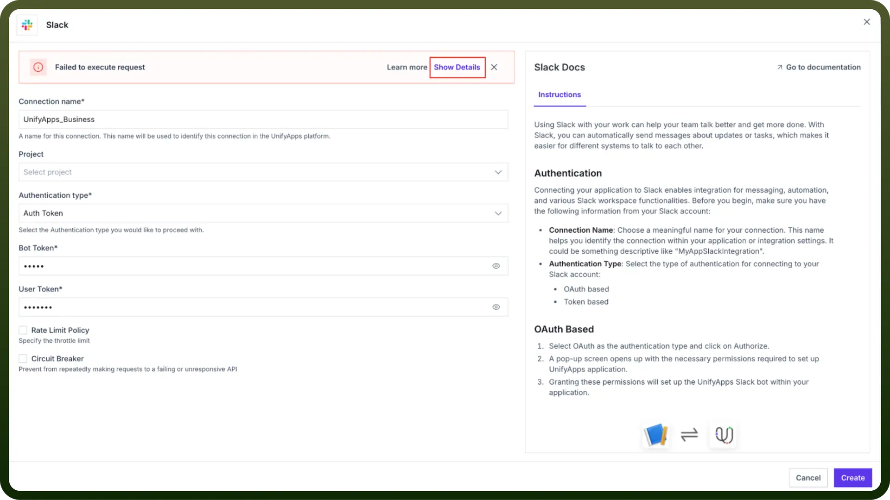
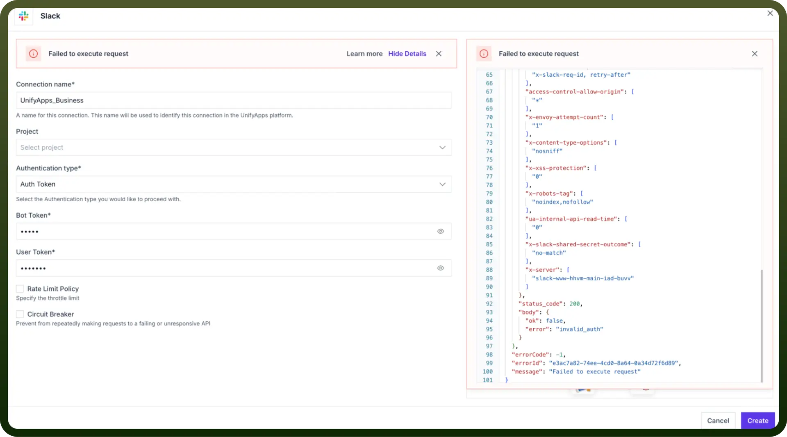

# Connection troubleshooting

Source: https://www.unifyapps.com/docs/unify-automations/connection-troubleshooting
Section: automations

---

## Overview

This comprehensive resource will help you diagnose and resolve connection issues when setting up integrations with external services. Whether you're connecting to APIs, databases, or third-party platforms, this guide covers common challenges and their solutions.

## API Timeout Issues

API timeouts occur when the connection attempt to the target service exceeds the maximum allowed time. These timeouts are critical protection mechanisms that prevent system resources from being tied up indefinitely but can indicate underlying connectivity or configuration issues that need to be addressed.

**Potential Causes**

- Network connectivity issues
- Firewall restrictions
- Service availability problems

**Solutions**

There are multiple ways in which you can enable access and resolve timeout issues:

- IP Whitelisting
  - Add your UnifyApps IP addresses to the target service's allowlist
  - Verify firewall rules aren't blocking the connection
  - Ensure all necessary ports are open
- SSL Certificate Configuration
  - Verify that the SSL certificate is valid and not expired
  - Ensure the certificate chain is complete
  - Check if the target service requires specific SSL/TLS versions
- SSH Tunnel Setup
  - Configure SSH tunnel for secure connectivity
  - Verify SSH key permissions
  - Ensure the tunnel endpoint is correctly specified

## Incorrect Input Details

This section encompasses a broad category of errors that arise when the provided configuration parameters don't match the expected format or requirements of the target service. This can range from malformed URLs to invalid authentication tokens. These errors are often immediately detectable and typically return specific error messages that can help identify the exact nature of the misconfiguration.

**Potential Causes**

- Authentication Credentials
  - Invalid API keys or tokens
  - Expired Credentials
  - Incorrect authentication type selected
- Configuration Parameters
  - Wrong endpoint URLs
  - Incorrect port numbers
  - Invalid service-specific parameters

**Solutions**

- Verify Credentials
  - Double-check API keys and tokens
  - Ensure credentials have proper permissions
  - Regenerate tokens if necessary
- Validate Configuration
  - Confirm endpoint URLs are correct and accessible
  - Verify port numbers match service requirements
  - Check service-specific documentation for parameter formats

## Mandatory Fields Not Filled

This error type occurs when required configuration fields are left empty. Each integration type in UnifyApps has specific required parameters that must be properly configured for the connection to be established. These fields are fundamental to the connection setup and are typically marked with an asterisk (*) in the user interface. Missing mandatory fields prevents the connection from being saved or established, serving as a validation checkpoint before any connection attempt is made.

**Solutions**

- Field Validation
  - Review all required fields marked with asterisks (*)
  - Ensure no empty required fields
  - Verify format of the entered data matches the requirements
- Service-Specific Requirements
  - Check service documentation for mandatory parameters
  - Validate field format requirements
  - Ensure all dependent fields are properly configured

## OAuth Redirection Issues

OAuth redirection errors are specific to connections that utilise OAuth authentication flows. These errors occur when there's a mismatch between the redirect URLs configured in the OAuth provider's settings and the URLs expected by UnifyApps. This critical security feature of OAuth ensures authentication callbacks are only processed for pre-approved URLs.

**Potential Causes**

- Authentication Credentials
  - Invalid API keys or tokens
  - Expired Credentials
  - Incorrect authentication type selected
- Configuration Parameters
  - Wrong endpoint URLs
  - Incorrect port numbers
  - Invalid service-specific parameters

**Solutions**

- Verify Credentials
  - Double-check API keys and tokens
  - Ensure credentials have proper permissions
  - Regenerate tokens if necessary
- Validate Configuration
  - Confirm endpoint URLs are correct and accessible
  - Verify port numbers match service requirements
  - Check service-specific documentation for parameter formats

## Debugging your issues

- When an error occurs, a red alert banner will appear at the top of your connection configuration screen to notify you of the issue.
- Look for the specific error message in the alert banner, which briefly describes what went wrong during the connection attempt.
- Use the "`Show Details`" button to open an expanded error panel on the right side of your screen.

  

- The expanded error panel directly displays the complete error response from the service you're trying to connect to.
- Review the technical details in the error panel, which include HTTP status codes, timestamps, and service-specific error messages.

  

- You can follow some general sanity checks, such as:
  - Verify that all required fields in your connection configuration have been filled out correctly.
  - Double-check that your authentication credentials (tokens, keys, passwords) are current and have not expired.
  - Ensure that any URLs or endpoints you've entered match exactly what's specified in the service's documentation.
  - Test your credentials directly in the service's console or dashboard to confirm they're working correctly.
  - Consider testing the connection with different authentication methods if multiple options are available.
  - Review your network settings to ensure there are no firewall rules blocking the connection.
- Finally, please reach out to support@unifyapps.com if you've tried the troubleshooting steps above but are still experiencing issues.
