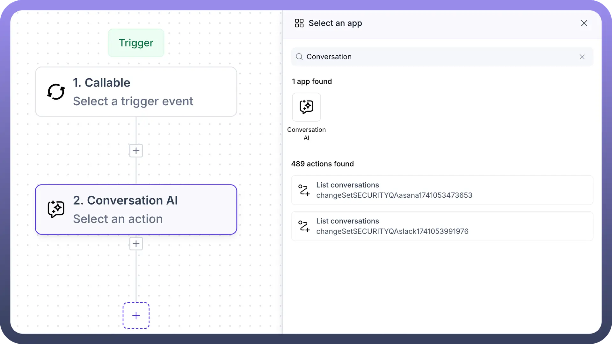
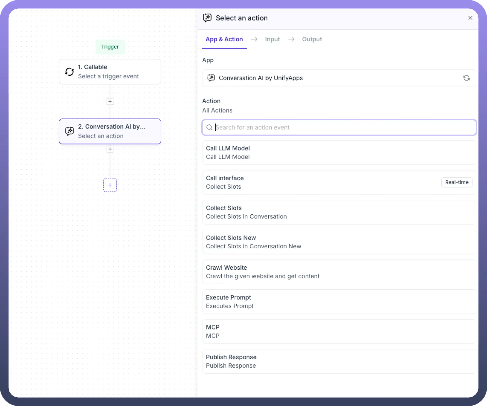
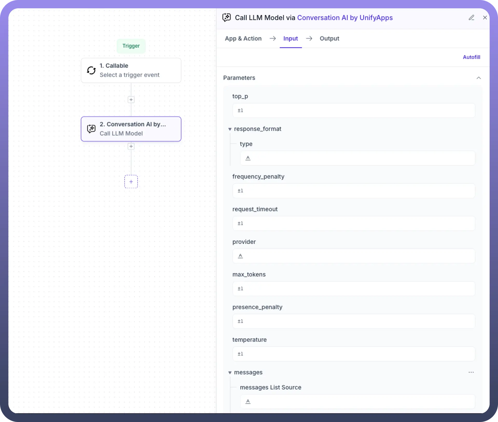
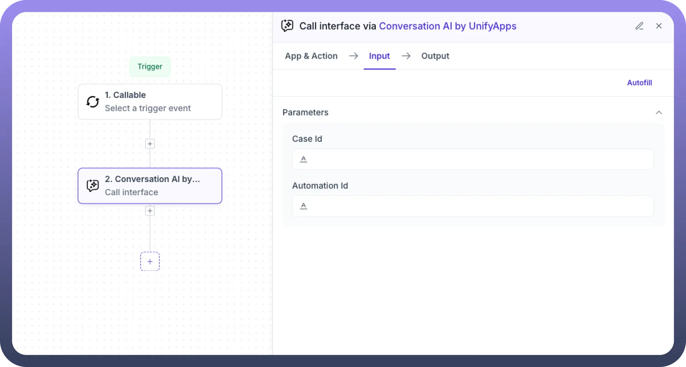
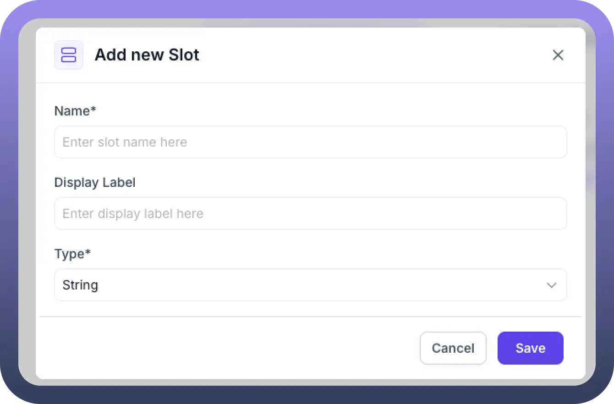
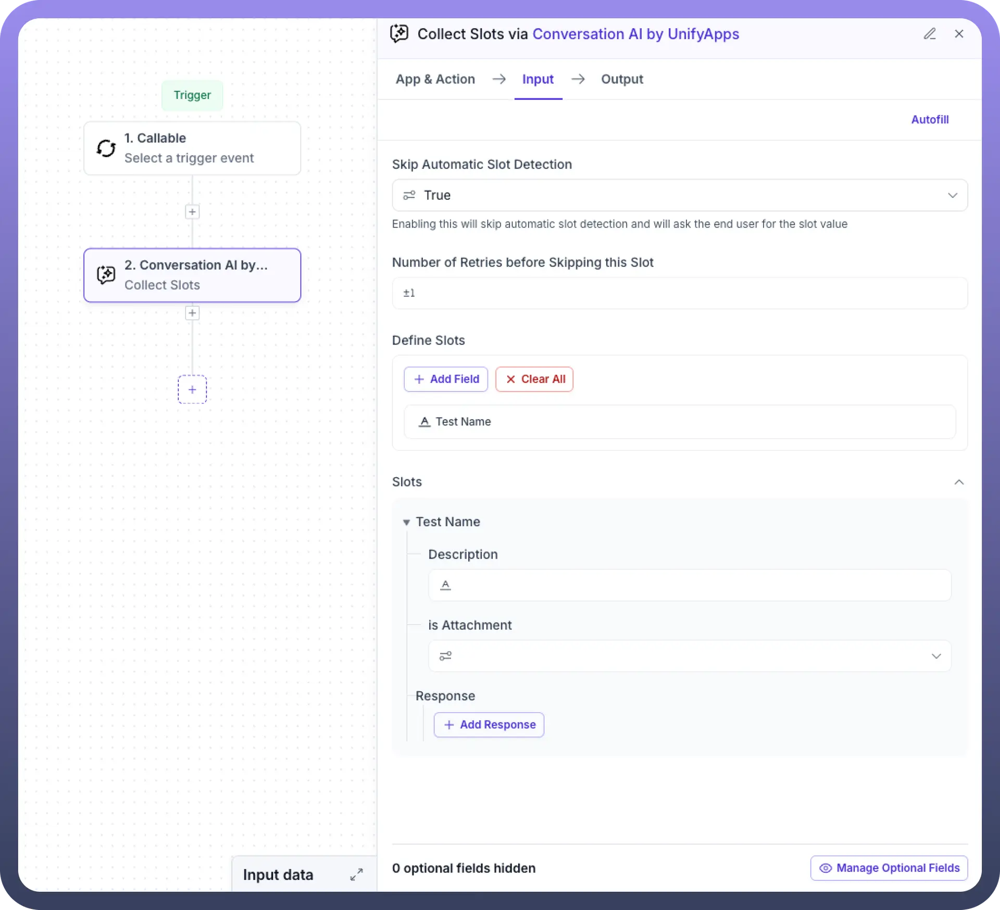
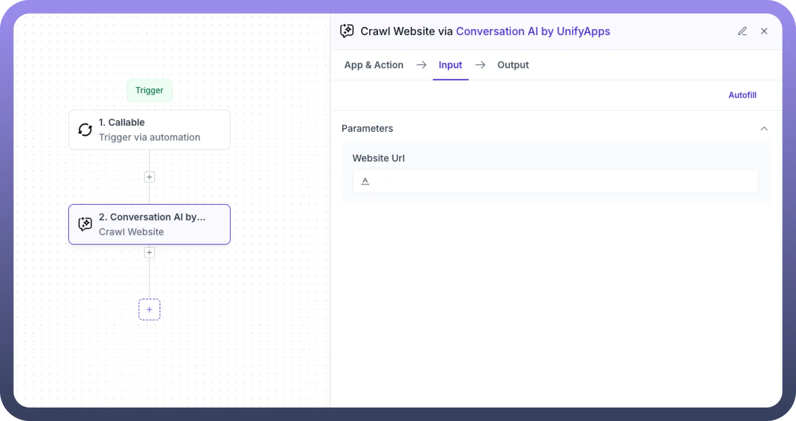
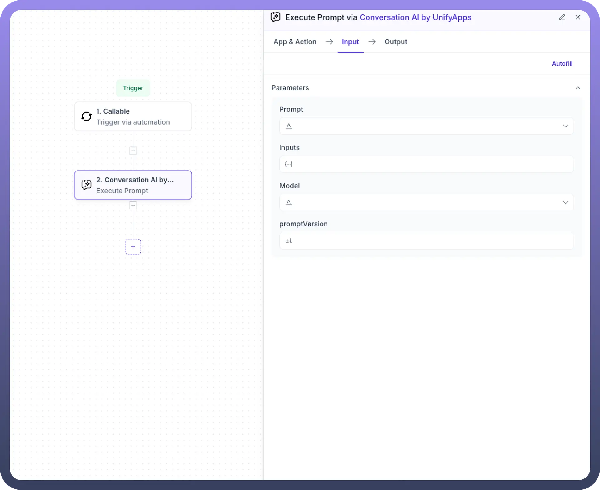
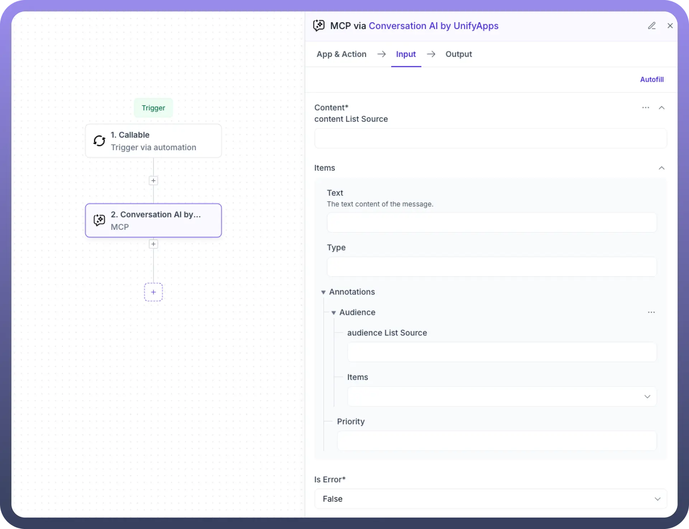
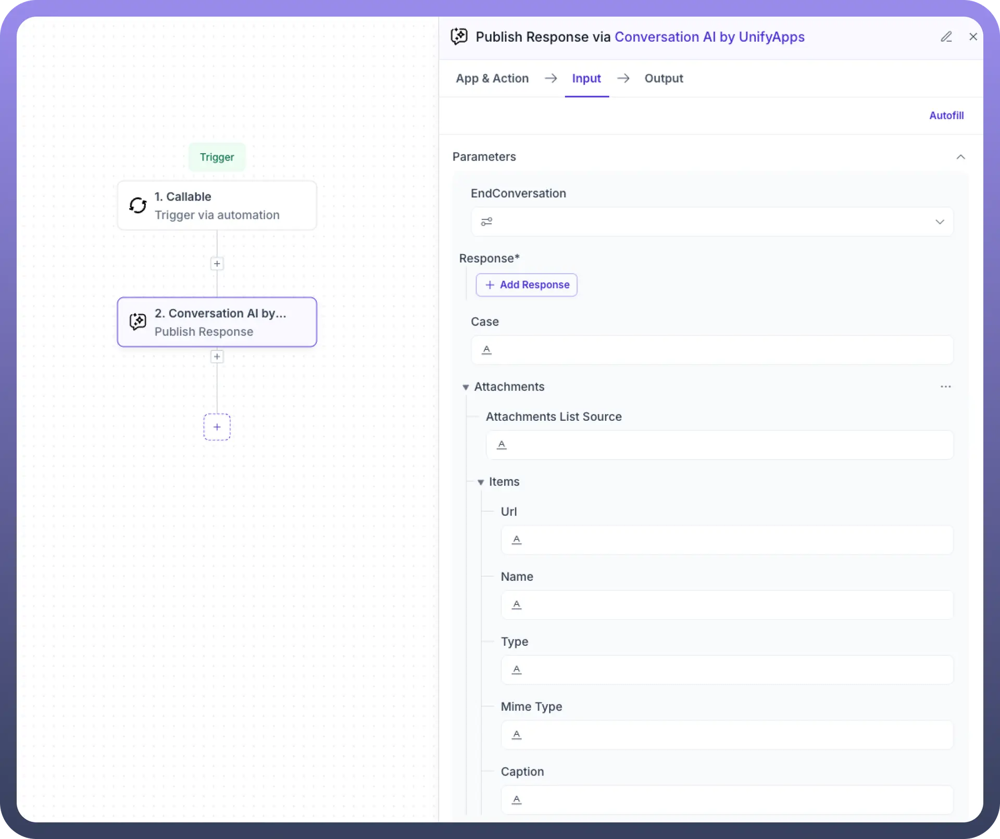

# Conversation by UnifyApps

Source: https://www.unifyapps.com/docs/unify-automations/conversation-by-unifyapps
Section: automations

---

## Overview

The Conversations node by UnifyApps facilitates seamless automation of user interactions, making business processes more efficient and intuitive. Designed specifically for business users, this feature simplifies integration with language models, external systems, and structured data collection, empowering teams to automate complex conversations and tasks effortlessly.

## Use Cases

**Enhanced Customer Engagement**

Business users leverage the "`Call LLM Model`" and "`Publish Response`" actions to automate customer interactions, providing timely, accurate, and personalized responses, enhancing overall customer satisfaction.

**Integrated Data Management**

Teams utilize "`Call Interface`" and "`Execute Prompt`" actions to seamlessly integrate automation workflows with external CRMs, databases, and web services, ensuring data accuracy and operational efficiency.

**Efficient Information Collection**

The "`Collect Slots`" feature streamlines structured data collection during conversations, aiding businesses in capturing essential customer information, feedback, or service requests effectively.

## Actions

### Call LLM Model

This action connects automation workflows directly to large language models, enabling automated content generation and dynamic conversation handling. It is especially useful for product analysts and business teams looking to automate knowledge-based responses, generate summaries, or enrich user experiences with AI-driven interactions.

**Input Requirements:**

- **Model ID:** Choose the specific LLM to use.
- **System Prompt:** Define the guiding instruction for the model.
- **Session ID:** Identifier to maintain conversation context.
- **Stream:** Whether the output should be streamed.
- **Tools List Source & Items:** Add custom tools for the LLM to use.
- **Messages List Source & Items:** Configure message roles, content type, text, and media.
- **Parameters:** Includes temperature, max tokens, top_p, frequency/presence penalties, timeout, etc.
- **Retry & Error Config:** Handle retry behavior and define error messages.
- **Media Inputs (optional):** Such as image_type, media_type, and image_data.

**Output:**

- Generated responses based on the prompt, tools, and messages passed to the model.

### Call Interface

This action allows UnifyApps workflows to invoke internal platform functionalities such as triggering automations or referencing internal data. It helps orchestrate internal services and ensures various UnifyApps components remain connected.

**Input Requirements:**

- **Case ID:** Reference to the context or ticket.
- **Automation ID:** Identifier for the specific automation to be triggered.

**Output:**

- Data fetched from or actions executed on external systems.

### Collect Slots

This action prompts users to enter specific data during a conversation, such as names, dates, or preferences. It is useful for building interactive flows like onboarding forms, surveys, and lead capture bots.

**Input Requirements:**

- **Skip Automatic Slot Detection:** Option to disable automatic inference of slot values.
- **Retries:** Define number of retries before skipping.
- **Define Slots:** Add fields with name, type, and display labels.
- **Slot Response Settings:** Configure description, attachment allowance, and nested responses.
- **Response Configuration:** Set language, question, header, title, and multiple choice options.

  

### Crawl Website

This feature helps businesses automate the extraction of information from public webpages. It's ideal for scenarios like tracking competitor content, gathering FAQs, or indexing relevant articles into knowledge bases.

**Input Requirements:**

- **Website URL:** The URL to crawl and extract data from.

**Output:**

- Structured content retrieved from the target website.

### Execute Prompt

This action sends a structured prompt to a language model and receives a generated output. Based on its inputs—like parameters, model ID, and prompt version—it is most suitable for custom instruction tasks such as responding with tailored recommendations or reformatting user input dynamically.

**Input Requirements:**

- **Prompt:** Text instruction or question.
- **Inputs:** Custom values used in the prompt.
- **Model:** Select the LLM.
- **Prompt Version:** Indicate the version of the prompt.

**Output:**

- Result from executing the custom instruction.

### MCP

MCP is designed to preserve conversational memory across multiple messages or actions. It helps the automation understand user context better by maintaining message history, metadata, and annotations—leading to more coherent, intelligent conversations.

**Input Requirements:**

- **Content List Source & Items:** Define the actual content (text, type).
- **Annotations (Audience):** Specify target audience settings.
- **Is Error:** Flag to indicate if the message is an error.

**Output:**

- Context-aware interaction maintained across the conversation flow.

### Publish Response

This action is used to send back a message or content to the end user after processing their input. It is commonly used to simulate chatbot replies in test environments or finalize interaction steps by showing confirmations, next steps, or example outputs.

**Input Requirements:**

- **End Conversation Toggle:** Set whether this ends the interaction.
- **Response Structure:** Define content, language, URLs, and selectable options.
- **Attachments:** Include URL, name, MIME type, and caption.
- **From Customer User ID:** Identifier for the source user.
- **Co-Pilot Blocks & Reference List (optional):** Structure and enrich outgoing messages.

**Output:**

- Final response published to the intended audience or system.
