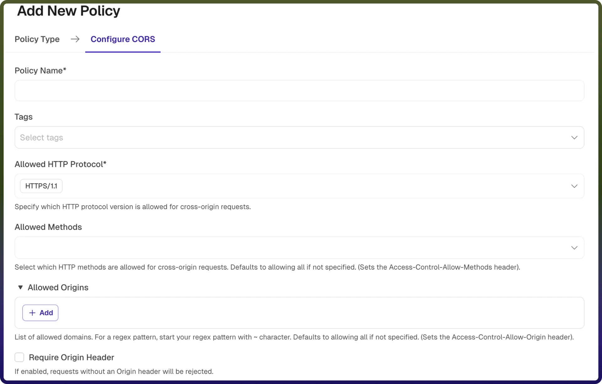
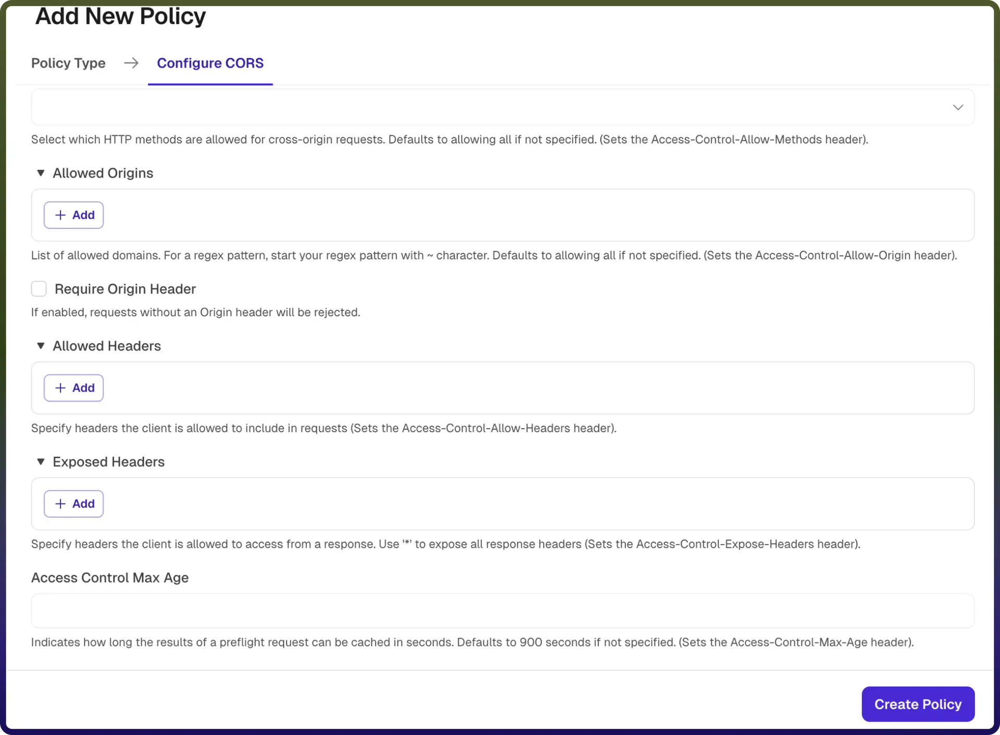

# CORS policy

Source: https://www.unifyapps.com/docs/unify-automations/cors-policy
Section: automations

---

## Overview

A CORS (Cross-Origin Resource Sharing) Policy controls how resources on your API can be accessed from different origins (domains). It defines which external clients are allowed to interact with your APIs and what type of requests they can make.

This policy helps enforce security by restricting unauthorized cross-origin access while enabling trusted domains to communicate with your backend services.

| **Field Reference** | **Description** |
|---|---|
| `Policy Name` | A unique identifier for the policy, used across logs, dashboards, and API group configurations. **Required** |
| `Tags` | Custom labels to organize and filter the policy by environment, team, or functionality. **Optional** |
| `Allowed HTTP Protocol` | Specifies which HTTP protocol version is permitted for cross-origin requests (e.g., HTTP/1.1, HTTP/2). **Required** |
| `Allowed Methods` | Defines which HTTP methods (e.g., GET, POST, PUT, DELETE) are allowed for cross-origin requests. 
 If not specified, all methods are allowed by default.**Optional** |
| `Allowed Origins` | Specifies the list of domains that are permitted to access the API. You can define explicit domains or use regex patterns (prefixed with ~ ). If not specified, all origins are allowed by default. **Optional** |
| `Require Origin Header` | Determines whether incoming requests must include the Origin header. If enabled, requests without an Origin header will be rejected. **Optional** |
| `Allowed Headers` | Defines which request headers clients are allowed to include in cross-origin requests. **Optional** |
| `Exposed Headers` | Specifies which response headers are exposed to the client. 
 Use * to expose all response headers. **Optional** |
| `Access Control Max Age` | Specifies how long (in seconds) the results of a preflight request can be cached by the client. Defaults to 900 seconds if not specified. **Optional** |

## How It Works

1. `Request initiated`**:** A client application (e.g., browser) sends a cross-origin request to the API.
2. `Origin validation`**:** The gateway checks if the request’s origin matches the configured allowed origins.
3. `Preflight handling (if applicable)`**:** For complex requests, a preflight (OPTIONS) request is sent. The gateway evaluates allowed methods, headers, and origins.
4. `Policy enforcement`**:** If the origin and request parameters comply with the policy, the request is allowed, else the request is rejected or blocked.
5. `Response headers added`**:** The gateway attaches appropriate CORS headers (e.g., Access-Control-Allow-Origin , Access-Control-Allow-Methods ) to the response.
6. `Client access control`**:** The browser enforces these headers to allow or deny access to the response.

## Attaching a Policy to an API Group

Once a CORS Policy is created, it can be attached to one or more API Groups. Multiple policies can be applied to an API Group, and their execution order can be configured by arranging them in the desired sequence.
