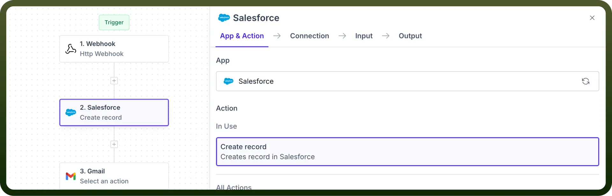

# CRM

Source: https://www.unifyapps.com/docs/unify-automations/crm
Section: automations

---

## Overview

CRM apps streamline **customer relationship management** by integrating key processes such as lead management and customer interaction tracking**.**

CRM connectors in UnifyApps enable seamless integration between various CRM systems and other applications, allowing us to automate complex automations.

## Use Case

To ensure that every new lead captured on our website is promptly followed up with personalised emails, we use a CRM connector to automate the process.

1. We **configure** a webhook to trigger the automation whenever a new lead fills up a form on our website.
2. We then **create** a new lead record in our CRM app(in this case, Salesforce).
3. We can then send a personalised email to our new lead using Gmail or any email marketing tool.
