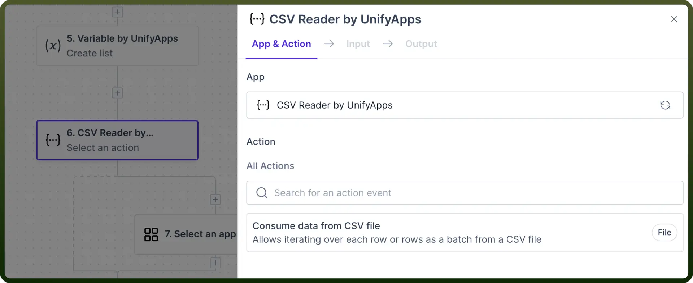
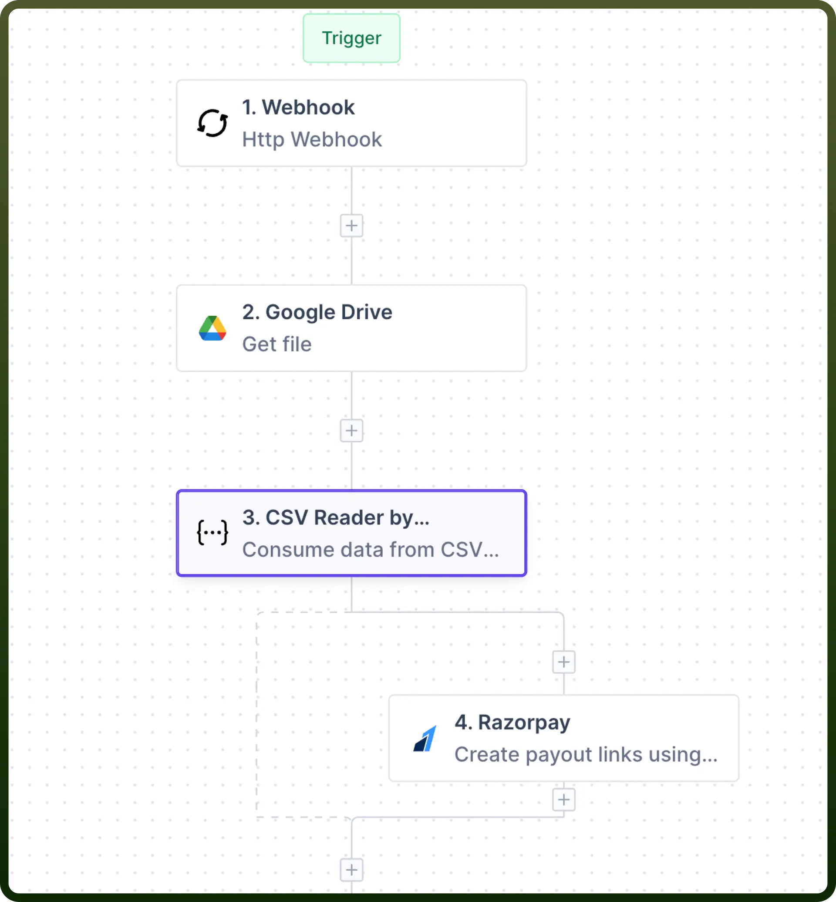
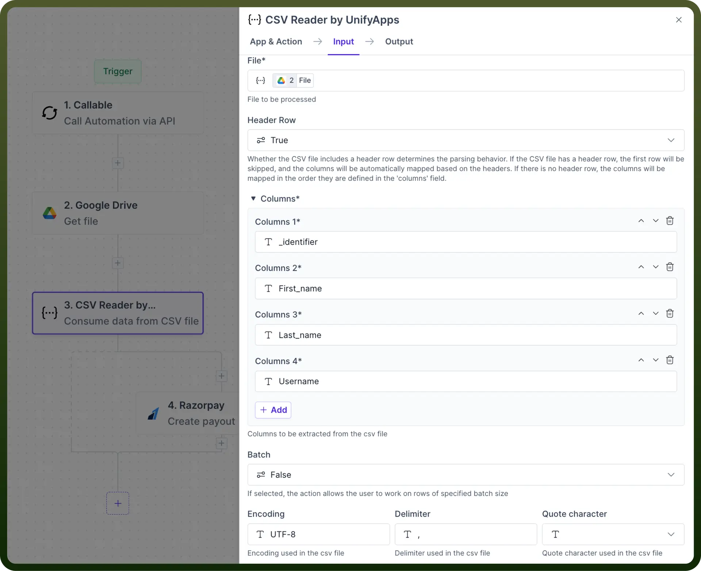
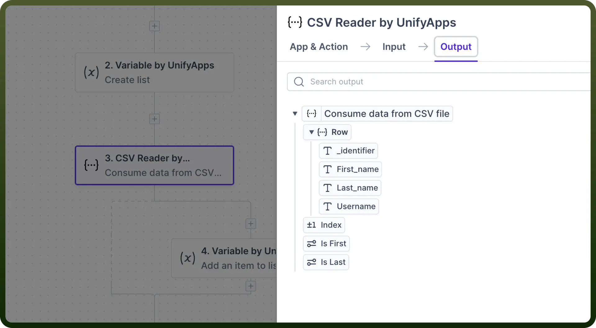
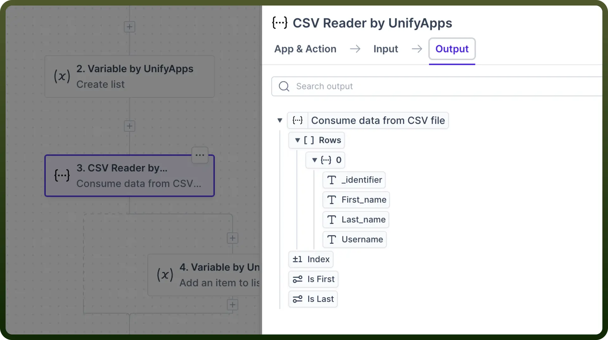

# CSV Reader by UnifyApps

Source: https://www.unifyapps.com/docs/unify-automations/csv-reader-by-unifyapps
Section: automations

---

## **Overview**

CSV Reader by UnifyApps allows you to **read the text content** of the CSV file and **pass key information** to the downstream automation.

This CSV Reader **iterates** through **each row** within the file and returns the data mapped within these rows as an object.

## Use Case

For instance, you have an Excel file with client details like Name, Company, Phone Number, Service, and Account ID. You need to generate invoices for each client using Razorpay.

1. We can get this file from our source and then use CSV Reader to interpret and pass information from this file to the rest of the automation.

  

2. We’ll fetch the properties such as `Name`, `Account ID,` and `Amount` from the CSV file and then use it as an input datapill in Razorpay, creating a separate payout link for each.
3. The CSV reader iterates through all the records available in the CSV file and returns data associated with each record.

## How to Parse CSV file?

1. Add the `CSV Reader by UnifyApps` node**,** select `Consume data from the CSV file`**,** and proceed with providing the required inputs.

  

2. **Inputs:**
  - **File:** Provide the URL or data pill to the CSV file here.
  - **Header Row:**
    - If your CSV file has a dedicated header row, leave it to `True` so the Reader knows to ignore the first row.
    - If your file doesn't have a Header row, ensure that you change the value to `False` so that the first row is not lost.
  - **Columns:** List the names of the columns you wish to retrieve. Use the `Add` button to add more columns.
  - **Batch:** This is set to `False` by default, enabling it to read rows individually. If set to `True`**,** you can set the batch size to read a set of rows at a time.

    

  - **Encoding:** It refers to the method of converting characters (letters, symbols, emojis, etc.) into a numerical format. Select your Unicode encoding. `UTF-8` is the default format.
  - **Delimiter:** This denotes the character on which your CSV file will be parsed. CSV files generally have the '`,`' delimiter. Other common delimiters can include '`_`' and '`;`'.
  - **Quote character:** This represents the quote character used in the CSV file, i.e., either double or single quotes or nothing.
3. After setting all the input parameters, set an `App & Action` inside the Reader iteration. We will simply use [Variable by UnifyApps](/docs/unify-automations/variable-by-unifyapps) to add items to the list created earlier one by one. **Note:** Users **must add a step** after CSV by UnifyApps Node to complete the Automation. The Automation can’t be deployed without this step.
4. **Output**:
  - When the “`Batch`” is selected as “`false`”, the input columns transform into fields of a single object in the output, with "`Row`" serving as the key.

    

  - When the “`Batch`” is selected as “`True`”, these same input columns turn into fields of an array of objects, with "`Rows`" acting as the key.

    
