# Custom HTTP Endpoint

Source: https://www.unifyapps.com/docs/unify-automations/custom-http-endpoint
Section: automations

---

## Overview

This node allows you to interact with external systems by making custom HTTP requests directly from your automation workflow. It acts as a versatile tool for integrating with APIs (Application Programming Interfaces - which are like contracts that allow different software to talk to each other) not covered by standard connectors.

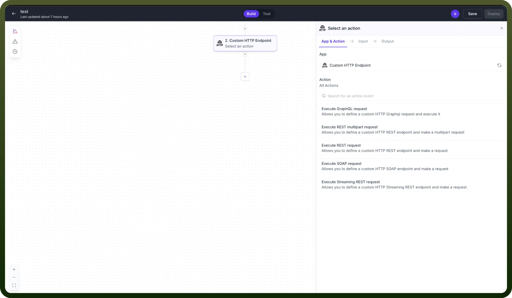

## Actions

### Execute REST request

**What is a REST request?**

REST (Representational State Transfer) is a very common and flexible architectural style for web services. REST APIs allow you to perform operations (like getting, creating, updating, or deleting data) on resources, which are identified by URLs. They typically use standard HTTP methods and often exchange data in formats like JSON.

This action is specifically designed to make standard RESTful API calls. It allows you to configure all aspects of an HTTP request, send it to the specified endpoint, and process the response for use in subsequent automation steps.

**Configuration Steps** After adding the **Custom HTTP Endpoint** node to your canvas, configure it using the following tabs:

1. **App & Action Tab**
  - **App:** Ensure **Custom HTTP Endpoint** is selected. This confirms you are using the built-in HTTP connection capabilities.
  - **Action:** Choose **Execute REST request** from the list under "`All Actions`". Selecting this action tailors the Input tab specifically for standard REST API interactions.
    - *Description:* Allows you to define a custom HTTP REST endpoint and make a request.
2. **Input Tab**This tab is where you define the specifics of the API call, including the target URL, method, authentication, data payload, and how you expect the response to be structured.
  - **Import OpenAPI Spec:**
    - Leverage an existing OpenAPI 3.0 definition to quickly configure the node. This is helpful for well-documented APIs as it can pre-fill the path, parameters, request body structure, and response structures.
    - Use **Upload File** to import a spec or **Export API Spec** to save your manual configuration for reuse or documentation.
  - **Base URL:** (Required)
    - Enter the fundamental root address of the API you are connecting to. This typically includes the scheme (http or https) and the domain name (e.g., api.example.com).
    - This part of the URL generally remains constant across multiple endpoints of the same API.
  - **Verify SSL Certificates:** (Default: True)
    - This setting controls whether the node checks the validity of the API server's SSL certificate. Keeping it True enhances security by preventing man-in-the-middle attacks.
    - You might need to set this to False only when dealing with internal systems or testing environments using self-signed certificates, but understand the security risks.
  - **Server certificate:**
    - If the API requires mutual TLS (mTLS) authentication, provide the client-side certificate in .pem format here. This is an advanced security measure where both client and server verify each other's identity.
  - **Path:** (Required)
    - Specify the particular resource or endpoint you want to access within the API. This is appended to the **Base URL**.
    - Use curly braces {} to denote dynamic parts of the path (e.g., `/users/{user_id}`). You'll typically map values to these path parameters from previous steps or define them in the Payload section.
  - **HTTP method:** (Required)
    - Select the REST verb corresponding to the action you want to perform on the resource (e.g., GET to retrieve data, POST to create data, PUT to update/replace data, PATCH to partially update data, DELETE to remove data).
  - **Request timeout duration:** (Default: -1)
    - Set a specific time limit (in seconds) for how long the node should wait for the API to respond. This prevents your workflow from getting stuck indefinitely if the API is slow or unresponsive.
    - Using the default -1 applies a system-defined timeout.
  - **Auth type:** (Default: Custom)
    - Choose the authentication mechanism the target API uses. Options typically include Basic Auth, OAuth 2.0, API Key, Bearer Token, etc. Selecting an option will reveal specific fields needed for that authentication type.
    - Custom might allow for more complex or non-standard authentication setups, often configured using the Headers section.

      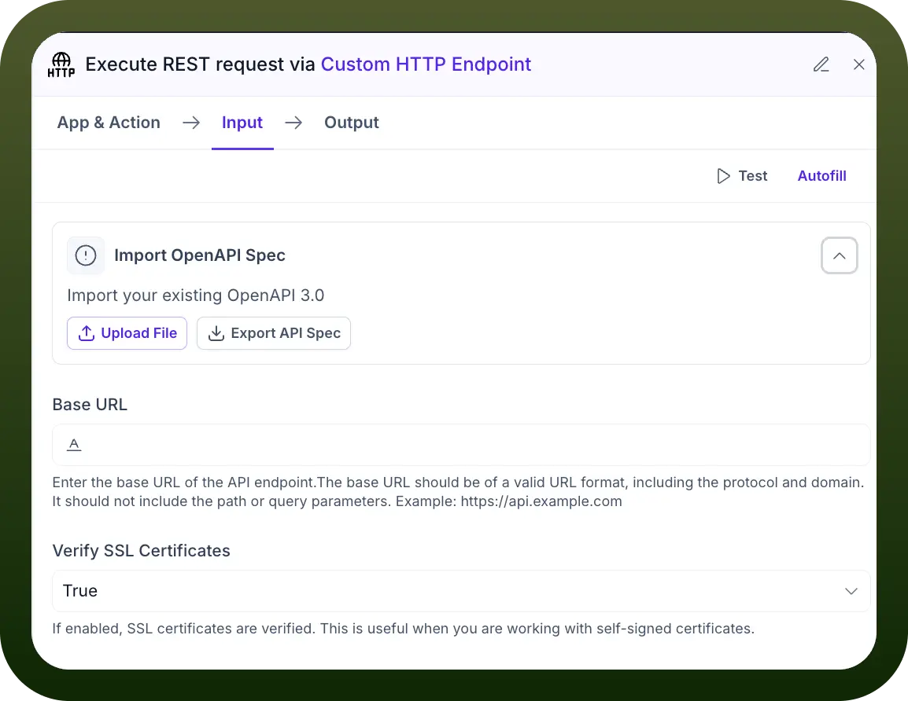

      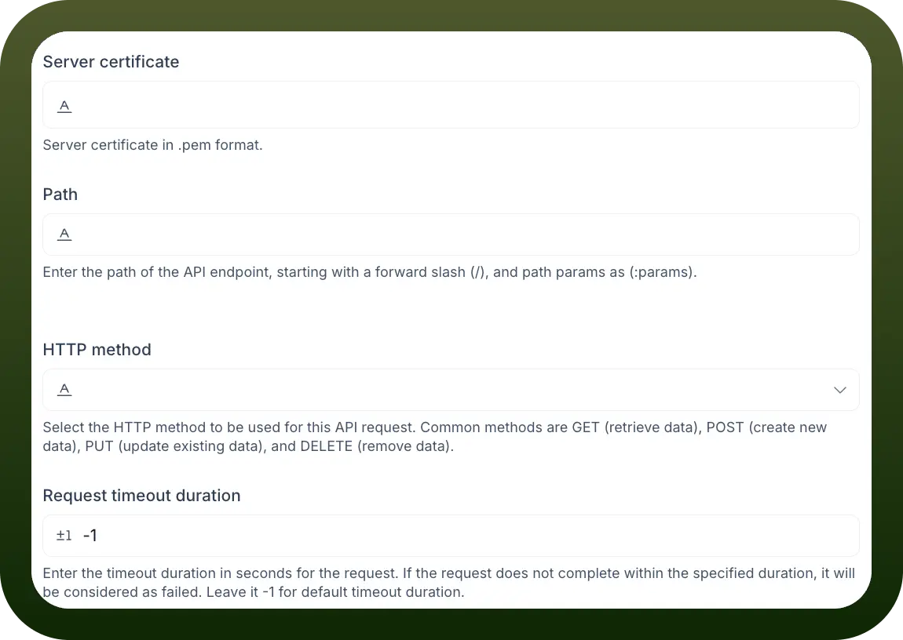

  - **Configure Request:** This section details the content and behaviour of your request.
    - **Is Async:** (Default: False)
      - Determines if the workflow should wait for the API response before proceeding (False) or continue immediately after sending the request (True). Asynchronous requests are useful for long-running API calls that don't require an immediate response for the next step.
    - **Ignore Trailing Slashes in URL:** (Default: False)
      - Some APIs are strict about URLs ending with or without a /. Setting this to True makes the node less sensitive to these inconsistencies by automatically ignoring any trailing slash in the final constructed URL.
    - **Request Content Type:** (Default: JSON)
      - Select the format of the data you are sending in the **Payload** (request body). This selection usually automatically sets the Content-Type HTTP header (e.g., application/json, application/xml, application/x-www-form-urlencoded).
    - **Headers:**
      - Define any necessary HTTP headers beyond standard ones like Content-Type or Authorization (which might be handled by the **Auth type** setting). Examples include Accept (to specify desired response format) or custom headers like X-API-Key.
    - **Query Parameters:**
      - Specify key-value pairs that will be appended to the URL after a ? (e.g., `?status=active&page=1`). These are commonly used with GET requests for filtering, sorting, or paginating results.
    - **Payload:**
      - Construct the body of your request, typically used with POST, PUT, and PATCH methods. This section offers flexibility:
        - `+ Add Field`**:** Build a structured payload (like a JSON object) field by field, useful for clear definition and mapping.
        - `{..} Use Code Snippet`**:** Input the entire request body as raw text, ideal for complex JSON/XML or when copying examples.
        - `[...] Map from step`**:** Dynamically insert data from previous steps in your workflow into the payload fields or code snippet.

          

          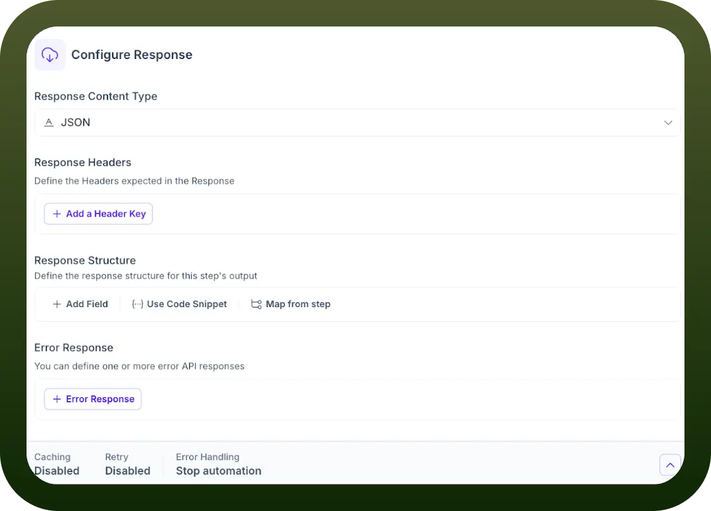

  - **Configure Response:** This section tells the node how to interpret and structure the data received *from* the API.
    - **Response Content Type:** (Default: JSON)
      - Indicate the expected format of the API's response body. Setting this correctly (e.g., JSON, XML, Plain Text) allows the node to parse the response accurately into usable data pills.
    - **Response Headers:**
      - If you need to capture specific headers from the API's response (e.g., ETag for caching, X-RateLimit-Remaining for rate limiting, pagination links), define their keys here using **+ Add a Header Key**.
    - **Response Structure:**
      - Define the expected format of a *successful* response body. Similar to the **Payload** section, you can use **+ Add Field**, **{..} Use Code Snippet**, or **[...] Map from step**. Defining this structure creates clearly named data pills in the Output tab, making it much easier to use the API results later.
    - **Error Response:**
      - APIs often return errors in a specific format. Use **+ Error Response** to define the structure(s) of potential error messages from the API. This allows you to check for specific error conditions and handle them appropriately in your workflow.
3. **Output Tab** This tab displays the data generated by the node after the API call is executed. These data pills can be mapped into subsequent steps in your automation.
- **Execute REST request:** (This represents the overall result of the node)
  - **{..} Result:** This is the primary output data pill containing the processed information from the API response. Its internal structure matches the **Response Structure** (on success) or **Error Response** (on failure) you defined in the Input tab. It typically holds the parsed response body, the HTTP status code, and any extracted response headers, ready for use.

    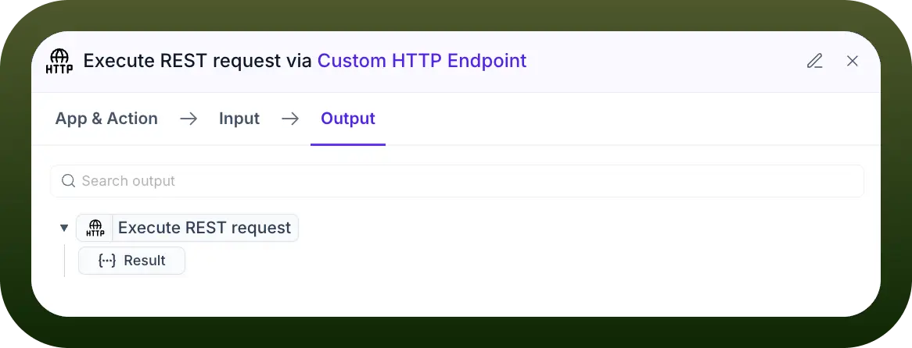

### Execute GraphQL request

**What is a GraphQL request?**

GraphQL is a query language for APIs and a server-side runtime for executing those queries. Unlike REST, which often requires multiple requests to different URLs to fetch related data, GraphQL allows you to request exactly the data you need in a single request to a single endpoint. This can make data fetching more efficient.

This action is tailored for making requests to GraphQL APIs. GraphQL allows clients to request exactly the data they need, often using a single endpoint and the POST HTTP method.

**Configuration Steps**

After adding the **Custom HTTP Endpoint** node to your canvas, configure it using the following tabs:

1. **App & Action Tab**
  - **App:** Ensure **Custom HTTP Endpoint** is selected.
  - **Action:** Choose **Execute GraphQL request** from the list under "`All Actions`". Selecting this action adapts the Input tab for GraphQL-specific configurations.
    - *Description:* Allows you to define a custom HTTP GraphQL request and execute it.
2. **Input Tab** This tab focuses on the elements needed for a GraphQL query, such as the endpoint URL, authentication, the query itself, and optional variables.
  - **Base URL:** (Required)
    - Enter the root URL of the GraphQL API endpoint. This often includes the scheme (https) and domain (e.g., api.example.com).
  - **Verify SSL Certificates:** (Default: True)
    - Controls SSL certificate validation for security. Set to False only if necessary for self-signed certificates in non-production environments.
  - **Path:** (Required)
    - Enter the specific path for the GraphQL endpoint. Unlike REST, GraphQL APIs often use a single, fixed path (e.g., /graphql or /api/graphql).
  - **Request timeout duration:** (Default: -1)
    - Set the maximum time (in seconds) to wait for the GraphQL API to respond. Use -1 for the default timeout.
  - **Auth type:** (Default: Custom)
    - Select the authentication method required by the GraphQL API (e.g., Bearer Token via Headers, API Key, OAuth 2.0). Configuration fields appear based on your selection.
  - **Configure Request:** This section focuses on the GraphQL-specific parts of the request.
    - **Headers:**
      - Define any necessary HTTP headers, often including the Authorization header (if not handled by **Auth type**) and Content-Type: `application/json`.
    - **Variables:**
      - Define any variables used within your **GraphQL Query**. This is the standard way to pass dynamic values into a GraphQL request. You can:
        - `+ Add Variable`: Define variables with key-value pairs.
        - `{..} Use Code Snippet`: Provide variables as a raw JSON object.
        - `[...] Map from step`: Map values dynamically from previous steps into your variables.

          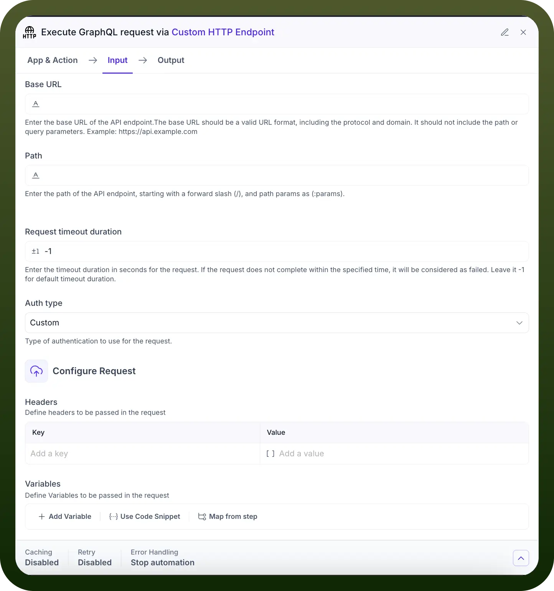

    - **GraphQL Query:** (Required)
      - Enter the complete GraphQL query or mutation here. This defines the structure of the data you are requesting or the operation you want to perform.
  - **Configure Response:** Define how to interpret the GraphQL API's response.
    - **Response Headers:**
      - Define any specific response headers you need to capture from the API's response using **+ Add a Header Key**.
    - **Response Structure:**
      - Define the expected structure of the data object within a *successful* GraphQL response. Use **+ Add Field**, **{..} Use Code Snippet**, or **[...] Map from step**. This structures the output data pill.
    - **Error Response:** Define the structure of the errors object that might be returned by the GraphQL API using **+ Error Response**. This helps in identifying and handling API-level errors.

      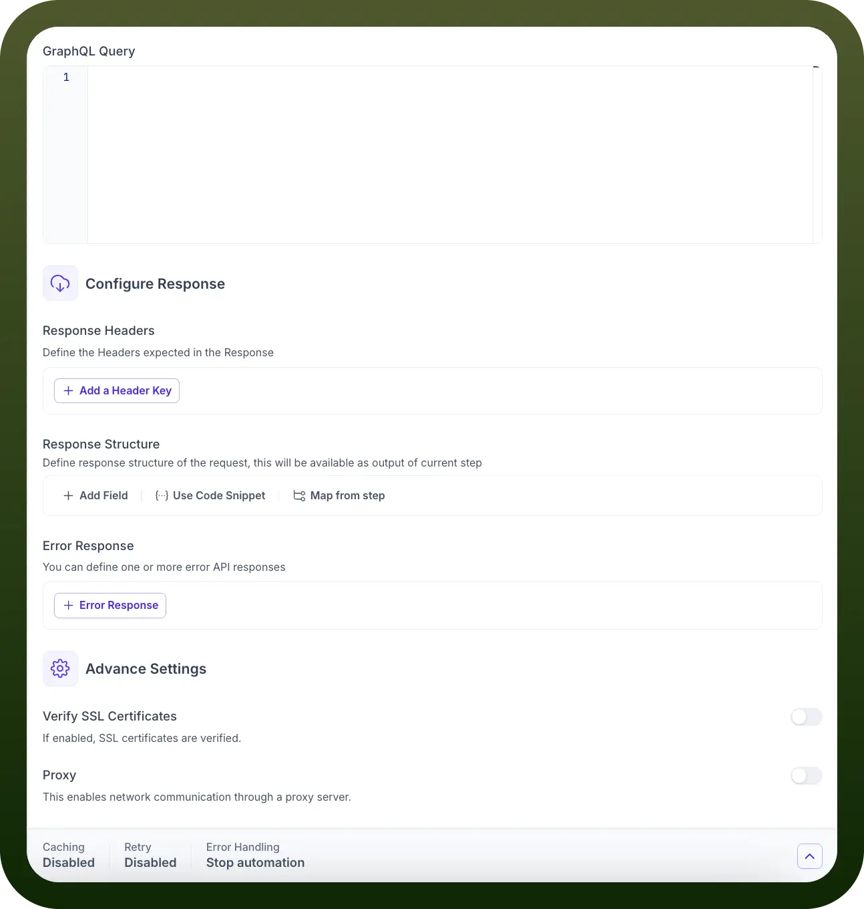

3. **Output Tab** This tab shows the data pills generated by the node after the GraphQL execution.
  - **Execute GraphQL request:** (Top-level object)
    - **{..} Result:** This data pill contains the outcome of the executed GraphQL request. Its structure is based on the **Response Structure** (for the data part) and **Error Response** (for the errors part) defined in the Input tab. It typically includes:
      - The parsed data object from the response.
      - The parsed errors object from the response (if any).
      - Response status code.
      - Extracted response headers (if defined).

### Execute REST multipart request

**What is a REST multipart request?**

A multipart request is a type of HTTP request used to send data that is composed of multiple parts, typically when uploading files. Each part can have its own content type (e.g., a text field and an image file). The multipart/form-data content type is commonly used for this.

This action is used for sending multipart/form-data requests, which are commonly required when uploading files along with other text-based form fields to an API endpoint.

**Configuration Steps**

After adding the **Custom HTTP Endpoint** node to your canvas, configure it using the following tabs:

1. **App & Action Tab**
  - **App:** Ensure **Custom HTTP Endpoint** is selected.
  - **Action:** Choose **Execute REST multipart request** from the list under "`All Actions`". This prepares the Input tab for constructing a multipart request.
    - *Description:* Allows you to define a custom HTTP REST endpoint and make a multipart request.
2. **Input Tab** This tab defines the API endpoint and the different parts (fields and files) of your multipart request.
  - **Import OpenAPI Spec:**
    - Optionally import an OpenAPI 3.0 specification. While OpenAPI has limited support for fully defining multipart requests, it might pre-fill URL, path, and basic parameters.
    - Use **Upload File** or **Export API Spec**.
  - **Base URL:** (Required)
    - Enter the root URL of the API endpoint (scheme + domain).
  - **Verify SSL Certificates:** (Default: True)
    - Controls SSL certificate validation. Keep True for security unless dealing with self-signed certificates.
  - **Server certificate:**
    - Provide a client certificate in .pem format if the API requires mTLS authentication.
  - **Path:** (Required)
    - Specify the API endpoint path that accepts multipart requests.
  - **HTTP method:** (Required)
    - Select the HTTP method, typically POST or PUT for requests involving data submission or file uploads.
  - **Request timeout duration:** (Default: -1)
    - Set the maximum time (in seconds) to wait for the API response. Consider increasing this for large file uploads. Use -1 for the default.
  - **Auth type:** (Default: Custom)
    - Select the authentication method required by the API (e.g., Basic Auth, OAuth 2.0, API Key).
  - **Configure Request:** This section details the content and behaviour of your multipart request.
    - **Request Content Type:** (Default: JSON - *Note: This might be automatically overridden to multipart/form-data by the node when configuring the payload*)
      - While shown, the actual Content-Type header sent will be multipart/form-data with a dynamically generated boundary when using this action type correctly.
    - **Ignore Trailing Slashes in URL:** (Default: False)
      - Set to True to ignore trailing slashes in the constructed URL if the target API requires it.
    - **Headers:**
      - Define any additional HTTP headers required by the API, besides Content-Type and Authorization.
    - **Query Parameters:**
      - Specify any URL query parameters needed for the request.
    - **Payload:** (Crucial for Multipart)
      - Define the different parts of your multipart/form-data request here. You will typically use **+ Add Field** or **[...] Map from step** to:
        - Add regular form fields (key-value pairs).
        - Map **file objects** from previous steps (e.g., from a trigger or file operation node) to a field name expected by the API. The node handles the encoding and formatting for file uploads.
    - **{..} Use Code Snippet** is generally less common for multipart requests unless you need very specific, low-level control over the raw request body structure.

      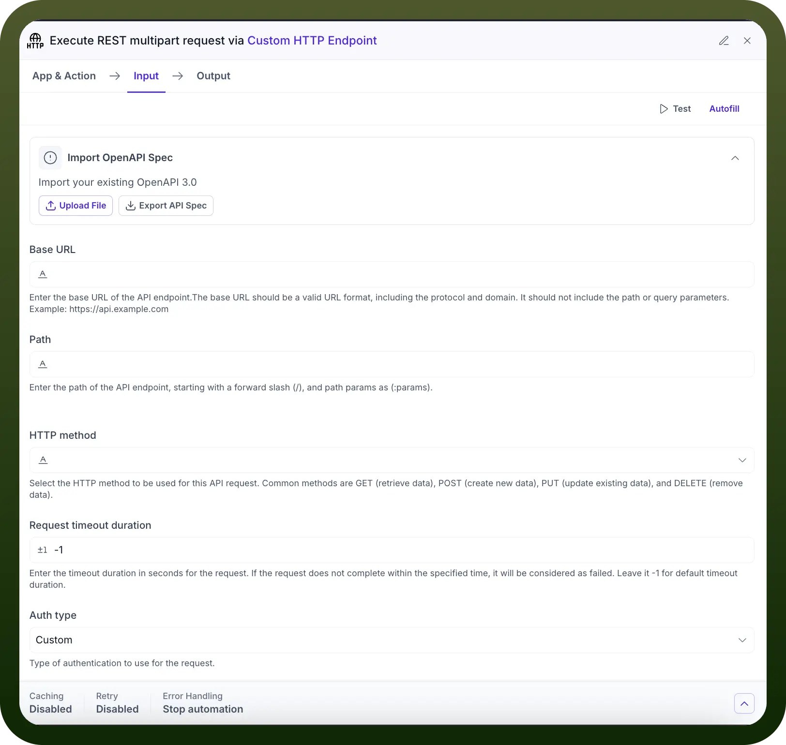

      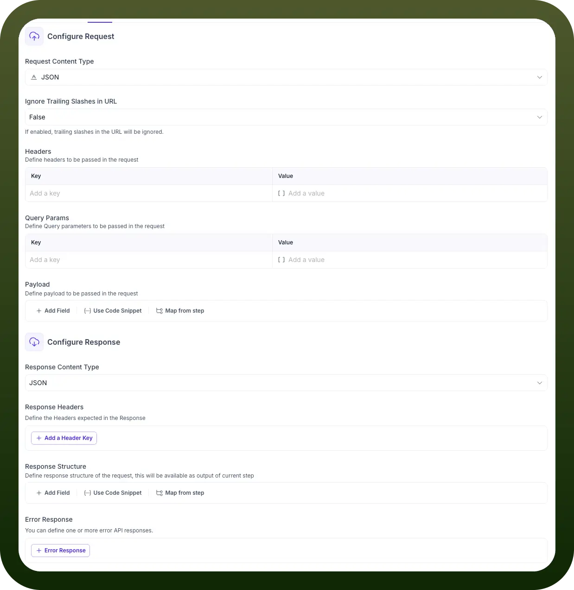

      - Define the different parts of your multipart/form-data request here. You will typically use **+ Add Field** or **[...] Map from step** to:
        - Add regular form fields (key-value pairs).
        - Map **file objects** from previous steps (e.g., from a trigger or file operation node) to a field name expected by the API. The node handles the encoding and formatting for file uploads.
      - **{..} Use Code Snippet** is generally less common for multipart requests unless you need very specific, low-level control over the raw request body structure.
  - **Configure Response:** Define how to interpret the API's response after the multipart request.
    - **Response Content Type:** (Default: JSON)
      - Specify the expected format of the API's response body (e.g., JSON, XML, Plain Text).
    - **Response Headers:**
      - Define specific response headers to capture using **+ Add a Header Key**.
    - **Response Structure:**
      - Define the expected structure of a *successful* API response using **+ Add Field**, **{..} Use Code Snippet**, or **[...] Map from step**.
    - **Error Response:**
      - Define the structure(s) of potential *error* responses using **+ Error Response**.
3. **Output Tab** This tab shows the data pills generated after the multipart request is executed.
  - **Execute REST multipart request:** (Top-level object)
    - **{..} Result:** Contains the outcome of the request, structured according to the **Response Structure** or **Error Response** definitions. It includes the parsed response body, status code, and extracted headers.

### Execute SOAP request

**What is a SOAP request?**

SOAP (Simple Object Access Protocol) is a protocol for exchanging structured information in the implementation of web services. It relies heavily on XML for its message format and usually operates over HTTP. SOAP APIs have a strict contract defined by a WSDL (Web Services Description Language) file.

This action is specifically designed for interacting with web services that use the SOAP standard.

**Configuration Steps**

After adding the **Custom HTTP Endpoint** node to your canvas, configure it using the following tabs:

1. **App & Action Tab**
  - **App:** Ensure **Custom HTTP Endpoint** is selected.
  - **Action:** Choose **Execute SOAP request** from the list under "`All Actions`". This configures the Input tab with SOAP-specific fields.
    - *Description:* Allows you to define a custom HTTP SOAP endpoint and make a request.
2. **Input Tab** This tab defines the target SOAP service endpoint, the specific SOAP action, authentication, and the structure of the SOAP request and expected response.
  - **SOAP Version:** (Default: Version 1.2)
    - Select the version of the SOAP protocol used by the target web service (typically 1.1 or 1.2). This affects the structure and headers of the request.
  - **Import XML Spec:**
    - Import a WSDL file using **Upload File**. WSDL files describe the SOAP service's operations, messages, and endpoint, which can help pre-fill configuration details.
    - You can also **Export XML** to save the current configuration.

      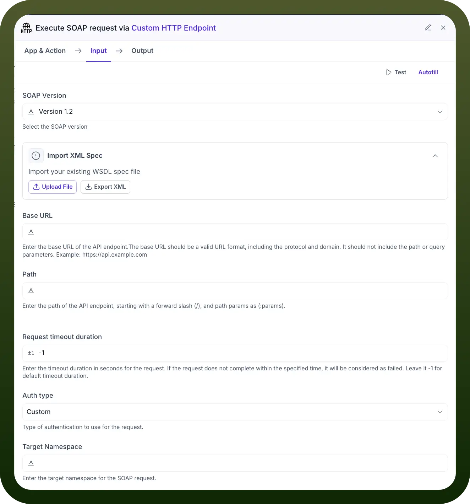

  - **Base URL:** (Required)
    - Enter the base URL of the SOAP service endpoint (scheme + domain).
  - **Verify SSL Certificates:** (Default: True)
    - Controls SSL certificate validation. Keep True for security unless dealing with self-signed certificates.
  - **Server certificate:**
    - Provide a client certificate in .pem format if the SOAP service requires mTLS authentication.
  - **Path:** (Required)
    - Specify the path to the SOAP service endpoint (e.g., `/Service.asmx`).
  - **Request timeout duration:** (Default: -1)
    - Set the maximum time (in seconds) to wait for the SOAP service to respond. Use -1 for the default.
  - **Auth type:** (Default: Custom)
    - Select the authentication method required by the SOAP service (e.g., Basic Auth, WS-Security via SOAP Headers, API Key via HTTP Headers).
  - **Target Namespace:**
    - Enter the target XML namespace associated with the SOAP service or operation, often found in the WSDL.
  - **Configure Request:** This section details the SOAP-specific request elements.
    - **Request Content Type:** (Default: Soap XML)
      - This is typically set automatically based on the selected SOAP version (text/xml for 1.1, application/soap+xml for 1.2).
    - **Headers:**
      - Define any standard HTTP headers required (e.g., SOAPAction for SOAP 1.1, which indicates the operation to invoke). The SOAPAction header is often critical for routing the request correctly on the server.
    - **SOAP Envelope Headers:**
      - Define any custom headers that need to be placed within the <`soap:Header`> section of the SOAP envelope XML. This is often used for WS-Security credentials or other metadata.
    - **XML Namespaces:**
      - Define any additional XML namespace prefixes and URIs that will be used within your SOAP **Payload**.
    - **Payload:** (SOAP Body Content)
      - Define the content that goes inside the <soap:Body> element of the SOAP request envelope. This typically contains the specific operation/method call and its parameters in XML format. You can:
        - `+ Add Field`: Build the XML structure field by field.
        - `{..} Use Code Snippet`: Provide the raw XML content for the SOAP Body.
        - `[...] Map from step`: Map dynamic data into the fields or code snippet.

          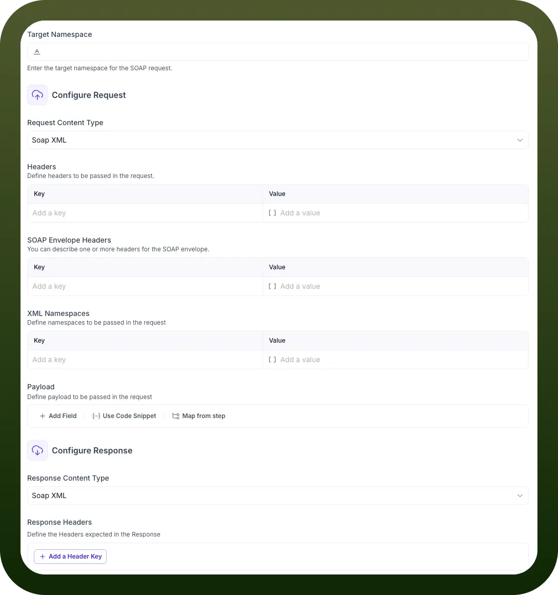

  - **Configure Response:** Define how to interpret the SOAP service's response.
    - **Response Content Type:** (Default: Soap XML)
      - Specifies the expected format of the response, typically XML.
    - **Response Headers:**
      - Define specific HTTP response headers to capture using **+ Add a Header Key**.
    - **Response Structure:**
      - Define the expected XML structure within the <`soap:Body`> of a *successful* SOAP response. Use **+ Add Field**, **{..} Use Code Snippet**, or **[...] Map from step** to structure the output data pill.
    - **Error Response:**
      - Define the structure of a SOAP Fault response (the standard way SOAP services report errors) using **+ Error Response**. This helps identify and handle service-level errors.
    - **Include Raw Request (Base64 Encoded):** (Optional)
      - Enable this toggle if you need the exact raw XML request sent by the node to be included (Base64 encoded) in the output data pills, useful for debugging.
    - **Include Raw Response (Base64 Encoded):** (Optional)
      - Enable this toggle if you need the exact raw XML response received from the service to be included (Base64 encoded) in the output data pills, useful for debugging complex responses.

        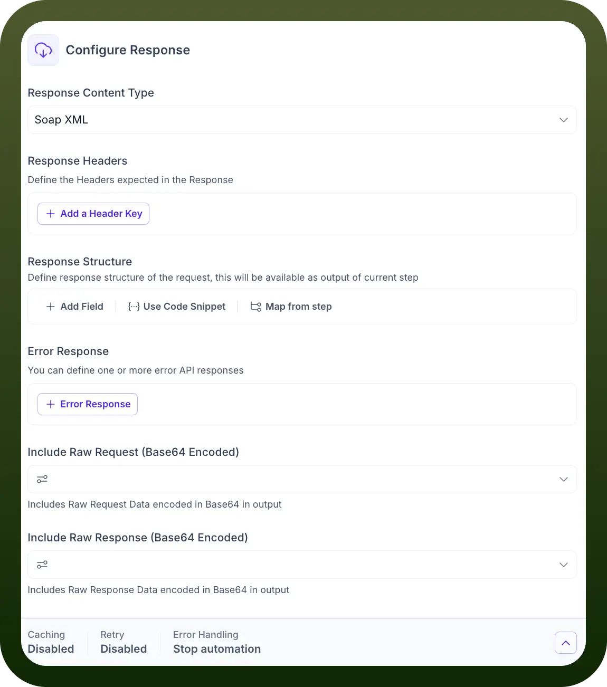

3. **Output Tab** This tab shows the data pills generated after the SOAP request is executed.
  - **Execute SOAP request:** (Top-level object)
    - **{..} Result:** Contains the outcome of the request. Its structure is based on the **Response Structure** (for success) or **Error Response** (for SOAP Faults) defined in the Input tab. It includes the parsed XML body content, status code, extracted HTTP headers, and optionally the raw request/response XML.

### Execute Streaming REST request

**What is a Streaming REST request?**

A streaming REST request is used when an API sends data back over a persistent connection in a series of chunks or events, rather than all at once. This is useful for real-time data, large datasets, or long-running processes where you want to receive updates as they happen. Examples include Server-Sent Events (SSE).

This action is designed to connect to REST APIs that provide streaming responses.

**Configuration Steps**

After adding the **Custom HTTP Endpoint** node to your canvas, configure it using the following tabs:

1. **App & Action Tab**
  - **App:** Ensure **Custom HTTP Endpoint** is selected.
  - **Action:** Choose **Execute Streaming REST request** from the list under "All Actions". This prepares the node to handle a streaming connection.
    - *Description:* Allows you to define a custom HTTP Streaming REST endpoint and make a request.
2. **Input Tab** This tab defines the connection details for the streaming API endpoint. The configuration is very similar to the standard "`Execute REST request`" but the underlying behavior focuses on maintaining an open connection and processing incoming data chunks.
  - **Import OpenAPI Spec:**
    - Optionally import an OpenAPI 3.0 specification. While OpenAPI doesn't fully describe streaming behavior, it can help pre-fill URL, path, and parameters.
    - Use **Upload File** or **Export API Spec**.
  - **Base URL:** (Required)
    - Enter the root URL of the streaming API endpoint (scheme + domain).
  - **Verify SSL Certificates:** (Default: True)
    - Controls SSL certificate validation. Keep True for security unless dealing with self-signed certificates.
  - **Server certificate:**Provide a client certificate in .pem format if the API requires mTLS authentication.

    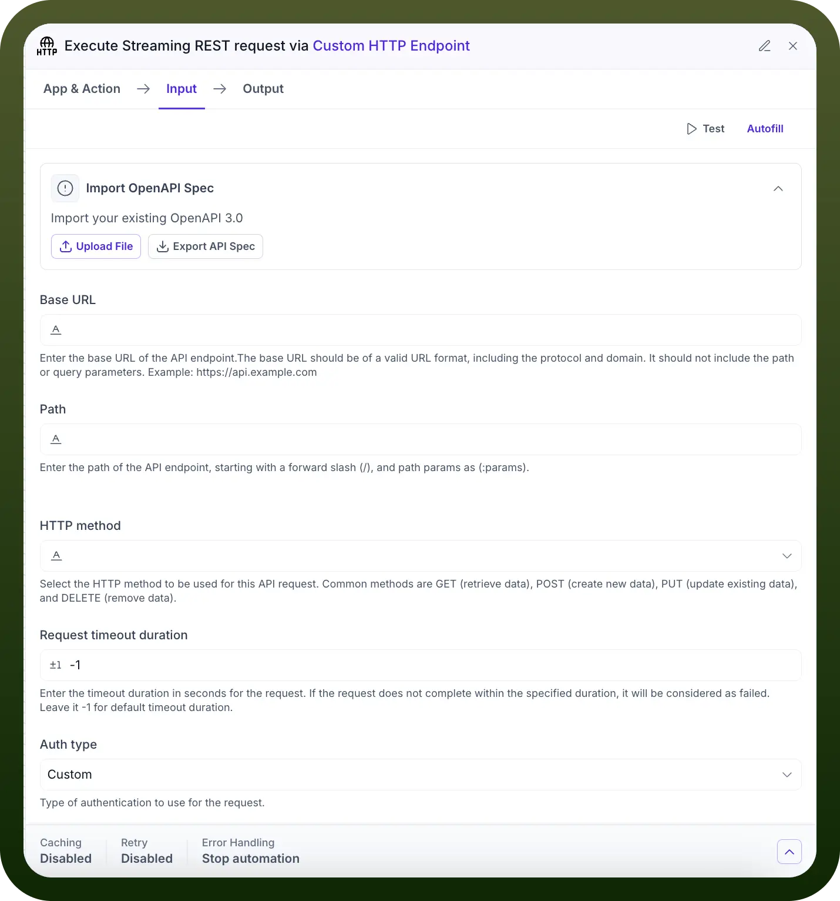

  - **Path:** (Required)
    - Specify the API endpoint path that provides the streaming response.
  - **HTTP method:** (Required)
    - Select the HTTP method required to initiate the stream, often GET or sometimes POST.
  - **Request timeout duration:** (Default: -1)
    - Set the maximum time (in seconds) to establish the initial connection and potentially wait between chunks (depending on implementation). A longer timeout might be needed for streams that have periods of inactivity. Use -1 for the default.
  - **Auth type:** (Default: Custom)
    - Select the authentication method required by the streaming API (e.g., Basic Auth, OAuth 2.0, API Key).
  - **Configure Request:** This section details the initial request to establish the stream.
    - **Is Async:** (Default: False)
      - This setting might behave differently for streaming. If False, the node might keep the connection open and process chunks as they arrive, potentially blocking subsequent steps until the stream closes or a condition is met. If True, it might establish the connection and allow the workflow to proceed, requiring separate logic to handle incoming stream events. *(Clarification might be needed from specific platform documentation)*.
    - **Ignore Trailing Slashes in URL:** (Default: False)
      - Set to True to ignore trailing slashes in the constructed URL if the target API requires it.
    - **Request Content Type:** (Default: JSON)
      - Select the format of any data sent in the initial request **Payload** (if using POST, etc.).
    - **Headers:**
      - Define any necessary HTTP headers for the initial request, such as Accept: text/event-stream for SSE, or Authorization.
    - **Query Parameters:**
      - Specify any URL query parameters needed for the initial request.
    - **Payload:**
      - Construct the body of the initial request if required by the API (e.g., for POST requests initiating a stream). Use **+ Add Field, {..} Use Code Snippet, or [...] Map from step**.

        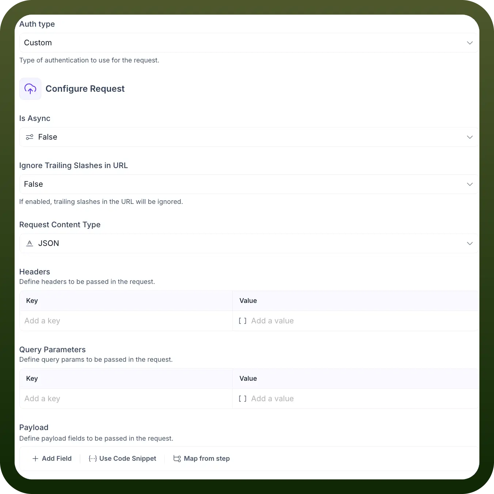

  - **Configure Response:** Define how to interpret the *individual chunks* or the *overall structure* of the streamed data.
    - **Response Content Type:** (Default: JSON)
      - Specify the expected format of the data within each stream chunk (e.g., JSON, Plain Text). For SSE, this might be text/event-stream, but you might define the structure of the data: field within it as JSON.
    - **Response Headers:**
      - Define specific response headers from the *initial* response establishing the stream (not headers within the stream itself) using **+ Add a Header Key**.

        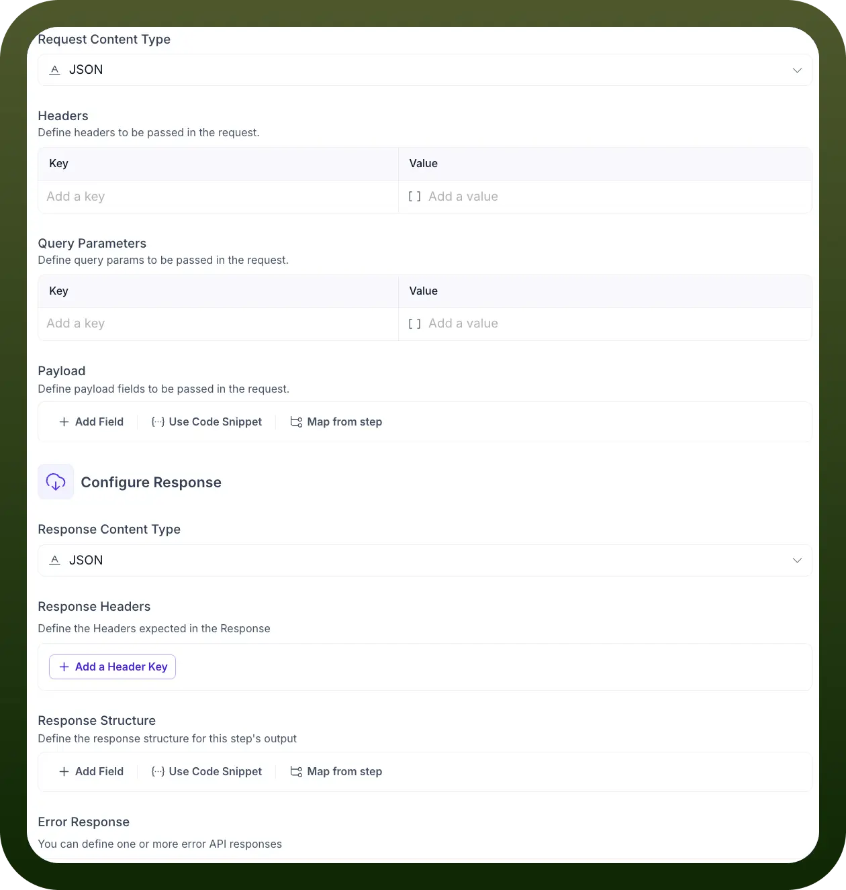

    - **Response Structure:**
      - Define the expected structure of *each data chunk* received from the stream. Use **+ Add Field**, **{..} Use Code Snippet**, or **[...] Map from step**. This structures the output data pill for each received event/chunk.
    - **Error Response:**
      - Define the structure(s) of potential *error* messages that might terminate the stream or be sent as error events.

**3. Output Tab**

This tab shows the data pills generated as the stream progresses. The exact behaviour might depend on the platform's implementation (e.g., does it output one pill per chunk, or collect chunks?).

- **Execute Streaming REST request:** (Top-level object)
  - **{..} Result:** (Likely represents individual chunks/events) Contains the outcome of processing a single chunk from the stream. Its structure is based on the **Response Structure** or **Error Response** definitions. It would typically include the parsed data chunk, potentially stream-specific metadata (like SSE event type or ID), and status information related to the stream's health. *(Further clarification from platform documentation might be needed on how the stream is presented in output pills)*.
