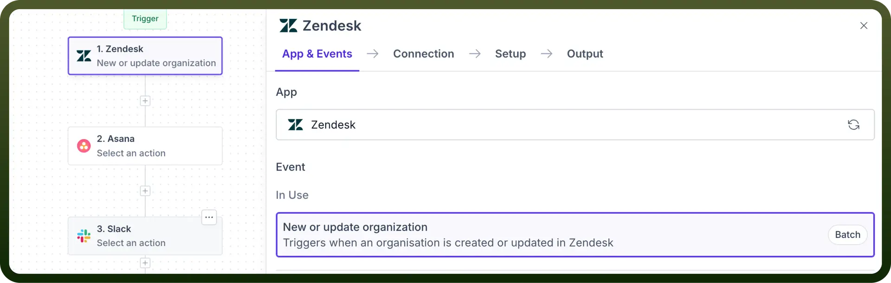

# Customer Support

Source: https://www.unifyapps.com/docs/unify-automations/customer-support
Section: automations

---

## Overview

Customer support apps enhance support management by integrating essential **ticketing** and customer communication **tracking** processes.

Customer support connectors in UnifyApps enable seamless connections between various support systems and other applications, automating complex support automations.

## Use Case

To ensure that support tickets are promptly addressed and escalated if not resolved within a specific timeframe, we leverage customer support connectors.

1. We **trigger** the automation whenever a ticket is created or updated in our customer support app (in this case, Zendesk).
2. We immediately **create** a task and **assign** it to a member in Asana.
3. Finally, we send a message in Slack to the concerned assignee to resolve the ticket quickly.
